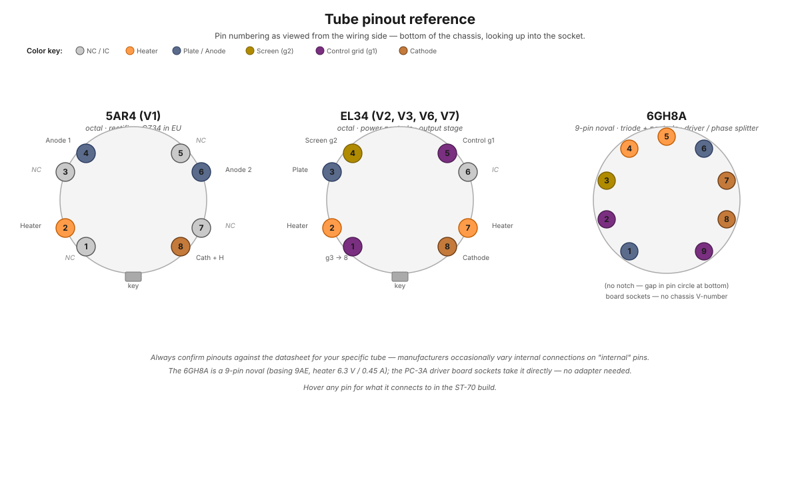

# Tube pinouts

Pin functions for every tube in this build. All views are from the **wiring side** (bottom of the socket).

<figure class="diagram-fig" markdown="span">
  
  <figcaption>Three tube types in this build, viewed from below the socket. Color coding: heater orange, plate blue, screen yellow, control grid purple, cathode brown, NC/IC grey. Hover any pin for spec. Click to zoom.</figcaption>
</figure>

## 5AR4 rectifier (V1)

Octal base, 8 pins.

| Pin | Function |
|---|---|
| 1 | NC |
| 2 | Heater |
| 3 | NC |
| 4 | Plate (anode) #1 |
| 5 | NC |
| 6 | Plate (anode) #2 |
| 7 | NC |
| 8 | Cathode + heater |

See [5AR4 page](../components/5ar4-rectifier-tube.md) for the dual-anode topology.

## EL34 output tube (V2, V3, V6, V7)

Octal base, 8 pins.

| Pin | Function |
|---|---|
| 1 | Suppressor grid (g3) — strapped to pin 8 (cathode) at the socket in this build |
| 2 | Heater |
| 3 | Plate (anode) |
| 4 | Screen grid (g2) |
| 5 | Control grid (g1) |
| 6 | No connection — used as a tie point for the 1 kΩ grid stopper |
| 7 | Heater |
| 8 | Cathode |

See [EL34 page](../components/el34-output-tube.md).

## 6GH8A driver / phase splitter

9-pin noval miniature (basing 9AE). Heater 6.3 V @ 0.45 A. Mounts in board sockets on the PC-3A driver board (no chassis V-number). One per channel. See [6GH8A page](../components/6gh8a-driver-tube.md).

| Pin | Function |
|---|---|
| 1 | Triode plate |
| 2 | Pentode control grid (g1) — audio input |
| 3 | Pentode screen grid (g2) |
| 4 | Heater |
| 5 | Heater |
| 6 | Pentode plate |
| 7 | Pentode cathode + g3 + internal shield |
| 8 | Triode cathode |
| 9 | Triode grid |
