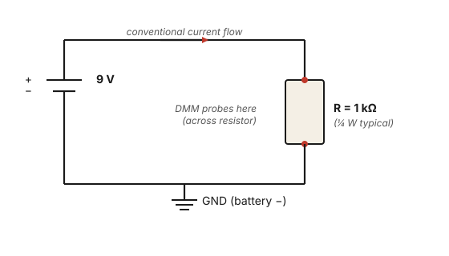

# Exercise 1 — Ohm's law and power

## The concept

Three quantities describe DC current flowing through a resistor:

- **Voltage** (V, in volts) — the potential difference across the resistor.
- **Current** (I, in amperes) — the flow of charge through the resistor.
- **Resistance** (R, in ohms) — how much the resistor opposes the current.

They are tied together by **Ohm's law**:

$$ V = I \times R $$

This is the single most-used equation in circuit work. Memorize it three ways:

$$ V = IR \qquad I = \dfrac{V}{R} \qquad R = \dfrac{V}{I} $$

The fourth quantity is **power** (P, in watts) — the rate at which energy is dissipated as heat:

$$ P = V \times I $$

Combine with Ohm's law to get the two forms you'll use most:

$$ P = \dfrac{V^2}{R} \qquad P = I^2 R $$

That's it. With those four expressions you can compute the current, voltage, or power anywhere a resistor is involved — including every dropping resistor, plate load, cathode resistor, grid stopper, and bias divider in the ST-70.

## Bench exercise

**Parts:** 9 V battery, 1 kΩ resistor, DMM.

**Circuit:**

<figure class="diagram-fig" markdown="span">
  
  <figcaption>The simplest possible circuit. Probe across the resistor with the DMM on DC volts; insert it in series for current. Click to zoom.</figcaption>
</figure>

**Predict (do this before you touch anything):**

Current through the resistor:

$$ I = \dfrac{V}{R} = \dfrac{9\text{ V}}{1{,}000\text{ Ω}} = 0.009\text{ A} = 9\text{ mA} $$

Power dissipated in the resistor:

$$ P = \dfrac{V^2}{R} = \dfrac{81}{1{,}000} = 0.081\text{ W} = 81\text{ mW} $$

(Well under the ¼-W rating of a typical resistor. The resistor will not get hot.)

**Build it** on the breadboard. Connect the resistor across the battery.

**Measure:**

| Measurement | DMM mode | Predicted | Yours |
|---|---|---|---|
| Voltage across the resistor | DC volts | ~9 V (battery voltage) | |
| Current through the resistor | DC current (mA range, **probes in series**) | ~9 mA | |
| Resistance of the resistor (battery disconnected) | Ohms | ~1 kΩ | |

To measure current, the DMM goes **in series** with the resistor — break the circuit, put the meter in the gap. Most DMMs require you to move the red probe to a different jack (often labeled mA or A). Get used to this — measuring current is the one DMM operation that's awkward, which is why most bench work uses voltage measurements (taken across resistors of known value) to infer current via Ohm's law.

## What you should see

- Voltage: should be within ~5% of the battery's actual voltage (a fresh 9 V battery often reads 9.3–9.5 V; an older one 8.0–9.0 V).
- Current: should match (battery voltage) / 1000, within ~5%.
- Resistance: within the resistor's tolerance band (5% for typical parts).

## What if my number is different?

- **Voltage reads 0:** open circuit somewhere. A wire isn't seated in the breadboard, the battery is dead, or the resistor is broken.
- **Voltage reads battery voltage but current reads 0:** the DMM's current probe isn't in series — it's in parallel. Move it.
- **Resistor reading is way off:** wrong resistor (check the color bands), or you're touching the resistor leads with your fingers (your skin conducts; 100 kΩ is a typical body resistance).
- **All readings match prediction:** good. You've just measured Ohm's law on the bench.

## Why this matters for the ST-70

Every voltage on the ST-70's chassis is the result of a current flowing through a resistance. The B+ rail at 435 V dropping to 415 V across the choke? That's V = IR — about 200 mA flowing through the choke's ~100 Ω DCR gives a 20 V drop. The bias supply's −65 V to ~−32 V at the EL34 grids? Same math, divided by a different resistor.

Once you can confidently apply V = IR and P = V²/R in your head, every node on the chassis becomes a quantitative prediction instead of a memorized number.

[Next: Voltage dividers and series circuits →](02-voltage-dividers.md)
