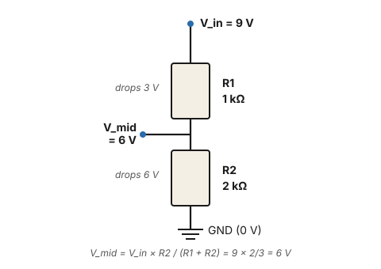
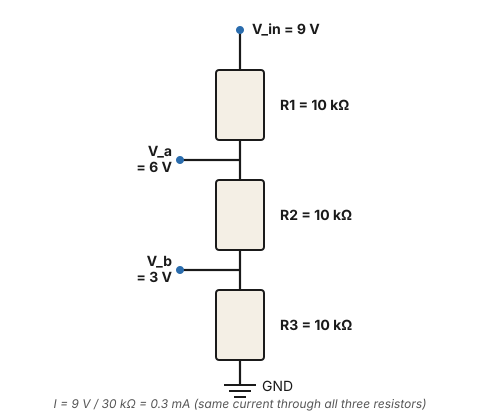

# Exercise 2 — Series, parallel, and voltage dividers

## The concept

When resistors are connected end-to-end (in **series**), the same current flows through all of them. By Ohm's law, each resistor drops a voltage proportional to its resistance:

$$ V_n = I \times R_n $$

If two resistors are in series from V_in to ground, with the midpoint tapped off, the midpoint sits at a fraction of V_in determined by the ratio of resistances. This is the **voltage divider** — one of the most-used circuit patterns in electronics.

<figure class="diagram-fig" markdown="span">
  
  <figcaption>R1 on top, R2 on bottom, midpoint tapped off. The bottom resistor's value (R2) appears in the numerator of the divider formula. Click to zoom.</figcaption>
</figure>

$$ V_{\text{mid}} = V_{\text{in}} \times \dfrac{R_2}{R_1 + R_2} $$

Memorize that the **bottom resistor** appears in the numerator. Intuition: if R₂ is huge (open), the midpoint approaches V_in. If R₂ is tiny (short), the midpoint goes to 0.

## Bench exercise

**Parts:** 9 V battery, two resistors (1 kΩ and 2 kΩ, or anything where you know both values), DMM.

**Circuit:** the 2-resistor divider shown above, with R1 = 1 kΩ on top and R2 = 2 kΩ on bottom.

**Predict:**

$$ V_{\text{mid}} = 9 \times \dfrac{2{,}000}{1{,}000 + 2{,}000} = 9 \times \dfrac{2}{3} = 6\text{ V} $$

Sanity check: R₂ is twice R₁, so R₂ should drop ⅔ of the input and R₁ should drop ⅓. V_mid = 6 V (across R₂) and the voltage across R₁ = 3 V. The two drops add up to 9 V ✓.

Also predict the current flowing through the divider (it's the same through both resistors):

$$ I = \dfrac{V_{\text{in}}}{R_1 + R_2} = \dfrac{9}{3{,}000} = 3\text{ mA} $$

**Build** it. Note that the order of R₁ and R₂ matters — R₁ is the *top* one (between V_in and the tap), R₂ is the *bottom* one (between the tap and ground).

**Measure:**

| Measurement | Predicted | Yours |
|---|---|---|
| V across R₁ (probe + on V_in, − on V_mid) | 3 V | |
| V across R₂ (probe + on V_mid, − on GND) | 6 V | |
| V across the whole divider (probe + on V_in, − on GND) | 9 V (battery) | |
| Sum: V₁ + V₂ should equal V_in | ✓ | |

Now **swap R₁ and R₂** so the bigger resistor is on top. Re-predict, then re-measure:

$$ V_{\text{mid}} = 9 \times \dfrac{1{,}000}{2{,}000 + 1{,}000} = 9 \times \dfrac{1}{3} = 3\text{ V} $$

## What if my number is different?

- **V_mid is way off (e.g., 4.5 V instead of 6 V):** your DMM is "loading" the divider — its internal resistance is in parallel with R₂, lowering the effective bottom-leg resistance and dropping V_mid. This is real and important, and exercise 3 is all about it. For now, if it bothers you, use smaller resistors (1 kΩ and 2 kΩ make loading negligible) — loading becomes severe when divider resistors are in the MΩ range.
- **V_mid drifts as you watch it:** a poor connection somewhere. Reseat the wires on the breadboard.
- **The two drops don't sum to V_in:** measurement error or one probe wasn't where you thought. Re-check.

## A second variation: three resistors

<figure class="diagram-fig" markdown="span">
  
  <figcaption>Three equal 10 kΩ resistors in series across 9 V. Equal resistors → equal drops (3 V each), with intermediate taps at V_a = 6 V and V_b = 3 V. Click to zoom.</figcaption>
</figure>

Predict V_a and V_b (three equal resistors, so the drops are equal — 3 V each):

- V_a = 6 V
- V_b = 3 V
- V across each resistor = 3 V
- Current = 9 V / 30 kΩ = 0.3 mA

Build, measure, confirm. You've just modeled the ST-70's stock bias divider topology — a chain of resistors from the raw bias rail to ground, with the pot wiper tapping off at an intermediate node.

## Resistors in parallel

Series isn't the only way to combine resistors. When two resistors are connected at **both** ends to the same two nodes, they're in **parallel**:

```
V_in ──┬──[R1]──┬── GND
       │        │
       └──[R2]──┘
```

The current now has two paths to ground. Whatever current the source delivers gets *split* between them. The voltage *across* each resistor is the same (both span the same two nodes), but each carries its own current set by Ohm's law:

$$ I_1 = \dfrac{V}{R_1} \qquad I_2 = \dfrac{V}{R_2} \qquad I_\text{total} = I_1 + I_2 $$

If you wanted to replace the pair with a single equivalent resistor R_eq that draws the same total current at the same voltage, you'd need V/R_eq = V/R₁ + V/R₂. Dividing by V:

$$ \dfrac{1}{R_\text{eq}} = \dfrac{1}{R_1} + \dfrac{1}{R_2} $$

??? note "Algebra detour: how does dividing by V give us that?"

    Two rules are doing the work:

    1. **Equality axiom.** If A = B, then A/c = B/c. Whatever you do to one side of an equation, you do to the other.
    2. **Distributive property of division over addition.** (a + b) / c = a/c + b/c. Dividing a sum by something means dividing each term.

    Start from:

    $$\dfrac{V}{R_\text{eq}} = \dfrac{V}{R_1} + \dfrac{V}{R_2}$$

    Divide both sides by V (rule 1), then distribute on the right (rule 2):

    $$\dfrac{V/R_\text{eq}}{V} = \dfrac{V/R_1}{V} + \dfrac{V/R_2}{V}$$

    Simplify each fraction. The pattern is (V/R) / V — V is in the numerator and the divider, so it cancels:

    $$\dfrac{V/R}{V} = \dfrac{V}{R \times V} = \dfrac{1}{R}$$

    Apply to all three terms:

    $$\dfrac{1}{R_\text{eq}} = \dfrac{1}{R_1} + \dfrac{1}{R_2}$$

    In plainer language: V appears as a *multiplicative factor* in every single term — left is V × (1/R_eq), right is V × (1/R₁) + V × (1/R₂). When the same thing multiplies every term in an equation, dividing through by it cancels it from every term, and you're left with what was underneath — here, the 1/R pieces. This is the **common-factor cancellation** trick, and it shows up constantly in circuit work. The same trick turns V_total = IR₁ + IR₂ + IR₃ into R_total = R₁ + R₂ + R₃ for series resistors.

Rearranged for exactly two resistors, this becomes the most-used form:

$$ R_\text{eq} = \dfrac{R_1 \times R_2}{R_1 + R_2} $$

??? note "Algebra detour: how does 1/R_eq = 1/R₁ + 1/R₂ rearrange to that?"

    Two steps: combine the two fractions on the right into one, then take the reciprocal of both sides.

    **Step 1 — combine 1/R₁ + 1/R₂ into a single fraction.** To add two fractions, they need a common denominator. The smallest one that contains both R₁ and R₂ is their product, R₁ × R₂. Give each fraction that denominator by multiplying it by a clever form of 1:

    $$\dfrac{1}{R_1} \times \dfrac{R_2}{R_2} = \dfrac{R_2}{R_1 \times R_2} \qquad \dfrac{1}{R_2} \times \dfrac{R_1}{R_1} = \dfrac{R_1}{R_1 \times R_2}$$

    (Multiplying top and bottom by the same thing doesn't change a fraction's value — it's just multiplying by 1.) Now they share a denominator, so we can add the numerators:

    $$\dfrac{1}{R_1} + \dfrac{1}{R_2} = \dfrac{R_2}{R_1 R_2} + \dfrac{R_1}{R_1 R_2} = \dfrac{R_1 + R_2}{R_1 \times R_2}$$

    So the equation becomes:

    $$\dfrac{1}{R_\text{eq}} = \dfrac{R_1 + R_2}{R_1 \times R_2}$$

    **Step 2 — take the reciprocal of both sides.** If two quantities are equal, so are their reciprocals: multiply both sides of `a = b` by 1/(a × b) and you get 1/b = 1/a. Visually, just flip both fractions upside down:

    $$R_\text{eq} = \dfrac{R_1 \times R_2}{R_1 + R_2}$$

    Done.

    **Alternative path — cross-multiplication.** From `1/R_eq = (R₁ + R₂) / (R₁ × R₂)`, multiply both sides by R_eq × (R₁ × R₂):

    $$R_1 \times R_2 = R_\text{eq} \times (R_1 + R_2)$$

    Then divide both sides by (R₁ + R₂):

    $$\dfrac{R_1 \times R_2}{R_1 + R_2} = R_\text{eq}$$

    Same result, different mechanical path. Both are worth being able to do.

    **Sanity check** with the bench-exercise numbers (R₁ = 10 kΩ, R₂ = 22 kΩ): R_eq = (10,000 × 22,000) / (10,000 + 22,000) = 220,000,000 / 32,000 ≈ **6,875 Ω**, matching the prediction below.

(The shape resembles the voltage-divider formula but it's a different rule entirely — series and parallel obey opposite arithmetic.)

For N resistors in parallel, just keep adding reciprocals: 1/R_eq = 1/R₁ + 1/R₂ + … + 1/R_N.

### Three intuitions that make this stick

1. **Parallel R is always smaller than the smallest individual R.** More paths for current → less total opposition. Two side-by-side pipes carry more water than either alone, so the combined "resistance to flow" is lower than either pipe by itself.
2. **Equal resistors in parallel divide by N.** Two 10 kΩ → 5 kΩ. Three equal → R/3. Useful shortcut.
3. **A much smaller R dominates a much larger R.** 1 kΩ ∥ 1 MΩ ≈ 999 Ω. The big resistor barely conducts anything; the small one does almost all the work. When you're sanity-checking quickly, the smaller R wins.

### Bench exercise — parallel resistors

**Parts:** two resistors (say 10 kΩ and 22 kΩ), DMM.

**Predict** the parallel combination:

$$ R_\text{eq} = \dfrac{10{,}000 \times 22{,}000}{10{,}000 + 22{,}000} = \dfrac{220{,}000{,}000}{32{,}000} \approx 6{,}875\ \Omega $$

Sanity check against intuition 1: R_eq (~6.9 kΩ) is smaller than the smaller of the two (10 kΩ). ✓

**Build** it on the breadboard. Put the two resistors side by side so that both their left leads share a node, and both their right leads share a node. (Two parallel runs of breadboard tie strip work perfectly.)

**Measure** the resistance across the pair with the DMM on ohms mode. You should read close to 6.9 kΩ — within tolerance of both resistors plus DMM accuracy, so anywhere from ~6.5 to ~7.3 kΩ.

Now try **two equal resistors in parallel** (10 kΩ + 10 kΩ): predict 5 kΩ exactly, measure, confirm.

And try **very-unequal** (100 Ω + 100 kΩ): predict ≈ 99.9 Ω (the small one wins almost completely), measure, confirm.

### Why this matters for the DMM and beyond

You've just done the math that makes the *next* exercise (DMM loading) work. The DMM's 10 MΩ input impedance, when probed across a node in a circuit, ends up in **parallel** with whatever was already there. If "whatever was already there" is high-impedance (MΩ range), the DMM significantly changes the effective resistance of that part of the circuit, which shifts the voltage you're trying to measure.

The combine-resistors-in-parallel pattern also shows up:

- **Anywhere two paths share endpoints**: the cathode of a triode tied to its grid bias resistor *and* a bypass cap to ground. The bypass cap acts like a low impedance at signal frequencies — that's a parallel combination of cathode-resistor and cap-impedance, which is why bypassed cathodes have much higher signal-frequency gain.
- **Speaker loads in parallel**: two 8 Ω speakers in parallel = 4 Ω load.
- **Loaded voltage dividers** (exercise 3): R₂ in parallel with the load resistance.

## Why this matters for the ST-70

The **bias network** is exactly this circuit. Following [signal-paths/bias](../signal-paths/bias.md): the −65 V rail (raw bias from the diode) feeds through the 10 kΩ filter resistor (step 20), into the 10 kΩ pot, and through the second 10 kΩ shunt to ground (step 22). When the pot is centered, you have a three-section divider exactly like the variation above — except scaled to 65 V across the chain instead of 9 V, with intermediate values of −43 V and −22 V on the pot's terminals.

Pot wiper at center → grid bias roughly at the midpoint of those = roughly **−32 V**, which is the manual's spec.

Now you understand *why* it's −32 V from first principles. It's just a voltage divider.

The B+ supply uses the same idea with dropping resistors between filter cap sections: 415 V at lug 1, then a drop across the 6.8 kΩ set by the driver board's load current to land at lug 4. (The manual's chart implies ~6 mA → 40 V → 375 V; this build measures ~9.4 mA → 64 V → 349 V. Same V = IR, different real-world current.) **You can predict every B+ rail with V = IR.**

[Next: DMM fundamentals →](03-dmm-fundamentals.md)
