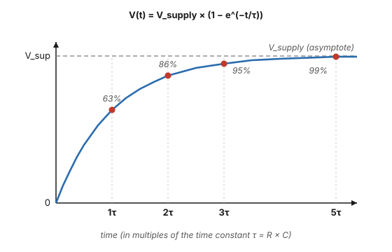
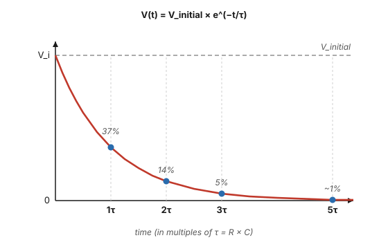
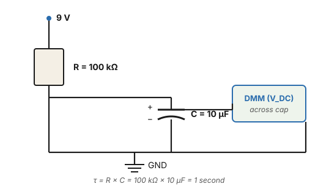
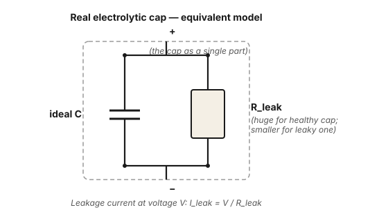

# Exercise 4 — Capacitors at DC

## The concept

A capacitor stores charge. At DC steady-state it acts like an open circuit (no current flows once it's fully charged). But the *getting there* is governed by exactly two equations.

**Charge stored:**

$$ Q = C \times V $$

Q in coulombs, C in farads, V in volts. A 30 µF cap charged to 9 V holds 270 µC of charge.

**Charging through a resistor — the RC time constant:**

When a discharged cap is connected to a voltage source through a resistor, it charges exponentially. The shape of the curve is set by the **time constant τ (tau)**:

$$ \tau = R \times C $$

τ has units of seconds (when R is in ohms and C in farads). After one τ, the cap has reached **63%** of the supply voltage. After 3τ, 95%. After 5τ, 99% — essentially "done."

<figure class="diagram-fig" markdown="span">
  
  <figcaption>The cap rises rapidly at first, then asymptotically approaches V_supply. The shape of the curve is identical for any RC pair — only the time axis stretches or compresses with τ. Click to zoom.</figcaption>
</figure>

The exact equation:

$$ V(t) = V_{\text{supply}} \times (1 - e^{-t/\tau}) $$

**Discharging through a resistor:**

When you remove the source and connect the charged cap across just a resistor, it discharges with the same time constant. After one τ, V has dropped to **37%** of where it started.

$$ V(t) = V_{\text{initial}} \times e^{-t/\tau} $$

<figure class="diagram-fig" markdown="span">
  
  <figcaption>The mirror image of the charging curve: rapid fall at first, asymptotic approach to zero. Same τ as the charge curve uses. Click to zoom.</figcaption>
</figure>

If you know any three of (V_initial, V_final, t, τ), you can solve for the fourth. **This is how you compute capacitor leakage.**

## Bench exercise 4A — predict and measure a charge curve

**Parts:** 9 V battery, 100 kΩ resistor, 10 µF electrolytic cap (any voltage rating ≥ 16 V), DMM.

**Circuit:**

<figure class="diagram-fig" markdown="span">
  
  <figcaption>The R and C set the time constant; the DMM in DC volts mode reads the cap voltage as it climbs. Discharge the cap (short its leads briefly) before each run. Click to zoom.</figcaption>
</figure>

**Predict:**

τ = R × C = 100,000 × 10 × 10⁻⁶ = **1 second**

So the cap charges to:
- 63% × 9 V = **5.7 V at t = 1 s**
- 86% × 9 V = **7.7 V at t = 2 s**
- 95% × 9 V = **8.55 V at t = 3 s**
- 99% × 9 V = **8.9 V at t = 5 s**

**Build it on the breadboard.** Discharge the cap first (short its leads with a wire for a second). Connect the DMM in DC volts mode across the cap (red probe on cap +, black on cap −). Now connect the battery to the top of the resistor.

**Measure:** watch the DMM and time the climb. You should see roughly:

| Time (s) | Predicted V | Yours |
|---|---|---|
| 0 | 0 | |
| 1 | 5.7 | |
| 2 | 7.7 | |
| 3 | 8.55 | |
| 5 | ~8.9 | |

The numbers won't be exact — your phone stopwatch is imprecise, the cap is 20% tolerance, the resistor is 5% tolerance. But the *shape* and *order of magnitude* should match. You should clearly see the curve flatten as it approaches V_supply.

Now **try it with a 1 MΩ resistor** instead of 100 kΩ. Predict: τ = 10 s, so V reaches 5.7 V at t = 10 s, etc. The whole curve stretches out by 10×. Confirm.

## Bench exercise 4B — discharge curve

Charge the cap up (skip the resistor, hold the battery + to cap +, − to cap −, for ~3 seconds). Disconnect the battery.

Now put **just the DMM in DC volts mode across the cap**, nothing else. The DMM's 10 MΩ input is the discharge path.

**Predict:** τ = 10 MΩ × 10 µF = **100 seconds**.

So at t = 100 s, the cap should still be at 0.37 × 9 V = **3.3 V**. At t = 200 s, 1.2 V.

**Measure:** start the stopwatch when you disconnect the battery, watch the DMM, record the voltage every 30 seconds for 2–3 minutes. Confirm the slow decay matches the prediction (within ~20%).

## Bench exercise 4C — modeling cap leakage

A real electrolytic cap has some internal leakage, modeled as an equivalent parallel resistor:

<figure class="diagram-fig" markdown="span">
  
  <figcaption>The dashed box is what you'd see at the bench — a single capacitor part. Inside, the equivalent model is an ideal cap in parallel with a leakage resistance. A healthy cap has R_leak in the GΩ range; a leaky cap might be down at MΩ. Click to zoom.</figcaption>
</figure>

R_leak is huge (MΩ to GΩ) for a healthy cap, smaller for a leaky one. You can't directly measure R_leak — but you can infer it from how fast the cap discharges when nothing else is connected.

**Simulate a leaky cap:** put a 1 MΩ resistor in parallel with your 10 µF cap. Now the total discharge path is the meter's 10 MΩ in parallel with that 1 MΩ:

$$ R_{\text{parallel}} = \dfrac{1 \times 10}{1 + 10}\text{ MΩ} \approx 909\text{ kΩ} $$

τ = 909 kΩ × 10 µF = **9.09 seconds**

So a cap charged to 9 V should drop to 9 × 0.37 = **3.3 V in 9 s** (and 1.2 V in 18 s).

Charge the cap to 9 V, disconnect the battery, watch the decay. You should see the rapid drop to ~3 V in about 9 s, exactly as predicted.

That's what a leaky cap looks like. The math is general: **the discharge time constant tells you the leakage resistance directly**, if you account for the meter's 10 MΩ in parallel.

## The general inverse calculation

Given:
- V_initial (V at start)
- V_final (V at some later time)
- t (the elapsed time in seconds)
- C (the cap value in farads)

Solve for total discharge resistance:

$$ \tau = \dfrac{-t}{\ln(V_{\text{final}} / V_{\text{initial}})} $$

$$ R_{\text{total}} = \dfrac{\tau}{C} $$

Then back out R_leak from R_total by un-paralleling the DMM's 10 MΩ:

$$ R_{\text{leak}} = \dfrac{R_{\text{total}} \times R_{\text{DMM}}}{R_{\text{DMM}} - R_{\text{total}}} $$

(If R_total is small compared to R_DMM, R_leak ≈ R_total. If R_total approaches R_DMM, you're seeing the DMM's loading and the cap leakage is very small.)

## What if my number is different?

- **Cap charges much faster than τ predicts:** you have a smaller cap than the label says (uncommon), or the resistor is smaller than you think (check it).
- **Cap charges much slower:** larger cap, or larger resistor, or measurement is too coarse-grained.
- **Cap discharges way faster than predicted with no parallel resistor:** the cap is leaky. Compute R_leak from the inverse calculation.
- **The shape doesn't look exponential — looks linear:** your time scale is too short to see the curvature, or measurement error.

## Bringing it back to your filter cap test

Your earlier test on the ST-70 filter cap (lug 2, ~30 µF section): charged to 9 V, dropped to 1 V in 45 s. Run the inverse calculation:

$$ \tau = \dfrac{-45}{\ln(1/9)} = \dfrac{-45}{-2.197} = 20.5\text{ s} $$

$$ R_{\text{total}} = \dfrac{20.5}{30 \times 10^{-6}} = 683{,}000\text{ Ω} = 683\text{ kΩ} $$

That R_total is much smaller than the DMM's 10 MΩ, so the DMM's loading is small (about 7% of the discharge path). The cap's actual leakage R is approximately:

$$ R_{\text{leak}} = \dfrac{683 \times 10{,}000}{10{,}000 - 683} \approx 733\text{ kΩ} $$

At the test voltage (~5 V average across the discharge), that's a leakage current of about:

$$ I_{\text{leak}} = \dfrac{5}{733{,}000} \approx 7\text{ µA average} $$

Now, **electrolytic cap leakage scales strongly with voltage** — not linearly, but typically as something like V to the 1.5–2 power. At the operating voltage of 435 V (87× the test voltage), leakage current would be much higher in absolute terms, but the *equivalent leakage resistance* might be similar or even higher (because the cap's dielectric forms more strongly at higher voltages).

So the bench measurement at 9 V doesn't directly predict behavior at 435 V — it's only a **first-look screening test**. A cap that discharges 9V → 1V in 45 s is in the "marginal, possibly fine, possibly worth testing further" category. (For this build, that 45-second result — measured June 2026, with the amp subsequently measuring healthy in full operation — is the recorded baseline for the lug-2 section. The number to watch isn't the absolute value; it's whether a future repeat of the same test decays substantially *faster* than 45 s, which would mean the cap is degrading.) The definitive test would be to apply rated voltage through a current-limiting resistor (using the variac), let it sit for several minutes to fully form, then measure the steady-state leakage current. That's exercise 6.

The point isn't that I'll tell you "it's fine" — it's that **you now have the math to compute precisely what your measurement means**.

## Why this matters for the ST-70

The B+ supply, the bias supply, the coupling caps in the audio path, and the snubber caps — every capacitor on the chassis follows τ = RC for its charge and discharge behavior. Understanding why an electrolytic discharges through its own leakage at one rate and through a 270 kΩ bleeder at another rate, and why each filter cap section reaches steady state at a different speed, is the foundation for diagnosing supply problems at bring-up.

[Next: The oscilloscope →](05-oscilloscope-fundamentals.md)
