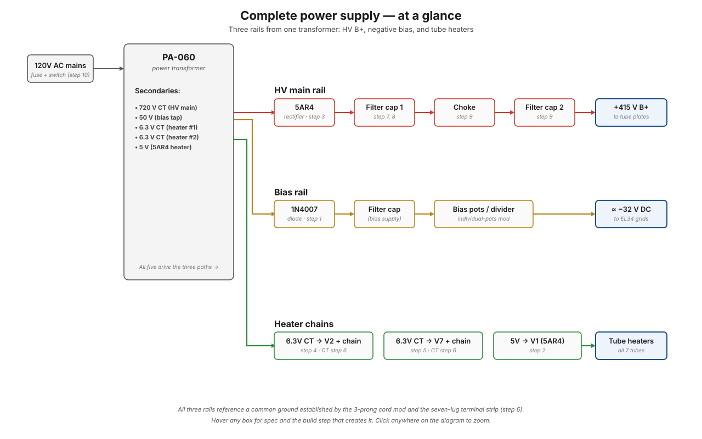

# Power supply wiring — page 6 overview

This page introduces the wiring procedure on page 6 of the Dynaco manual: the conventions used for instructions, the role each connection plays in the overall power supply, and a one-look summary of the three power-supply paths the page 6 wiring creates.

!!! note "Diagram TODO"
    The "complete power supply at a glance" ASCII diagram below will be replaced with a proper SVG schematic in [phase 3](../../index.md).

## Manual page 6 introduction

The manual opens page 6 with a general note about transformer leads and a wiring procedure introduction.

> *NOTE: Transformer leads are not cut to length and accordingly these must be shortened to suit in each step. Allow sufficient length to make each connection and dress wires as shown in the pictorial. Avoid tension of wire between transformer and connection.*

> *WIRING PROCEDURE: Each length of hookup wire specified should have ¼" of insulation stripped from each end unless otherwise specified. "Tinning" of ends is suggested.*

### What this is asking you to do

**"Dressing" wires** means routing them neatly. The pictorial shows the intended path — usually along the chassis edge, or through cable channels, with bends that minimize stress on the solder joints. Two reasons:

1. **Mechanical** — wires bouncing against each other or pulling on solder joints over time will eventually fail. A well-dressed wire is at rest in its routed position, with no tension.
2. **Electrical** — heater wires (which carry AC current) should run close to the chassis to minimize hum radiation; signal wires should run perpendicular to heater wires where possible to avoid coupling.

**"Tinning" the wire ends** means melting a thin coat of solder onto the bare copper before making the connection. This:

- Prevents the wire strands from fraying as you push the wire through the eyelet of a terminal lug
- Ensures a clean solder joint by pre-wetting the wire with solder
- Provides a brief mechanical stiffening that helps push the wire into tight spaces

### Convention used throughout

- **(S)** at the end of a step means *solder this connection now* — make a permanent solder joint.
- A pin number without (S) means *make the connection but leave it unsoldered* — another wire will land on the same pin in a later step, and you'll solder them all together at once.
- "Pin #N of socket V*X*" refers to the pin number as viewed from the wiring side (bottom of the chassis), with the standard octal or 9-pin socket numbering.

See [reading this manual](../../getting-started/reading-this-manual.md) for the full convention list.

## The complete power supply at a glance

Once page 6 is complete, the power supply has three stages of operation: a high-voltage path, a bias path, and the heater paths.

<figure class="diagram-fig" markdown="span">
  
  <figcaption>From the mains on the left to the three tube-facing rails on the right. Hover any block for spec and the build step that creates it. Click to zoom.</figcaption>
</figure>

The wiring procedure on page 6 builds the **inputs** to all three of these paths. Steps 1–11 connect every PA-060 secondary lead to its appropriate destination. After page 6, the rectified outputs and filter networks get assembled, and eventually the circuit is complete.

## Step-by-step

- [Step 1 — Bias diode](step-01-bias-diode.md)
- [Step 2 — 5AR4 heater](step-02-5ar4-heater.md)
- [Step 3 — 5AR4 anodes](step-03-5ar4-anodes.md)
- [Step 4 — V2 heater](step-04-v2-heater.md)
- [Step 5 — V7 heater](step-05-v7-heater.md)
- [Step 6 — Heater CTs](step-06-heater-cts.md)
- [Step 7 — HV center tap](step-07-hv-ct.md)
- [Step 8 — OPT B+ feeds](step-08-opt-b-plus.md)
- [Step 9 — Choke](step-09-choke.md)
- [Step 10 — Primary fuse & switch](step-10-primary-fuse-switch.md)
- [Step 11 — Right OPT secondaries](step-11-right-opt-secondaries.md)
