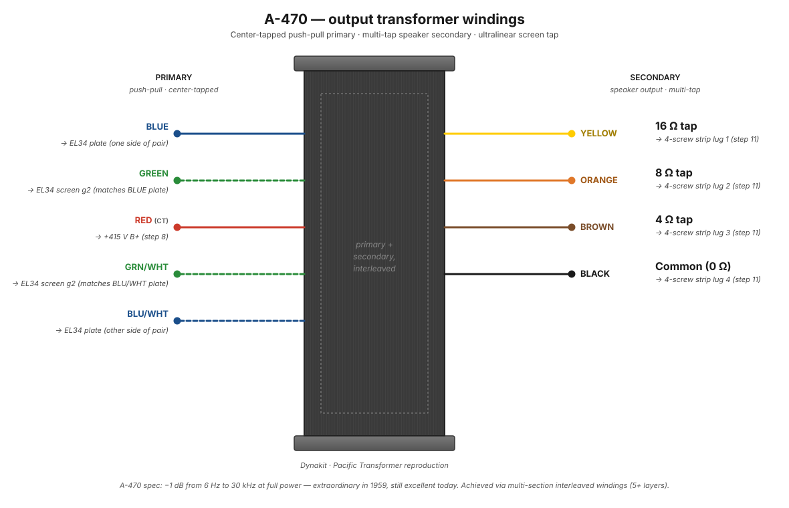

# A-470 output transformer

The A-470 is the output transformer in the ST-70 — the part that turns the high-impedance, high-voltage AC swing on the EL34 plates into a low-impedance current that can drive a speaker. There are two A-470s in the amp, one per channel.

This build uses the Dynakit-branded Pacific Transformer reproductions, which are widely considered faithful to the original 1959 Dynaco specs.

<figure class="diagram-fig" markdown="span">
  
  <figcaption>Push-pull primary on one end (BLUE + GREEN plates, RED center tap to B+, BLU/WHT + GRN/WHT ultralinear screen taps); speaker secondary on the other end (BLACK common, BROWN 4 Ω, ORANGE 8 Ω, YELLOW 16 Ω). Hover any lead for its role. Click to zoom.</figcaption>
</figure>

## Specs (per manual page 24)

| Parameter | Value |
|---|---|
| Primary impedance | 4300 Ω plate-to-plate, center-tapped |
| Power rating | 35 W |
| Lead length | 12" |
| Mounting | 4 bolts, ⅝" hole centers |

The A-470 is rated for the ST-70's 35W per channel and uses a 4300Ω plate-to-plate impedance — matched to a pair of EL34s biased at ~50 mA each.

## Lead colors

The A-470 has **9 leads total**: 5 on the primary end and 4 on the secondary end. The two ends are physically separated by the transformer body, so there's no risk of confusing primary and secondary leads.

### Primary end (5 leads)

| Lead | Purpose |
|---|---|
| Blue | Plate, one side of push-pull primary |
| Green | Plate, other side of push-pull primary |
| Red | Primary center tap (B+ feed from the choke) |
| Blue/White | Ultralinear screen tap, matched to the blue plate |
| Green/White | Ultralinear screen tap, matched to the green plate |

### Secondary end (4 leads)

| Lead | Purpose |
|---|---|
| Black | Speaker common (0 Ω reference) |
| Brown | 4 Ω secondary tap |
| Orange | 8 Ω secondary tap |
| Yellow | 16 Ω secondary tap |

The matching pairs (BLU plate + BLU/WHT screen tap, GRN plate + GRN/WHT screen tap) are deliberate — each ultralinear screen tap belongs to the same half of the primary winding as its matching plate lead. Mixing them up (e.g., BLU plate with GRN/WHT screen tap) would break the ultralinear configuration and likely sound terrible or oscillate.

## What this transformer does

*Page to be expanded.* Planned coverage:

- Primary: center-tapped, push-pull, two plate connections (blue + green) and a B+ feed (red center tap).
- Secondary: multiple impedance taps (4Ω, 8Ω, 16Ω) plus a common (black) — different speaker loads use different tap pairs.
- The ultralinear screen taps (blue/white + green/white) — what UL operation is and why this transformer supports it.
- Interleaving: see [how transformers work](../theory/how-transformers-work.md#what-separates-a-good-output-transformer-from-a-great-one) for why this matters.
- The original spec: −1dB from 6Hz to 30kHz at full power.
- Pacific Transformer reproductions vs. original Dynaco vs. third-party clones.
- Failure modes (very rare; output transformers in well-treated Dynacos last forever).

## See also

- [How transformers work](../theory/how-transformers-work.md) — general theory, with focus on output transformer interleaving
- [Push-pull topology](../theory/push-pull-topology.md) — how the center-tapped primary is driven
- [Feedback](../theory/feedback.md) — the 16Ω tap is where the global feedback loop originates
- [Transformer specs](../appendices/transformer-specs.md) — at-a-glance reference
