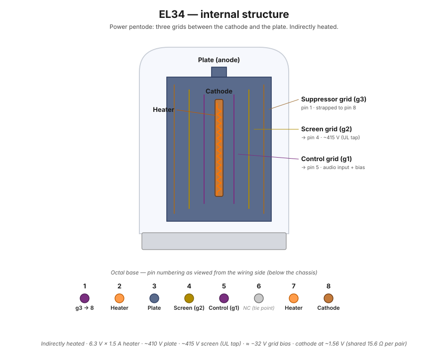

# EL34 output tube

The EL34 is the workhorse pentode that produces the ST-70's output power. Four of them, configured as two push-pull pairs, drive the two [A-470 output transformers](a-470-output-transformer.md). This build uses an Electro-Harmonix EL34 Apex Matched Quad.

<figure class="diagram-fig" markdown="span">
  
  <figcaption>Power pentode: cathode at the center, three grids (g1 control, g2 screen, g3 suppressor), and an outer plate. Hover any element or pin for spec and wiring details. Click to zoom.</figcaption>
</figure>

## Pinout (octal base, viewed from wiring side)

| Pin | Function | Notes |
|---|---|---|
| 1 | Suppressor grid (g3) | Strapped to pin 8 (cathode) externally at the socket in this build |
| 2 | Heater | 6.3V AC |
| 3 | Plate (anode) | HV B+ via OPT primary (~410 V) |
| 4 | Screen grid (g2) | Fed from the OPT's ultralinear taps at ~415 V — slightly *above* the plate; no dropping resistor |
| 5 | Control grid (g1) | Negative bias from bias supply |
| 6 | No connection | Used as a tie point for the 1 kΩ grid stopper |
| 7 | Heater | 6.3V AC |
| 8 | Cathode | Usually grounded via small R |

*Page to be expanded.* Planned coverage:

- Pentode operation: cathode, control grid, screen grid, plate, and what each does
- Heater specs (6.3V at 1.5A per tube)
- Operating points: idle current, plate voltage, screen voltage in the ST-70 config
- Why we set bias and what happens if it drifts
- Triode-strap vs. ultralinear vs. pentode mode
- Failure modes: red-plating, screen failure, cathode poisoning
- Tube matching and why we use a "matched quad"
- EL34 vs. KT77 vs. 6CA7 vs. 6L6GC — what swaps are reasonable

## In this build

The EL34s occupy sockets **V2, V3, V6, V7** — V2/V3 are the left channel pair, V6/V7 are the right channel pair. They're driven by the [6GH8A phase splitters](6gh8a-driver-tube.md) on the [PC-3A board](pc-3a-driver-board.md).

Wiring steps that touch the EL34 sockets:

**Heaters** (pins 2 and 7):

- [Step 4](../build/power-supply/step-04-v2-heater.md) — green pair → V2 heater (left channel start)
- [Step 5](../build/power-supply/step-05-v7-heater.md) — brown pair → V7 heater (right channel start)
- [Step 16](../build/output-stage/step-16-v6-v7-heater-daisy.md) — V6 ↔ V7 heater daisy
- [Step 17](../build/output-stage/step-17-v2-v3-heater-daisy.md) — V2 ↔ V3 heater daisy

**Plates and screens** (pins 3 and 4):

- [Step 13](../build/output-stage/step-13-left-opt-primary.md) — left OPT primary (V2/V3 plates + UL screens)
- [Step 14](../build/output-stage/step-14-right-opt-primary.md) — right OPT primary (V6/V7 plates + UL screens)

**Cathode sense for bias measurement** (pin 8):

- [Step 31](../build/output-stage/step-31-v2-cathode-sense.md) — V2 cathode-sense resistor (15.6 Ω)
- [Step 32](../build/output-stage/step-32-v2-v3-cathode-daisy.md) — V2 ↔ V3 cathode daisy
- [Step 33](../build/output-stage/step-33-v3-to-left-biaset.md) — V3 cathode-sense → left Biaset socket
- [Step 34](../build/output-stage/step-34-v7-cathode-sense.md) — V7 cathode-sense resistor
- [Step 35](../build/output-stage/step-35-v6-v7-cathode-daisy.md) — V6 ↔ V7 cathode daisy
- [Step 36](../build/output-stage/step-36-v6-to-right-biaset.md) — V6 cathode-sense → right Biaset socket

**Control grid and grid stoppers** (pin 5/pin 6):

- [Step 37](../build/output-stage/step-37-grid-stoppers.md) — 1 kΩ grid stoppers across pins 5–6 on all four sockets
- [Step 39](../build/driver-stage/step-39-eyelet-23-to-v6.md) — coupling cap output (eyelet 23) → V6 grid
- [Step 40](../build/driver-stage/step-40-eyelet-22-to-v7.md) — coupling cap output (eyelet 22) → V7 grid
- Later (steps 55–56): coupling cap outputs → V3 and V2 grids
- Later (step 48): HF feedback sample from V6 pin 4 (UL tap) back to PC-3A board

Through step 46, all four EL34s have heaters, plates, screens, and cathodes wired. The right-channel grids (V6, V7) have coupling caps landed; the left-channel grids (V2, V3) will be landed in steps 55–56.

## See also

- [A-470 output transformer](a-470-output-transformer.md) — what the EL34 plates drive
- [Push-pull topology](../theory/push-pull-topology.md) — how the four EL34s work together
- [Individual bias pots modification](../modifications/individual-bias-pots.md) — the per-tube bias adjustment
