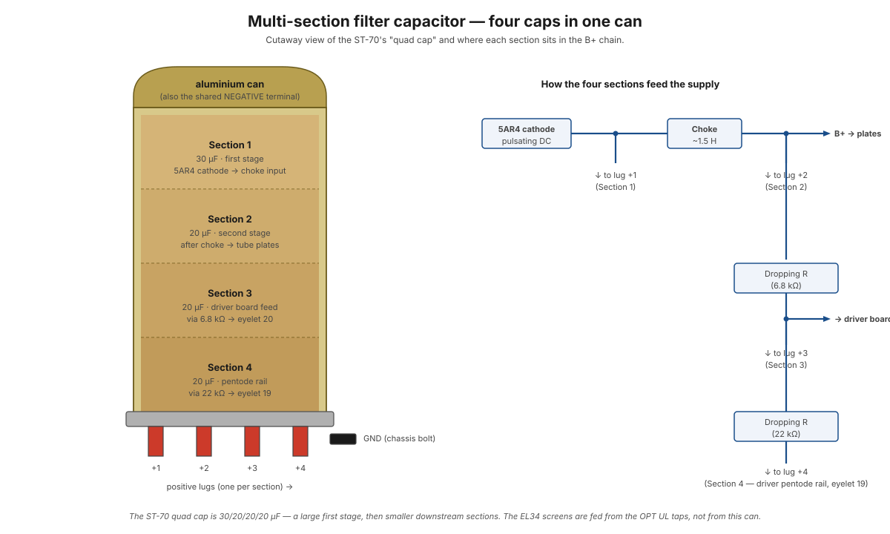

# Filter capacitors

The ST-70 uses a **multi-section filter capacitor** — a single cylindrical aluminium can containing four separate electrolytic capacitors with a shared negative terminal (the can itself). Common nicknames: "quad cap," "FP cap" (Sprague's brand name was Filter, Polarized), "twist-lock cap."

These caps are the energy reservoirs that smooth the 5AR4's rectified pulse output into the clean DC the tubes need on their plates. They are also the most likely component in any vintage Dynaco to need replacement — original electrolytics dry out and lose capacitance over decades.

<figure class="diagram-fig" markdown="span">
  
  <figcaption>Cutaway of the quad cap on the left; how each section feeds the supply on the right. The can itself is the shared negative terminal — the chassis bolt that holds it in place is the ground connection. Hover any section for what it does. Click to zoom.</figcaption>
</figure>

## What it physically is

One aluminium cylinder, ~1.5" diameter × 3" tall, mounted vertically on the chassis. Inside are four separate rolls of electrolytic-cap construction — each one an aluminium foil + paper + electrolyte sandwich, wound into a roll. Each roll has its own positive lead (brought out as one of the four bottom lugs); all four share the can as their common negative terminal.

The can mounts to the chassis with a single twist-lock or threaded bolt. That mounting bolt **is the negative connection** — no separate ground wire. This means:

- A loose or corroded cap mount = a loose ground = audible hum.
- The chassis itself becomes part of the cap's negative return.
- When you replace the cap, the new can's body must be clean and tight against the chassis.

## Typical ST-70 values

Original Dynaco ST-70s shipped with various combinations across the years. A common configuration:

| Section | Value | Voltage | Function |
|---|---|---|---|
| 1 | 30 µF | 525 V | First filter stage (5AR4 cathode → choke input) |
| 2 | 20 µF | 525 V | Second filter stage (after choke → output tube plates) |
| 3 | 20 µF | 525 V | Screen grid / driver supply (via dropping R) |
| 4 | 10 µF | 525 V | Input stage / bias decoupling |

Modern replacements often use slightly larger values (40-40-20-20 or 47-47-22-22 µF) — more capacitance means less ripple, with no downside if the rectifier can handle the inrush. Many replacement parts are rated to 500 V or 525 V WV; some are 450 V (acceptable if your line voltage is well-behaved).

## Why a multi-section can instead of four separate caps

Three reasons:

1. **Mechanical efficiency.** One mounting hole, one bolt, one piece of hardware. Saves chassis real estate.
2. **Shared ground.** All four negative returns share one low-impedance path (the can's chassis bond). Separate caps would each need their own ground wire — adding ground loops and potential hum.
3. **Cost.** Cheaper to manufacture one assembly than four.

The downside: when one section fails, you replace the whole can. There's no servicing one cap inside.

## Why electrolytic specifically

Electrolytic capacitors give the most capacitance per unit volume of any common type — by a wide margin. A 30 µF / 525 V film capacitor would be the size of a small bottle; the same value in electrolytic fits in a 1.5" diameter can.

The tradeoffs:

- **Polarized.** Wrong polarity will rupture them, sometimes spectacularly. The bottom lugs are clearly marked.
- **Slow** in the high-frequency sense — they're great at filtering 120 Hz mains ripple but not ideal for RF bypass. Some builds add small film caps in parallel for that reason.
- **Limited lifespan.** The liquid electrolyte slowly dries through the rubber end seal. Original 1960 caps are generally end-of-life today.

For a B+ filter where you want bulk capacitance at audio frequencies, electrolytic is the right choice.

## Voltage rating

The ST-70's B+ rail sits at ~450 V DC. During startup, before the load fully comes on, it can briefly reach 500 V+ — so the caps need a working-voltage rating *above* worst-case startup voltage.

- **525 V WV** caps give comfortable headroom; this is the canonical Dynaco spec.
- **500 V WV** parts are common today and acceptable if your mains is well-regulated.
- **450 V WV** parts are risky — close to startup voltage, no margin for line surges.

Don't undershoot the voltage rating. An overvoltaged electrolytic doesn't just stop working; it can rupture and spray hot corrosive electrolyte.

## Failure modes

These caps fail in three ways, in roughly increasing severity:

### Drying out (the common slow death)

The electrolyte slowly evaporates through the end seal over decades. Symptoms:

- Audible 120 Hz hum on the output (the cap can't smooth ripple any more).
- Reduced bass response, "loose" sound.
- Higher ESR (equivalent series resistance) on a capacitance/ESR meter.
- Measured capacitance dropping below ~70% of marked value.

Any cap older than ~30 years should be assumed at or near end-of-life. Original 1960s caps in a working ST-70 today are statistically lucky.

### Slow leakage (subtle but corrosive)

The cap's insulation breaks down slightly, letting a small DC current flow continuously through the cap. Symptoms:

- The cap stays warm even with no signal.
- Slightly elevated current draw from the rectifier.
- In extreme cases, the cap "boils" — visible bulging end seal, electrolyte weeping out.

A leaky cap won't filter properly AND it's slowly killing the 5AR4 by drawing extra current. Replace immediately if you spot this.

### Catastrophic shorting (sudden, dangerous)

Internal aluminium foil breaks through its oxide layer and contacts the other plate. Result: a dead short across the B+ rail. Consequences:

- The 5AR4 dumps full short-circuit current — often destroys the rectifier.
- The power transformer secondary can overheat in seconds.
- The fuse blows (if you have one in the HV path) or the primary fuse blows.
- Sometimes the cap ruptures — explosive failure, electrolyte sprays.

This is the failure mode that makes capacitor replacement non-optional after long storage. A cap that's been sitting unpowered for years can short on first power-on.

## Reforming old caps — controversial

Some people argue that you can "reform" an old electrolytic by slowly ramping up voltage with a variac, letting the oxide layer re-form, and bringing the cap back to spec.

In practice:

- It works for caps that are *slightly* aged but otherwise sound.
- It doesn't work for caps with dried-out electrolyte (no electrolyte = no oxide chemistry).
- It can work, briefly — and then the cap fails catastrophically a week later.

Modern view: don't bother. Caps are $5-15 each; new caps are reliable for decades. The time spent reforming is worth less than the part cost.

## Modern replacements

Several manufacturers make direct twist-lock replacements for the Dynaco quad cap:

- **F&T (Frolyt).** German-made, well-respected. Common values include 40-40-20-20 µF / 525 V.
- **CE Manufacturing.** US-made, modern reproductions of the classic Mallory/Sprague form factor.
- **JJ Electronic.** Czech-made, popular in guitar amp circles, available in Dynaco-compatible sizes.
- **Sprague Atom (separates).** Not a quad cap — four individual axial-lead caps wired up to a phenolic board. Some builders prefer this for serviceability and ease of swapping individual sections.

The choice between "quad cap" and "Sprague Atom rebuild" is largely aesthetic — sonically they're indistinguishable.

## In this build

The quad filter cap sits on the chassis between the rectifier and the choke. Wiring steps that touch it:

- [Step 7](../build/power-supply/step-07-hv-ct.md) — red/yellow CT lands at the cap's ground area (the chassis bolt holding the can).
- [Step 8](../build/power-supply/step-08-opt-b-plus.md) — A-470 red leads (OPT primary CTs) land at lug 1.
- [Step 9](../build/power-supply/step-09-choke.md) — choke leads connect between lug 1 and lug 2 (LC filter pair).
- [Step 29](../build/output-stage/step-29-rectifier-to-filter-cap.md) — 5AR4 cathode (V1 pin 8) → lug 2 (the raw-rectified input to the choke).
- [Step 30](../build/output-stage/step-30-b-plus-dropping-resistor.md) — 6.8 kΩ dropping resistor between lug 1 and lug 4 (creates the screens/triode-plate rail).
- [Step 41](../build/driver-stage/step-41-eyelet-19-to-cap-3.md) — lug 3 → PC-3A eyelet 19 (delivers the lowest B+ rail to the board for the pentode plate load).
- [Step 42](../build/driver-stage/step-42-22k-dropping-resistor.md) — 22 kΩ dropping resistor between lug 3 and lug 4 (creates the pentode-plate rail at lug 3).
- [Step 43](../build/driver-stage/step-43-eyelet-20-to-cap-4.md) — lug 4 → PC-3A eyelet 20 (delivers the screens/triode-plate rail to the board).

Through step 46 all four cap sections are wired into the B+ cascade — the cascade lives entirely on the filter cap chassis (the 22 kΩ between lugs 3 and 4 is mounted on the cap itself, not on the PC-3A board). Voltage at each lug at idle:

| Lug | Voltage | Role |
|---|---|---|
| 2 | ~435 V | Raw rectified DC (input to choke) |
| 1 | ~415 V | After choke — main B+, OPT primary CTs |
| 4 | ~375 V | After 6.8 kΩ — pentode screens + triode plates (via eyelet 20) |
| 3 | ~305 V | After 22 kΩ — pentode plate load (via eyelet 19) |

See [B+ signal path](../signal-paths/b-plus.md) for the full cascade.

## Safety reminder

A 30 µF cap at 450 V stores **3 joules** — enough to ruin your day if it discharges through your hand. Multiple caps in parallel store even more.

**Always discharge filter caps before working inside a powered-off amp.** See [high-voltage safety](../test-equipment/high-voltage-safety.md#discharging-filter-caps) for the discharge procedure. Don't assume the bleeder resistor (if any) has drained them.

## See also

- [Rectification — smoothing](../theory/rectification.md#smoothing-from-pulsating-dc-to-clean-dc) — what filter caps do conceptually
- [Choke](choke.md) — the inductor that pairs with the filter caps
- [High-voltage safety](../test-equipment/high-voltage-safety.md) — *required reading* before touching these caps
- [Step 7](../build/power-supply/step-07-hv-ct.md), [Step 8](../build/power-supply/step-08-opt-b-plus.md), [Step 9](../build/power-supply/step-09-choke.md) — where the cap is wired up
