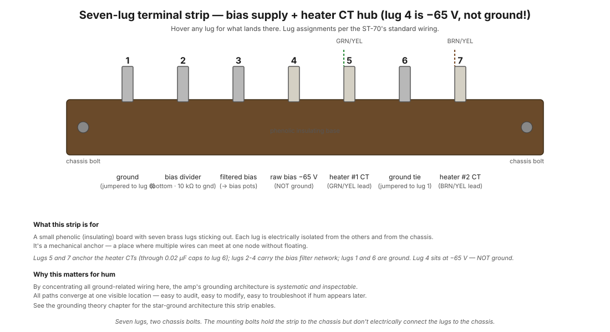

# Seven-lug terminal strip

A small phenolic (insulating) board with seven brass lugs sticking out, mounted to the chassis by two bolts. Each lug is electrically isolated from the others and from the chassis itself. It exists for one reason: in a point-to-point amp, you can't float wires in mid-air, you need physical anchor points where multiple wires can meet at a single node.

In the ST-70 specifically, this strip is also the visible embodiment of the amp's **[star grounding architecture](../theory/grounding-and-hum.md)** — most of the ground-related decisions in the amp converge here, by design, so the entire grounding scheme is inspectable from one location.

<figure class="diagram-fig" markdown="span">
  
  <figcaption>The strip with its seven lugs and two chassis-mounting bolts. Lugs 5 and 7 are the canonical heater-CT anchors (wired in step 6). Other lugs vary by schematic revision but serve roughly similar grounding-network roles. Hover any lug for details. Click to zoom.</figcaption>
</figure>

## What it physically is

Approximate dimensions: ~3" wide × 0.5" tall, mounted horizontally on the chassis somewhere convenient to all the components whose grounds land there. Two countersunk holes at the ends let it bolt down with #6 or #8 screws.

The "phenolic" is an old-school thermoset plastic resin (Bakelite-family) that's been used in electrical insulators since the 1920s. Modern equivalents use similar materials. The properties that matter: it's electrically insulating, dimensionally stable, and tolerates the heat radiating from nearby tubes.

The lugs are stamped brass with a small hole at the top for wire termination — you push the stripped wire end through the hole, bend it over, solder.

## Lug assignments (this build)

| Lug | What lands here | Wired in step |
|---|---|---|
| 1 | Schematic-version dependent — often input stage / coupling cap ground tie | later steps |
| 2 | Schematic-version dependent — often bias network reference | later steps |
| 3 | Schematic-version dependent | later steps |
| 4 | Signal ground (star-point link to chassis) | later steps |
| **5** | **Heater #1 CT (GRN/YEL lead from PA-060)** | **[Step 6](../build/power-supply/step-06-heater-cts.md)** |
| 6 | Schematic-version dependent | later steps |
| **7** | **Heater #2 CT (BRN/YEL lead from PA-060)** | **[Step 6](../build/power-supply/step-06-heater-cts.md)** |

Lugs 5 and 7 are universally the heater-CT anchors across all ST-70 schematic revisions. The others vary somewhat between revisions — refer to the Version B schematic for your specific PC-3A driver board.

## Why heater CTs go to separate lugs (5 and 7)

The two 6.3V heater windings power separate channels of the amp:

- Winding #1 (GRN pair) → tube heaters for channel A (V2, V3, half the driver tubes).
- Winding #2 (BRN pair) → tube heaters for channel B (V6, V7, the other half).

Tying each CT to its OWN lug means each channel's heater-CT path eventually reaches signal ground via a path near *that channel's* sensitive components. This is the [star grounding](../theory/grounding-and-hum.md) principle applied to heaters: independent return paths, not shared.

If both heater CTs landed on the same shared lug, you'd create a **ground loop** between the two channels. Heater current variations in one channel would couple into the other's ground reference. Audible result: weird intermodulation, or hum that's worse on one side but loud on both.

## Why one strip instead of separate connections

You could ground the heater CTs directly to the chassis at the transformer with a solder lug under one of the mounting bolts. That would work, electrically.

But routing the leads to this terminal strip serves a design purpose: it concentrates all the ground-related wiring at a known location, making the amp's grounding scheme **systematic and inspectable**. If you're troubleshooting a hum issue years from now, you know where to look — all the grounding decisions are visible at the terminal strip rather than scattered across the chassis.

This is the philosophy of point-to-point wiring done well: every electrical decision should be visible, traceable, and modifiable. The terminal strip is the embodiment of that philosophy for the ground network.

## Reading the lug layout

The lugs are numbered 1 through 7 left to right (or right to left depending on chassis orientation — the Dynaco manual specifies which). Lug numbering follows physical position, not function. To find lug 5 specifically: count from one end, third from the right (since there are 7 lugs and 7−5+1=3).

When you're wiring step 6, the manual will say "lug #5" — count carefully. A misidentified lug means the heater CT ends up at the wrong network node.

## How the strip relates to the chassis

The mounting bolts hold the strip mechanically to the chassis but DO NOT connect any lug to the chassis electrically. The chassis-to-lug connection (where the star ground is actually established) happens via a separate dedicated wire from one of the lugs (usually lug 4) to a chassis bolt elsewhere.

This separation matters: it means you can change the chassis-to-audio-ground link without disturbing any of the wiring at the strip itself.

## Failure modes

Terminal strips are basically inert — they have no electrical activity of their own. The only ways they fail:

- **Loose lug** — a wire pulls free or the lug rotates inside the strip. Easy to spot visually; fix by re-soldering the wire properly.
- **Cracked phenolic** — the strip itself breaks (rare but happens if dropped or over-torqued at the mounting bolt). Replace the strip.
- **Carbonised between lugs** — if a tube arc-flashes nearby, carbon can deposit on the strip surface and create a leakage path between lugs. Wipe with isopropyl alcohol; replace if persistent.

In ~60 years of ST-70 history, original terminal strips almost always outlast everything else in the amp. They're maintenance-free.

## See also

- [Step 6 — Heater CTs](../build/power-supply/step-06-heater-cts.md) — the first wires that land on the strip
- [Grounding and hum](../theory/grounding-and-hum.md) — the wider ground network philosophy
- [Heater circuits](../theory/heater-circuits.md) — why the heater CTs need to be grounded
- [3-prong cord modification](../modifications/3-prong-cord.md) — where the chassis safety earth lands (NOT on the seven-lug strip; that's its own dedicated bolt)
