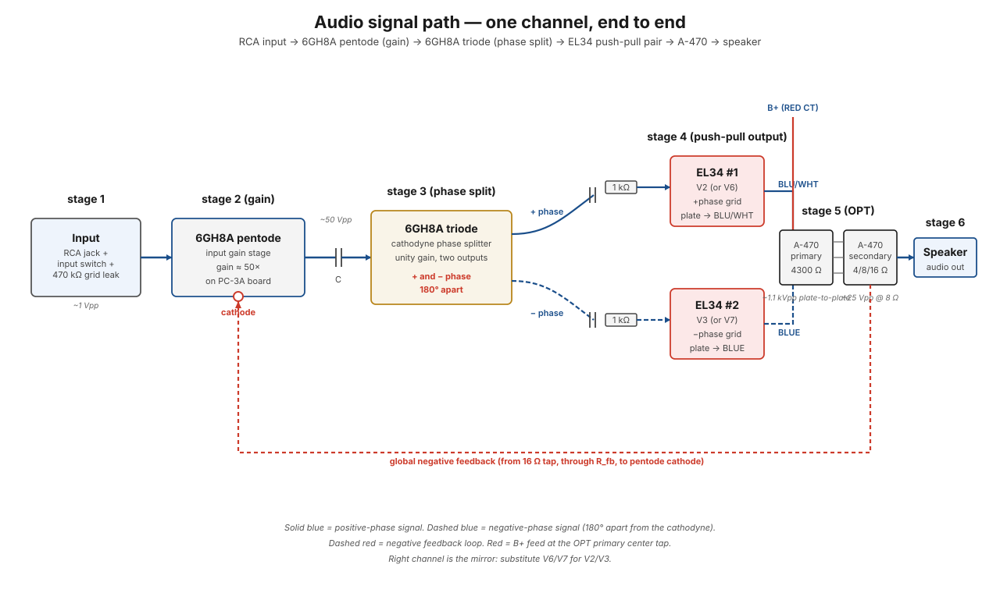

# Audio signal path

The trace of one channel's audio signal from the RCA input jack on the rear panel to the speaker terminals (also on the rear). Six stages, two tube envelopes (one 6GH8A + two EL34s), one output transformer.

The right channel is the mirror of the left: same topology, different parts, no signal crossing between channels except through the (per-channel) feedback loop. This page describes the **left channel** for concreteness — for the right channel, substitute V6/V7 for V2/V3 and the right [6GH8A](../components/6gh8a-driver-tube.md) for the left.

## The big picture

This path takes a ~1 V signal from your source and turns it into ~20 V *with real current behind it* at the speaker terminals — enough to physically shove a speaker cone back and forth. Everything in between is just three jobs done in order: **make it bigger** (pentode), **split it into two opposite copies** (phase splitter), and **convert high-voltage/low-current into low-voltage/high-current** (push-pull EL34s into the output transformer).

!!! note "In plain words — why so many stages?"
    No single tube can do the whole job. A tube is a great *voltage* amplifier but a lousy *current* source — it can swing hundreds of volts but only pass tens of milliamps, while a speaker wants a few volts and *amps*. So the amp amplifies voltage first (stages 2–4), uses two big tubes as a team (stage 6), and lets a transformer do the final voltage-for-current exchange. Every stage below either grows the signal, reshapes it for the next stage, or protects it.

## At a glance

<figure class="diagram-fig" markdown="span">
  
  <figcaption>One channel, end to end: RCA input through the 6GH8A pentode (gain), the cathodyne phase splitter, the EL34 push-pull pair, the A-470 OPT, to the speaker. Solid blue = positive-phase signal; dashed blue = the 180°-shifted signal after the phase splitter. Dashed red = the global feedback wire returning to the pentode cathode. Hover any stage for details. Click to zoom.</figcaption>
</figure>

## Stage by stage

### Stage 1 — RCA jack → input switch

Audio enters the amp on the rear panel left RCA jack (mounted in [step M2](../build/mechanical-assembly/step-m02-input-connector.md)). The center pin carries the audio signal; the shell ties to chassis-side ground.

From the RCA, the signal goes to the **input switch** ([step M3](../build/mechanical-assembly/step-m03-input-switch.md)), which selects between input modes for that channel. The switch's selected output goes to the input of the [PC-3A driver board](../components/pc-3a-driver-board.md) — wired in [step 54](../build/driver-stage/step-54-left-rca-to-input-switch.md) (RCA-to-switch) and [step 53](../build/driver-stage/step-53-eyelet-7-to-left-rca.md) (switch-to-board).

Typical signal level at this point: line level, around 1 V peak-to-peak with a "loud" source. Source impedance is whatever the source supplies (commonly a few hundred ohms from a CD player or DAC).

**Why the shell goes to ground:** the signal is a *voltage difference* — it only means something relative to a reference. The RCA shell ties the source and the amp to the same "zero volts" (chassis ground); without that shared reference the center-pin voltage is meaningless and you'd hear hum or nothing.

### Stage 2 — 6GH8A pentode (gain)

The signal arrives at the **control grid of the pentode section** of the left 6GH8A on the PC-3A board. A **470 kΩ grid leak resistor** ([step 51](../build/driver-stage/step-51-left-grid-leak.md)) ties the grid to ground — this gives the grid a DC reference at 0 V so it doesn't drift with leakage current, while presenting a high enough impedance to the source that the signal isn't loaded down.

Inside the pentode, the control grid modulates the plate current. With a plate-load resistor to B+ (~330 V), the AC swing on the grid becomes a much larger AC swing on the plate — **gain of roughly 50×**, depending on the specific tube and the operating point. See [6GH8A](../components/6gh8a-driver-tube.md#pentode-input-stage) for the topology.

!!! note "In plain words — how a tube amplifies"
    Picture a garden-hose nozzle. B+ is the water pressure behind it; the grid is your finger on the trigger. A tiny finger movement (the 1 V input signal) controls a big change in flow — and that big flow change, forced through the plate-load resistor, becomes a big *voltage* change. The tube doesn't "create" the bigger signal; it uses the small signal to *steer* power that B+ already provides. That's why the [B+ path](b-plus.md) matters so much: no pressure, no amplification.

??? note "Why you won't measure 50× on a running amp (and shouldn't want to)"
    The ~50× figure is the stage's **open-loop** gain — what the pentode does on its own. On a running amp the [negative feedback loop](negative-feedback.md) deliberately throws most of that gain away in exchange for lower distortion. **Measured on this build: input-to-plate gain of 19× with feedback active** — anywhere in the 15–25× range is healthy. If you ever measure close to the full ~50× on a running amp, that's not a bonus; it means the feedback loop is open and the amp is broken.

The pentode's **cathode is also where the global negative feedback returns**, mixed in with the local cathode bias. See [negative feedback](negative-feedback.md) for the loop. Why the cathode? Because the tube amplifies the *difference* between grid and cathode — injecting the feedback at the cathode lets the output signal subtract from the input without touching the input wiring.

### Stage 3 — coupling cap to the triode

The pentode's plate sits at high DC voltage (~150–200 V), so a **coupling capacitor** is needed to pass the AC signal to the next stage while blocking that DC. The coupling cap lives on the PC-3A board between the pentode plate output and the triode section's grid input.

**Why this step must happen:** the audio is a small AC wiggle riding on top of ~150–200 V of DC. The next tube's grid needs the *wiggle* but must sit near 0 V DC — put 150 V on a grid and the tube conducts full-tilt and the stage is destroyed or hopelessly skewed. The cap is the tool that separates the two: a capacitor blocks DC completely but passes AC (you proved this on the bench — [caps at DC](../bench-primer/04-capacitors-dc.md), [caps with AC](../bench-primer/extras/e5-caps-with-ac.md)).

!!! note "In plain words"
    Think of the coupling cap as a flexible rubber diaphragm in a water pipe. No water crosses it (DC is blocked), but pressure *waves* push right through (AC passes). The next stage gets the message without getting the flood.

This is one of the components most likely to age into a problem — see [PC-3A failure modes](../components/pc-3a-driver-board.md#failure-modes). A leaky coupling cap puts DC on the next grid and skews the bias, sometimes audibly, sometimes not.

### Stage 4 — 6GH8A triode (phase splitter)

The triode section is wired as a **cathodyne** (split-load) phase splitter: equal-value resistors above and below the triode (47 kΩ each, matched 1%), with the signal taken from both the plate (one output) and the cathode (the other output).

Because the same current flows through both resistors, the two outputs have **equal amplitude but opposite phase** — exactly what the push-pull output stage needs. See [phase splitting](../theory/phase-splitting.md) for the full derivation and why cathodyne self-balances.

**Why split the signal at all?** The output stage ahead is *push-pull*: two EL34s working like two people on a two-handled saw — one pushes while the other pulls. Each needs its own drive signal, identical in size but opposite in direction. One tube can't be told "push" and "pull" by the same waveform, so this stage manufactures the mirror-image copy.

!!! note "In plain words — why cathodyne is clever"
    The same current flows up through the plate resistor and down through the cathode resistor — it's one series path. Same current × same resistance = same voltage swing at both ends, just measured from opposite sides. The balance isn't adjusted or trimmed; it's *guaranteed by the wiring*. That's why this stage never needs calibration.

After the triode, the signal exists as **two complementary copies, 180° out of phase**, ready to drive the two EL34 grids.

### Stage 5 — coupling caps + grid stoppers → EL34 grids

Each of the triode's two outputs goes through its own coupling cap (blocking the high triode-section DC) and out of the PC-3A board to an EL34 grid:

- One output → V2 grid, via [eyelet 1 → V2](../build/driver-stage/step-56-eyelet-1-to-v2.md)
- The other output → V3 grid, via [eyelet 2 → V3](../build/driver-stage/step-55-eyelet-2-to-v3.md)

The coupling caps here do the same job as in stage 3 and for the same reason: the triode's plate and cathode sit at high DC, and the EL34 grids must not see it. Each output gets its *own* cap because the two signals are opposite copies that must stay separate.

Just before each grid pin (pin 5), there's a **1 kΩ grid stopper resistor** ([step 37](../build/output-stage/step-37-grid-stoppers.md)) directly across pins 5 and 6 of the EL34 socket. These suppress parasitic RF oscillation, which the EL34s are otherwise prone to under high-gain conditions.

**Why the stopper must be *at the socket*, not back on the board:** the resistor plus the tube's internal capacitance forms a tiny low-pass filter that kills radio-frequency energy before it reaches the grid. If the resistor sits inches away, the wire between it and the pin acts as an antenna and the protection is lost. It's a 1 kΩ part whose *position* matters more than its value.

The EL34 grids also receive a **negative DC bias** (≈ −32 V, ±20%) from the [bias supply](bias.md) — the AC signal rides on top of this DC bias, swinging the grid above and below its quiescent point.

!!! note "In plain words — two things on one pin"
    Each EL34 grid pin carries two signals at once: a steady −32 V DC "hold-back" from the [bias supply](bias.md), and the AC audio wiggling above and below it. The bias is where your foot rests on the gas pedal; the audio is your foot pumping around that resting point. The coupling cap upstream is what lets the two coexist — it delivers the AC while refusing to disturb the DC.

### Stage 6 — EL34s push-pull → A-470 primary → speaker

The two EL34s (V2 and V3) operate in **push-pull**: when V2's grid goes positive, V3's grid is going negative by the same amount, and vice versa. Their plate currents swing oppositely. See [push-pull topology](../theory/push-pull-topology.md).

The plates connect to opposite ends of the **A-470 primary winding**:

- V2 plate (pin 3) → A-470 BLUE/WHITE lead ([step 13](../build/output-stage/step-13-left-opt-primary.md))
- V3 plate (pin 3) → A-470 BLUE lead (same step)
- A-470 RED (center tap) → B+ via the choke (see [B+ path](b-plus.md))

EL34 screen grids (pin 4) connect to the **ultralinear taps** on the A-470 (GREEN and GREEN/WHITE), each tap matched to the half of the winding driven by the corresponding plate. UL operation is a compromise between pentode (high power, more distortion) and triode (low distortion, less power) — see [A-470](../components/a-470-output-transformer.md).

The push-pull currents in the primary's two halves cancel any common-mode contribution and **reinforce the audio signal in the secondary**. The secondary is a low-voltage, low-impedance winding with three impedance taps (4 Ω BROWN, 8 Ω ORANGE, 16 Ω YELLOW) plus a common (BLACK), wired to the **left 4-screw rear terminal strip** in [step 12](../build/output-stage/step-12-left-opt-secondaries.md).

**Why a transformer is unavoidable here:** the EL34 plates swing hundreds of volts but can only pass tens of milliamps; the speaker wants a few volts but *amps* of current. Those are incompatible worlds — connect a speaker directly to a tube plate and almost no power transfers (you demonstrated this mismatch problem in [driving a speaker](../bench-primer/extras/e6-driving-a-speaker.md)). The OPT trades voltage for current at a fixed ratio, matching the tube's high-impedance world to the speaker's low-impedance one. Same power in, different voltage/current mix out.

!!! note "In plain words"
    The transformer is a gearbox. The tubes are an engine that spins fast with little torque (high voltage, low current); the speaker is a wheel that needs slow, forceful turns (low voltage, high current). The OPT is the gearing between them — and the 4/8/16 Ω taps are three different gear ratios so you can match whatever speaker you own.

Speaker wires connect to the appropriate tap pair (most modern speakers: ORANGE 8 Ω + BLACK common), completing the path. The 16 Ω YELLOW tap does double duty: it is also the sample point for the [negative feedback loop](negative-feedback.md), because it carries the closest thing to "what the speaker actually hears."

## Per-channel notes

| | Left channel | Right channel |
|---|---|---|
| Input jack | Left RCA | Right RCA |
| 6GH8A | Left socket on PC-3A | Right socket on PC-3A |
| EL34 pair | V2, V3 | V6, V7 |
| OPT | Left A-470 | Right A-470 |
| Speaker strip | Left 4-screw (back) | Right 4-screw (back) |
| Feedback loop | independent | independent |

The two channels are wholly separate from input to speaker. They only share the **power supply** (B+, heaters, bias) and the **chassis ground**. Crosstalk between channels comes from coupling through these shared supplies — minimized by good filtering (the multi-stage [B+ path](b-plus.md)) and good grounding ([grounding and hum](../theory/grounding-and-hum.md)).

## Where it can break

| Symptom | Likely cause | DMM probe |
|---|---|---|
| Channel is dead | Coupling cap open, grid leak open, broken solder joint in input wiring | Inject a 1 kHz tone at the RCA; probe AC voltage at the pentode plate, then triode plate/cathode, then EL34 grids — the signal stops where the path broke |
| Channel is distorted at low volume | EL34 bias too low (grid not negative enough), driving the EL34s into clipping early | Measure bias voltage at EL34 pin 5; should be around −32 V (±20%) |
| Distortion + low gain | Leaky coupling cap putting DC on the next grid | DC probe at triode grid: should be near 0 V; if positive, the previous coupling cap is leaking |
| 60 Hz hum on one channel | Heater-cathode leakage in the 6GH8A | Swap channels' 6GH8As; if hum follows the tube, replace it |
| One side of push-pull silent | Coupling cap to one EL34 open, or grid stopper failed | Probe AC voltage at each EL34 grid; should be roughly equal magnitudes |
| Sounds boomy / loose at LF | Bad coupling cap, or filter cap section feeding that stage dried out | Scope the stage; LF cutoff should be < 20 Hz |

## What to remember

- The whole path is three jobs in order: **make the voltage bigger** (pentode), **split it into two opposite copies** (cathodyne), **trade voltage for current** (EL34 pair + OPT).
- Every **coupling cap** exists for the same single reason: pass the AC wiggle, block the DC the previous stage sits on. Three caps, one job.
- A tube doesn't create power — it **steers B+**. Small grid voltage in, big plate swing out, all paid for by the [B+ supply](b-plus.md).
- On this build, expect **~19× gain** input-to-pentode-plate with feedback working — measuring the full open-loop ~50× means the feedback loop is broken, not that the amp is extra healthy.
- Debugging is signal-tracing: inject a tone at the RCA and follow it stage by stage; **the fault is wherever the signal stops**.

## See also

- [6GH8A driver tube](../components/6gh8a-driver-tube.md) — what's inside the envelope
- [EL34 output tube](../components/el34-output-tube.md) — the push-pull pair's specs and pinout
- [A-470 output transformer](../components/a-470-output-transformer.md) — primary topology and secondary taps
- [PC-3A driver board](../components/pc-3a-driver-board.md) — what's on the PCB and what's not
- [Phase splitting](../theory/phase-splitting.md) — the cathodyne topology in detail
- [Push-pull topology](../theory/push-pull-topology.md) — what the EL34 pair is doing
- [B+ signal path](b-plus.md) — what feeds the plates and screens
- [Negative feedback](negative-feedback.md) — the closed loop riding alongside this signal path
