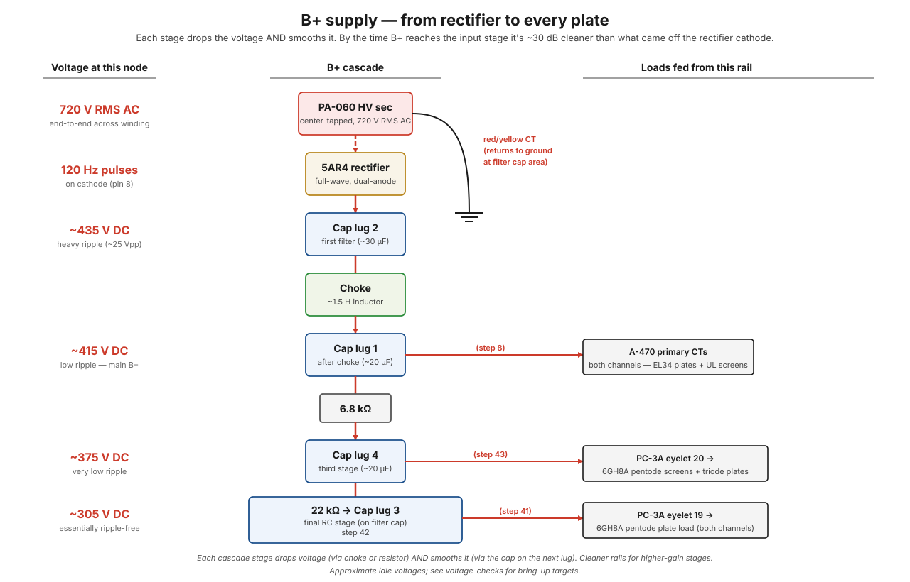

# B+ signal path

**B+** is the high-voltage DC supply that every tube plate and screen in the amp depends on. It starts as 720 V RMS end-to-end across the PA-060's high-voltage secondary, gets rectified by the 5AR4, then cascades through a multi-stage filter network that produces progressively cleaner, progressively lower-voltage DC for each load.

## The big picture

The wall gives you AC — voltage that swings positive and negative 60 times a second. Tubes need the opposite: steady, unwavering DC at several hundred volts. This path is the conversion plant: **step it up** (transformer), **make it one-directional** (rectifier), then **smooth it in stages** (caps, choke, resistors), delivering cleaner and cleaner DC the closer you get to the sensitive input stage.

!!! note "In plain words — the water main"
    B+ is the amp's water main. The transformer is the pump that raises the pressure; the rectifier is a one-way valve so water only flows forward; each filter cap is a **storage tank** that keeps pressure steady between pump strokes; the choke and dropping resistors are **pressure reducers** feeding smaller and calmer branch lines. The output tubes drink straight from the big noisy main because they can tolerate it; the delicate input stage gets its water from the last, calmest tank at the end of the line. Everything on this page is one of those four jobs: pump, one-way valve, tank, or reducer.

By the time the build is at idle, the rail looks something like:

| Filter node | Approx. DC | Feeds |
|---|---|---|
| Just after rectifier (cap lug 2) | ~435 V | input of the choke |
| After choke (cap lug 1) | ~415 V | main B+ — OPT primary center taps (EL34 plates + UL screens) |
| After 6.8 kΩ drop (cap lug 4) | ~375 V | 6GH8A pentode screens + triode plates (via eyelet 20) |
| After 22 kΩ drop (cap lug 3) | ~305 V | 6GH8A pentode plate load (via eyelet 19) |

All four cap sections plus both dropping resistors live on the **filter cap chassis** — the cascade is fully assembled before any B+ enters the PC-3A board. Eyelets 19 and 20 just deliver two already-finalized rails to the board.

Numbers are typical — see [voltage checks](../bring-up/voltage-checks.md) for what to expect at bring-up time. The key thing is that each downstream load gets a **lower, smoother** voltage than the one upstream — the filter cap + dropping resistor cascade buys both regulation and ripple rejection at each stage.

??? note "Measured on this build — actual voltages and ripple at each lug"
    The table above is the manual's nominal chart (435/415/375/305 V). With mains at ~116 V, this build measures:

    | Filter node | Measured DC | Measured ripple |
    |---|---|---|
    | Lug 2 (after rectifier) | 428 V | ~40 Vp-p |
    | Lug 1 (after choke) | 413 V | ~2–3 Vp-p |
    | Lug 4 (after 6.8 kΩ) | 349 V | ~110 mVp-p |
    | Lug 3 (after 22 kΩ) | 280 V | <1 mV |

    Lug 4 runs ~26 V below the chart because this build's driver board draws ~9.4 mA through the 6.8 kΩ (a 64 V drop) versus the ~6 mA/375 V the chart implies — a normal build-to-build difference, not a fault. Read the ripple column left to right and you can *see* the cascade doing its job: each stage knocks the ripple down by an order of magnitude or more, from 40 V of sawtooth to under a millivolt.

## At a glance

<figure class="diagram-fig" markdown="span">
  
  <figcaption>The cascade flows top-to-bottom: each stage drops the voltage (via choke or dropping resistor) AND smooths it (via the cap on the next lug). Branches at lug 1 and lug 4 feed the OPT primaries and PC-3A board respectively. Hover any stage for details. Click to zoom.</figcaption>
</figure>

## Stage by stage

### Stage 1 — PA-060 HV secondary

The PA-060 [power transformer](../components/pa-060-power-transformer.md) has a center-tapped high-voltage secondary winding: two red leads at the ends of the winding, one red/yellow lead at the center tap. Across the full winding, ~720 V RMS end-to-end at 60 Hz. From either red lead to the CT, ~510 V peak (~360 V RMS), shifted 180° between the two halves.

**Why this stage exists:** wall power is 120 V and the tubes need ~430 V. A transformer is the only cheap, reliable way to change AC voltage — that's the entire reason the amp starts with one. The center tap exists to make the *next* stage (full-wave rectification) possible with only two diodes: it gives the circuit a middle point so each half of the winding can take turns.

The CT establishes the **return reference** for the rectified current — every electron that flows out one half of the winding has to come back through the CT. In plain words: the CT is the drain that every drop of B+ current eventually returns to. If the CT connection is bad, *nothing* in the B+ system works, because the loop is broken.

### Stage 2 — 5AR4 plates (V1 pins 4 and 6)

Each red lead wires to one of the 5AR4's anodes ([step 3](../build/power-supply/step-03-5ar4-anodes.md) — or, with the optional [rectifier diode mod](../modifications/rectifier-diode-mod.md), via a series 1N4007).

The 5AR4 is a **dual-anode full-wave rectifier**: each anode conducts during the half-cycle when its red lead is positive relative to the CT, taking turns 120 times per second. See [rectification](../theory/rectification.md) for the topology.

**Why rectify at all:** AC spends half its time negative. Feed AC to a tube plate and the tube would only work half the time — and the audio would be garbage. The rectifier is a one-way valve: it lets current through only when the voltage is pushing the right way. Two anodes taking turns means *both* halves of the AC cycle get used (that's the "full-wave" part) — the output pulses 120 times per second instead of 60, which makes the smoothing job downstream twice as easy. You worked with the one-way-valve behavior of diodes in [LEDs and diodes](../bench-primer/extras/e3-leds-and-diodes.md); the 5AR4 is the same idea rated for 400+ volts.

### Stage 3 — 5AR4 cathode → first filter cap (lug 2)

Both anodes share a single cathode at V1 pin 8. The cathode swings positive on every half-cycle of the line frequency — producing **120 Hz pulsating DC**.

A short heavy wire from V1 pin 8 to **filter cap lug 2** ([step 29](../build/output-stage/step-29-rectifier-to-filter-cap.md)) is the first place the rectified DC lands. The cap section attached to lug 2 (~30 µF, see [filter capacitors](../components/filter-capacitors.md)) starts smoothing those pulses — current is dumped *into* the cap on the peak of each pulse and drawn *out* between pulses, integrating the waveform toward a DC level.

!!! note "In plain words — why a cap smooths"
    The rectifier delivers water in 120 splashes per second; the tubes want a steady stream. The cap is a storage tank between the two: it fills on each splash and keeps the tap flowing between splashes. The tank isn't infinite, so the level still dips a little between refills — that leftover wobble is **ripple**, and it's why one cap isn't enough (measured here: ~40 Vp-p of it at lug 2). You built exactly this charge-and-hold behavior on the bench in [capacitors at DC](../bench-primer/04-capacitors-dc.md).

The red/yellow CT lands at the ground reference next to the filter cap ([step 7](../build/power-supply/step-07-hv-ct.md)) to complete the loop.

### Stage 4 — choke → second filter cap (lug 1)

A wire from lug 2 goes to one end of the **choke** ([step 9](../build/power-supply/step-09-choke.md)); the other end of the choke lands on **lug 1** of the filter cap. The choke is a large inductor (~1.5 H) that resists rapid changes in current — together with the cap on lug 1 (~20 µF), it forms an **LC filter** that removes essentially all of the 120 Hz ripple.

**Why a choke instead of another resistor?** Because the choke discriminates. A resistor drops DC and AC alike — to kill 40 V of ripple with a resistor you'd also throw away a huge chunk of the DC you worked to make. An inductor passes steady DC almost freely (only its small wire resistance) but fights *changes* in current — which is exactly what ripple is. So the choke lets the ~212 mA of DC through while blocking the 120 Hz wobble. It's a pressure regulator that only resists *surges*, not flow.

The voltage on lug 1 sits a bit lower than lug 2 due to the choke's DC resistance (spec 62 Ω; 71 Ω measured on this build — about a 15 V drop at the full ~212 mA draw) and the steady current draw, but it's much smoother. This is the **clean B+ rail that feeds the output transformer primaries** — both A-470 red leads (center taps) land on lug 1 in [step 8](../build/power-supply/step-08-opt-b-plus.md).

Measured on this build: ripple drops from ~40 Vp-p at lug 2 to ~2–3 Vp-p at lug 1 — the LC stage alone buys roughly a 15–20× reduction.

### Stage 5 — to the OPT primary center taps

Each [A-470 output transformer](../components/a-470-output-transformer.md) has a center-tapped primary, with the center tap (RED lead) drawing B+. Current flows from lug 1 → A-470 red → through both halves of the primary → out the BLUE and BLU/WHT plate leads → into the EL34 plates (pin 3 of V2/V3 for left, V6/V7 for right).

Because the two halves of the primary are driven by **push-pull** plate currents (one half going up while the other goes down), the *quiescent* current draw on the B+ is steady, and only the *AC* signal swings oppositely in the two halves. This is what makes push-pull so efficient at rejecting B+ ripple — see [push-pull topology](../theory/push-pull-topology.md).

The EL34 **screen grids** (pin 4) get their voltage from the UL taps (GREEN and GRN/WHT), which sit at ~43% of the way from the CT to each plate — they see B+ minus some signal swing, not B+ minus a fixed drop.

### Stage 6 — 6.8 kΩ drop → third filter cap (lug 4)

A 6.8 kΩ resistor ([step 30](../build/output-stage/step-30-b-plus-dropping-resistor.md)) hops from cap lug 1 to **cap lug 4** — together with the cap on lug 4 (~20 µF), this forms an **RC filter** that drops the voltage and smooths it further. The third B+ stage sits at ~375 V at idle (349 V measured on this build — see the measured-values table above for why).

**Why a resistor works here (when it didn't at stage 4):** the driver stage sips only ~9 mA, versus the ~200 mA the output tubes gulp. At 9 mA, a 6.8 kΩ resistor drops a useful, predictable amount of voltage without wasting much power — small load, small drop, cheap part. This is the same source-impedance arithmetic you measured in [source impedance and sag](../bench-primer/extras/e4-source-impedance-and-sag.md): the drop across a supply's series resistance is proportional to the current drawn through it. (It's also why this build's lug 4 reads 349 V instead of the chart's 375 V — this board draws ~9.4 mA instead of the ~6 mA the chart assumes, so the same resistor drops more volts.)

Meanwhile the cap on lug 4 does the smoothing half of the job, taking ripple from ~2–3 Vp-p down to ~110 mVp-p (measured on this build). Resistor drops, cap smooths — the same two-part pattern as every stage. See [caps with AC](../bench-primer/extras/e5-caps-with-ac.md) for the RC-filter behavior on the bench.

This rail (cap lug 4) feeds two things via PC-3A eyelet 20 ([step 43](../build/driver-stage/step-43-eyelet-20-to-cap-4.md)):

- The 6GH8A pentode **screen grids** (through an on-board screen-dropping resistor).
- The 6GH8A triode plate loads (the cathodyne phase splitter's plate resistor).

### Stage 7 — 22 kΩ drop → fourth filter cap (lug 3)

A second dropping resistor (22 kΩ, [step 42](../build/driver-stage/step-42-22k-dropping-resistor.md)) is mounted on the filter cap itself between lug 4 and **cap lug 3** — together with the cap on lug 3, the final RC filter. This is the cleanest, lowest-voltage B+ rail — ~305 V at idle (280 V and <1 mV ripple measured on this build).

This rail powers the **6GH8A pentode plate load** via PC-3A eyelet 19 ([step 41](../build/driver-stage/step-41-eyelet-19-to-cap-3.md)). The pentode is the high-gain input stage, so its plate B+ gets the most filtering.

Putting the input stage on the cleanest, most heavily-filtered rail is deliberate: any ripple here gets amplified by the full gain chain and ends up as audible hum at the speaker. So the input gets the "premium" supply, the EL34s (which are at the end of the chain and benefit from push-pull ripple rejection) get the "raw" supply.

Note that **both dropping resistors (6.8 kΩ and 22 kΩ) are mounted on the filter cap** — the entire B+ cascade lives on the cap chassis. The PC-3A board only receives two already-filtered rails via eyelets 19 and 20.

## How the cascade works

Each stage is the same pattern: **drop voltage, smooth voltage**. The dropping element (choke for the first stage, resistor for the rest) plus the capacitor on the receiving lug forms a low-pass filter that:

- Reduces ripple by ~20–40 dB per stage
- Drops the DC level by an amount proportional to the load current and the dropping element's resistance
- Provides energy storage so transient current draws (like a kick drum hitting full-power) don't pull the rail down

By the time B+ has been through four stages, what arrives at the pentode plates is ~30+ dB cleaner than what came off the rectifier cathode.

!!! note "In plain words — why stages beat one big filter"
    Each stage is a modest improvement — maybe 10–20× less ripple. But the improvements *multiply*: 15× then 20× then 100× is a 30,000× total reduction. One giant cap after the rectifier can't compete with that, because a single filter stage improves things only in proportion to its (finite) size, while a cascade compounds. It's cheaper to knock ripple down in four cheap steps than in one heroic one. On this build the compounding is directly measurable: 40 V → 2–3 V → 110 mV → <1 mV, lug by lug.

## Where it can break

| Symptom | Likely cause | DMM probe |
|---|---|---|
| No B+ anywhere | 5AR4 not lit, rectifier tube failed, primary fuse open | Check primary fuse continuity; verify 5AR4 heater is glowing |
| B+ very low (e.g., 200 V at lug 2) | Filter cap shorted, or one half of HV secondary open | Disconnect lug 2 wire, measure DC across just the cap; should match HV secondary loaded behavior |
| Loud 120 Hz hum | Choke not filtering (open) or lug 2 cap dried out | Measure ripple at lug 1 with scope; should be < 1 V AC. If much higher, choke or lug 2 cap is bad |
| Hum on one channel only | Cap lug 3 or 4 section failed | Channel signals share later filter stages but EL34s share lug 1 — by elimination, hum on one channel implicates the PC-3A B+ rails |
| EL34s red-plating | B+ way too high (shorted choke leg, lost CT, etc.) OR bias too low (separate issue) | Measure B+ at lug 1: > 500 V is suspect. Also check bias supply (≈ −32 V at EL34 pin 5; raw supply ≈ −65 V) |
| Voltage at lug 4 = voltage at lug 1 | 6.8 kΩ resistor open or shorted | Measure across the resistor — should drop ~40–65 V at idle (64 V measured on this build) |
| Voltage at lug 3 = voltage at lug 4 | 22 kΩ resistor open or shorted | Measure across the resistor — should drop ~70 V at idle |
| No signal from input stage even with B+ on lug 4 | Eyelet 19 wire missing, or pentode plate-load resistor open on board | Measure DC at the pentode plate (PC-3A); should be ~150–200 V |

For the full bring-up sequence and what to measure where, see [voltage checks](../bring-up/voltage-checks.md).

## Why the chain looks like this

It's tempting to think "just put one big cap after the rectifier and feed everything from it." It doesn't work for two reasons:

1. **Different loads want different voltages.** The EL34 plates want ~415 V; their screens (in UL) want similar; the 6GH8A pentode screens and triode plates want ~375 V; the 6GH8A pentode plates (after their plate-load resistor drops) end up at ~150–200 V starting from ~305 V at the eyelet. You need to drop voltage between stages, which means dropping resistors, which means an RC filter at each drop.
2. **Different loads tolerate different ripple.** The EL34 plates can tolerate ~1 V ripple — it's at the end of the gain chain and the push-pull cancels much of it anyway. The pentode plates cannot — any ripple here gets multiplied by the full gain chain (50× per stage × 50× per stage × push-pull gain) and ends up as hum. So the input stage gets the most heavily filtered rail.

The cascade gives you both at once: each stage drops voltage *and* smooths it, scaling the protection to where it's needed most.

## What to remember

- Everything in this path is one of four jobs: **pump** (transformer), **one-way valve** (rectifier), **tank** (filter caps), or **pressure reducer** (choke and dropping resistors).
- The rule of the cascade: **each stage drops the voltage and smooths it**, and the improvements multiply stage over stage — on this build, 40 Vp-p of ripple at lug 2 becomes <1 mV at lug 3.
- **The dirtiest rail feeds the toughest load** (EL34 plates, which tolerate ripple); **the cleanest rail feeds the most sensitive load** (the input pentode, whose ripple would be amplified by the whole chain). That pairing is the entire design logic.
- The voltage at any lug depends on the **current drawn through the resistance upstream of it** — which is why this build's lug 4 reads 349 V instead of the chart's 375 V. Different draw, different drop; both healthy.
- The whole cascade lives **on the filter cap chassis**; the PC-3A board just receives two finished rails at eyelets 19 and 20.

## See also

- [PA-060 power transformer](../components/pa-060-power-transformer.md) — what produces the raw HV AC
- [5AR4 rectifier tube](../components/5ar4-rectifier-tube.md) — full-wave rectification details
- [Filter capacitors](../components/filter-capacitors.md) — the quad cap that hosts lugs 1–4
- [Choke](../components/choke.md) — the inductor between the first two filter stages
- [Rectification](../theory/rectification.md) — theory behind stage 2
- [Voltage source vs current path](../theory/voltage-vs-current.md) — what "B+" actually is
- [Audio signal path](audio.md) — what this rail ultimately powers
- [Voltage checks (bring-up)](../bring-up/voltage-checks.md) — measuring all of this for real
- [Rectifier diode mod](../modifications/rectifier-diode-mod.md) — the optional 1N4007 series-diode mod that sits between stages 1 and 2
