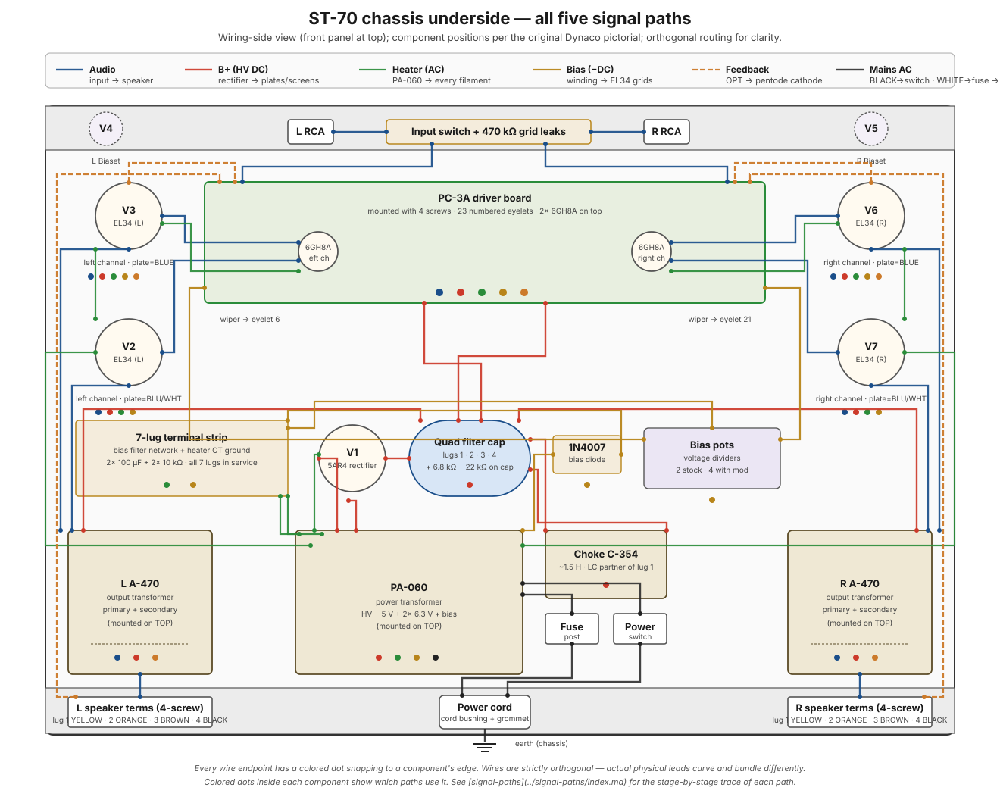

# Chassis overview — all five paths on the underside floorplan

A view of the ST-70 chassis **from the underside** (the wiring side — what the builder sees while wiring) with every major component in its actual position per the original Dynaco wiring pictorial. **All five signal paths drawn simultaneously in distinct colors**. Use this as the "where does what live" overview before diving into a specific path.

The path-specific pages ([audio](audio.md), [B+](b-plus.md), [heater](heater.md), [bias](bias.md), [negative feedback](negative-feedback.md)) trace each path in stage-by-stage detail. This page is the *map*; those pages are the *journeys*.

## The big picture

The amp does exactly one job: take a small audio signal (~1 V) and make it big enough to move a speaker (~20 V and real current). Only **one** of the five paths — the blue audio path — actually carries music. The other four exist purely to make the blue path possible: they deliver power, warm the tubes, set idle operating points, and correct errors.

!!! note "In plain words — the five paths as a kitchen"
    Think of the amp as a restaurant kitchen. The **audio path** is the meal being cooked — the only thing the customer ever tastes. The **B+ supply** is the gas line: high pressure, always on, powering every burner. The **heater path** is the pilot lights — nothing cooks until they're warm. The **bias path** is the thermostat on each burner, holding each flame at exactly the right idle level so nothing scorches. And **negative feedback** is the chef tasting the dish and correcting the seasoning before it leaves the kitchen. Four of the five never touch the food — but remove any one and dinner doesn't happen.

<figure class="diagram-fig" markdown="span">
  
  <figcaption>Underside (wiring-side) view. Front panel at top, rear panel at bottom — matches the orientation of the original Dynaco wiring pictorial. Wire routes are drawn with strict horizontal/vertical segments (90° bends) for readability; actual physical leads curve and bundle. Hover any component for details. Click to zoom.</figcaption>
</figure>

## How to read the diagram

- **Underside view (wiring side up)** — front panel at top, rear panel at bottom. This is the orientation you see when the chassis is flipped over on the bench for wiring.
- **Components in their actual chassis positions** — laid out to match the original Dynaco pictorial: V3/V2 stack on the left, V6/V7 stack on the right, PC-3A board in the center with V1 directly below it, PA-060 at the rear-center, choke and right speaker strip at the rear-right, left speaker strip and fuse at the rear-left.
- **Orthogonal wire routing** — every wire is horizontal or vertical with 90° bends. Actual physical leads curve and bundle; the simplified routing here is for readability.
- **Color = path**:

| Color | Path | What it carries |
|---|---|---|
| **Blue** (solid) | [Audio signal](audio.md) | The actual audio waveform, RCA → speaker |
| **Red** (solid) | [B+ supply](b-plus.md) | High-voltage DC to every tube plate and screen |
| **Green** (solid) | [Heater](heater.md) | 5 V and 6.3 V AC to every tube filament |
| **Gold** (solid) | [Bias](bias.md) | Small negative DC rail to the EL34 grids |
| **Orange** (dashed) | [Negative feedback](negative-feedback.md) | Sampled output back to the input cathode |

- **Colored dots inside each component** show which paths pass through that part. A component with multiple dots is a junction point where the paths interact — these are the most informative places to study.

## Why five separate paths at all

Each path exists because of a mismatch between what's available and what the tubes need. Knowing the *why* makes the map much easier to hold in your head:

- **Audio (blue)** exists because carrying the music is the whole point. Why does it need its own carefully routed wires? Because it's the *smallest* signal in the box (~1 V at the input) living inches away from the *biggest* (~435 V DC and nearly 9 A of heater AC). Small signals next to big fields pick up noise — so the audio path is kept short, and the other paths are kept away from it.
- **B+ (red)** exists because tubes only amplify when their plates are hundreds of volts more positive than their cathodes. The wall outlet gives you 120 V AC; the tubes need 300–435 V of *smooth DC*. The entire red path is the machinery that converts one into the other, step by step.
- **Heater (green)** exists because a cold cathode emits no electrons — a cold tube is an open circuit, no matter what voltages you apply. The green path is nothing but low-voltage AC delivering heat. It carries no signal, but it carries the most *current* of anything in the amp, which is why its routing (twisting, center-tap grounding) gets so much attention.
- **Bias (gold)** exists because an EL34 with B+ on its plate and 0 V on its grid conducts uncontrollably and destroys itself. The gold path delivers a small negative "hold back" voltage to each output-tube grid — a brake pedal held partly down at all times.
- **Feedback (orange)** exists because tubes and transformers are imperfect — they add distortion and drift. The orange path lets the amp compare its own output to its input and cancel the difference. It's the only path that runs *backwards*.

## Where the paths overlap

A few components are heavily multi-tasked:

- **PA-060 power transformer** — single source for B+, heater (both channels), and bias. Every power-related path starts here.
- **EL34 sockets (V2, V3, V6, V7)** — touched by audio (grid + plate), B+ (plate), heater (pins 2/7), bias (grid). V3 and V6 also touch feedback (their pin-4 UL taps are sampled).
- **PC-3A driver board** — the convergence point for *every* path: audio passes through, B+ enters via eyelets 19 and 20, heater enters via V3 and V6 daisies, bias is distributed through the on-board pot connections, and feedback returns to the pentode cathode.
- **Filter cap chassis** — owns the entire B+ cascade (rectifier output, both dropping resistors, four filter sections).
- **A-470 output transformers** — audio (primary + secondary), B+ (primary CT), and feedback (both UL primary taps and 16 Ω secondary tap).

!!! note "Why the overlaps matter for debugging"
    These shared components are the reason "which channel has the symptom?" is the most powerful first question. If *both* channels hum, the fault is almost certainly in something shared (PA-060, filter caps, bias supply). If only *one* channel is wrong, everything shared is instantly ruled out and you're down to that channel's tubes, OPT, and wiring. The dots on the diagram are your elimination checklist.

## Where the paths don't overlap (and why that matters)

- The **5 V heater winding** to the 5AR4 is the only winding that doesn't share its return with anything else — the 5AR4's cathode rides on this winding, and isolating it from ground keeps the rectifier independent of the rest of the chassis ground topology.
- The **two 6.3 V heater windings** (left and right channel) share *only the chassis ground* via their separate CTs. No heater current crosses between channels — preventing one channel's heater ripple from coupling into the other's signal path.
- The **bias supply** never touches the audio signal except *at the EL34 grids* — by design, so that DC bias modulation doesn't propagate through the audio chain.
- The **feedback wires** are the only path that runs *backwards* through the amp — from output back to input. Every other path goes input-to-output.

## When this diagram earns its keep

- **Conceptual learning** — when the per-path detail pages get dense, zoom out here to remind yourself how they fit together.
- **Debugging by elimination** — if symptom X appears only on one channel, the diagram instantly shows which components are shared (and therefore ruled out) versus which are channel-specific.
- **Modification planning** — adding a mod that touches one path? Use the dots to see what *else* touches the same components.

## What this diagram is NOT

- **Not a physical-routing pictorial.** Wires in the real amp follow specific paths along the chassis (twisted pairs hugging the metal, signal wires perpendicular to AC wires, etc.). The original Dynaco manual's pictorial diagrams are the right reference for that.
- **Not a schematic.** A schematic shows electrical relationships abstracted from physical layout. This is in-between: physical-ish layout, schematic-ish wires.
- **Not interactive yet.** Currently a static SVG with hover tooltips. A future revision may add path-selection (click to highlight one path and dim the others) and a side panel with component-in-path detail.

## What to remember

- Only the **blue audio path carries music**. The other four (B+, heater, bias, feedback) are support systems that make amplification possible.
- Every power path **starts at the PA-060** and every path **converges at the PC-3A board** — those two components touch everything.
- **Shared vs. channel-specific** is your debugging superpower: a symptom on both channels points to shared parts; a symptom on one channel rules them out.
- The feedback path is the only one that runs **output-to-input** — everything else flows front-to-back.
- This page is the map. When a detail page loses you, come back here and re-anchor: *which color am I on, and where does it start and end?*

## See also

- [Audio signal path](audio.md)
- [B+ signal path](b-plus.md)
- [Heater path](heater.md)
- [Bias path](bias.md)
- [Negative feedback path](negative-feedback.md)
- [Components index](../components/index.md) — per-component deep dives
- [Build progress](../build/index.md) — which steps wire which paths
