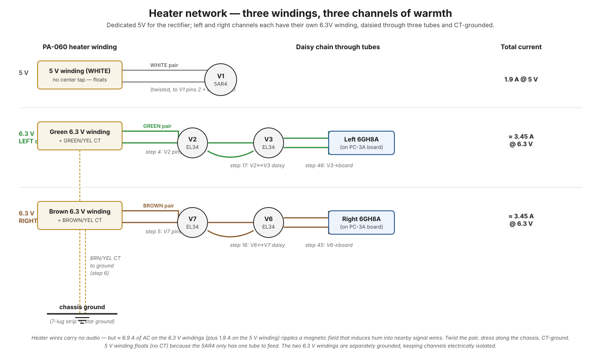

# Heater path

The heater (filament) path supplies low-voltage AC to every tube's heater filament, which warms the cathode so it can emit electrons. Heaters don't carry the audio or B+ signal — they're a separate power network — but they're a major source of audible hum if they're not wired and grounded correctly. Twist, daisy, center-tap, ground. Get any of those wrong and the amp hums.

## The big picture

A tube only works because its hot cathode boils electrons off into the vacuum — no heat, no electrons, no amplification, full stop. This path is nothing more than an electric stove circuit: low-voltage AC delivering pure heat to seven filaments. The catch is that it's the highest-*current* wiring in the amp, and big AC currents radiate hum — so every wiring choice on this page is really about delivering the heat **without letting its hum leak into the music**.

!!! note "In plain words"
    Every other path in this manual does something clever with electricity. The heater path just runs a toaster inside each tube. It never touches the audio — but like a noisy appliance sharing a wall with a recording studio, it *will* be heard unless you soundproof it. Twisting the wires, splitting channels onto separate windings, and grounding the center taps are the soundproofing.

The PA-060 [power transformer](../components/pa-060-power-transformer.md) supplies **two completely separate heater networks**:

| Winding | Voltage | Current draw | Feeds |
|---|---|---|---|
| White pair | 5 V AC | 1.9 A | 5AR4 rectifier (V1 only) |
| Green pair + green/yellow CT | 6.3 V AC | ~3.5 A | Left channel: V2, V3 (EL34s) + left 6GH8A |
| Brown pair + brown/yellow CT | 6.3 V AC | ~3.5 A | Right channel: V7, V6 (EL34s) + right 6GH8A |

The 5 V is its own thing — only the 5AR4 uses 5 V heaters, and it has its own dedicated winding. The two 6.3 V windings each feed one *channel's worth* of tubes via a series chain (technically still a parallel circuit at the tube terminals, but the wires daisy-chain from socket to socket). Keeping the two channels on separate windings is a deliberate hum-rejection choice — heater current ripple on one channel doesn't couple into the other.

??? note "Why AC heaters at all — wouldn't DC be quieter?"
    Yes, DC heaters would eliminate heater hum at the source — and some modern amps do exactly that. But in 1959, making 8+ amps of clean DC would have required a heavy, expensive extra rectifier-and-filter chain just for heat. AC straight off a transformer winding is nearly free. Dynaco's bet: use cheap AC, then spend pennies on hum *countermeasures* (twisting, center taps, bypass caps) instead of dollars on a DC supply. The rest of this page is those countermeasures.

??? note "Why does the rectifier get 5 V when everything else gets 6.3 V?"
    Not a design whim — the 5AR4 tube was simply *made* with a 5 V filament (the "5" in its name), a standard from the tube era's rectifier families, while receiving tubes standardized on 6.3 V. More importantly, the 5AR4's heater winding must be **electrically separate**, not just a different voltage: its cathode sits at the full ~430 V B+ output, and one heater pin is internally tied to that cathode. Put the 5AR4 on the shared 6.3 V winding and you'd connect 430 V directly into every other tube's heater circuit. The dedicated floating winding lets the whole 5 V loop ride up at B+ potential safely.

## At a glance

<figure class="diagram-fig" markdown="span">
  
  <figcaption>Three parallel rows: a dedicated 5 V winding for V1 (5AR4); a 6.3 V green winding daisied through the left channel; a 6.3 V brown winding daisied through the right channel. Both 6.3 V CTs return to chassis ground (dashed gold), holding heater AC symmetric about ground and suppressing hum coupling. Hover any winding or tube for details. Click to zoom.</figcaption>
</figure>

The center taps don't carry signal current — they're an **AC reference** that holds the heater AC symmetric about ground, which suppresses hum coupling. (They reach ground through 0.02 µF disc caps, not a hard wire — the windings float at DC.)

## Stage by stage

### Stage 1 — White pair → V1 (5AR4 heater)

The 5AR4 uses a 5 V AC heater that draws 1.9 A. The WHITE pair of leads from the PA-060 goes to V1 **pins 2 and 8** in [step 2](../build/power-supply/step-02-5ar4-heater.md), with pin 8 deliberately *not soldered yet* because the cathode wire also lands on pin 8 in a later step ([step 29](../build/output-stage/step-29-rectifier-to-filter-cap.md)).

Note pin 8 is **both** the cathode and one end of the heater — this is normal for indirectly heated rectifiers. The cathode and one heater pin share an internal connection inside the tube, which is fine because the 5 V heater winding floats relative to ground (no CT).

The white pair is twisted close together to minimize radiated hum — see [heater circuits](../theory/heater-circuits.md#how-twisting-the-leads-helps).

### Stage 2 — Green pair → V2 → V3 → left 6GH8A (left channel heater chain)

The GREEN pair carries the 6.3 V AC for the left channel's three tubes. Wiring sequence:

1. [Step 4](../build/power-supply/step-04-v2-heater.md): green pair from PA-060 → **V2 pins 2 and 7** (left EL34 heater).
2. [Step 17](../build/output-stage/step-17-v2-v3-heater-daisy.md): a short jumper from V2 to V3 — **V2 pin 2 ↔ V3 pin 2**, and **V2 pin 7 ↔ V3 pin 7** — putting V3's heater in parallel with V2's.
3. [Step 46](../build/driver-stage/step-46-v3-heater-to-board.md): from V3 to the PC-3A board, feeding the left 6GH8A's heater pins.

Total left-channel heater load: 2 × EL34 (1.5 A each) + 1 × 6GH8A (0.45 A) ≈ **3.45 A** at 6.3 V.

**Why daisy-chain instead of running each tube its own pair from the transformer?** Electrically the tubes are in parallel either way — each sees the same 6.3 V. Daisy-chaining just gets there with the least wire: one twisted pair hops socket to socket instead of three pairs fanning out across the chassis. Less wire means less antenna, less clutter, and fewer joints to fail. The order (V2 → V3 → board) simply follows physical proximity.

The green pair is twisted from the PA-060 to V2; the V2↔V3 daisy is also twisted; and the V3-to-board wire is twisted. The twist is essential for hum control — see [why we twist heater leads](../theory/heater-circuits.md#how-twisting-the-leads-helps).

!!! note "In plain words — why twisting works"
    A wire carrying AC radiates a magnetic field. Its return wire carries the same current the *opposite* way, radiating the opposite field. Twist the two together and, from any distance, the two fields overlap and cancel — every half-twist flips which wire is "closer," so the leftovers average out to nearly zero. Untwisted, the pair forms an open loop that broadcasts 60 Hz into every signal wire nearby. Twisting costs nothing and is the single most effective hum measure in the amp.

### Stage 3 — Brown pair → V7 → V6 → right 6GH8A (right channel heater chain)

Mirror of stage 2, on the other channel:

1. [Step 5](../build/power-supply/step-05-v7-heater.md): brown pair → V7 pins 2 and 7.
2. [Step 16](../build/output-stage/step-16-v6-v7-heater-daisy.md): V7 ↔ V6 daisy.
3. [Step 45](../build/driver-stage/step-45-v6-heater-to-board.md): V6 to PC-3A board, feeding the right 6GH8A.

Total right-channel heater load: same ~3.45 A.

### Stage 4 — Center taps to ground (both windings)

Each 6.3 V winding has its own center tap — the **green/yellow** lead for the left winding, the **brown/yellow** lead for the right. Both CTs land on the [seven-lug terminal strip](../components/seven-lug-terminal-strip.md) (lugs 5 and 7) in [step 6](../build/power-supply/step-06-heater-cts.md). They are **not hard-wired to ground** — each reaches ground only through a 0.02 µF disc cap (see stage 5), which anchors the midpoint for AC while leaving the winding floating at DC.

Why reference the CT instead of one end? Because the heater AC is then **symmetric around ground** — at any instant, one end of the heater is at +4.5 V and the other end is at −4.5 V (relative to ground). Any heater-to-cathode capacitance couples equal amounts of positive-going and negative-going AC into the cathode, which cancels at the audio output rather than appearing as hum.

If you grounded one end of the heater instead, the heater would swing from 0 V to +9 V — all positive-going AC coupling into the cathode, audible as hum. The CT arrangement is a free hum-reduction trick that costs only a wire and a cap.

!!! note "In plain words — the seesaw"
    Picture the heater winding as a seesaw. Ground one *end* and the whole plank bounces up and down together — everything nearby feels the full bounce. Ground the *middle* (the CT) and the plank pivots: one end goes up exactly as the other goes down, and the average motion felt nearby is zero. Same AC power delivered to the tubes either way; the only difference is whether the leakage into the audio adds up or cancels out.

### Stage 5 — Bypass caps on the heater CTs (step 15)

[Step 15](../build/output-stage/step-15-disc-caps.md) adds two **disc ceramic capacitors** (0.02 µF) from each heater CT to ground. These are the CTs' *only* path to ground: at 60 Hz and above they anchor the midpoint so the hum cancellation works, while at DC the windings float. They also short any RF riding on the heater wires (computer monitors, switching power supplies, radio signals) to ground.

In modern environments with more RF pollution than 1959 had, these caps earn their place.

**Why a cap instead of a plain wire to ground?** A capacitor's opposition to current falls as frequency rises — it blocks DC entirely but looks more and more like a wire at higher frequencies (the same frequency-dependent behavior you measured in [caps with AC](../bench-primer/extras/e5-caps-with-ac.md)). Using a cap gets the best of both: for AC hum purposes the CT is solidly anchored to ground, but at DC the winding floats, so no stray DC ground current can flow through the winding and no ground-loop path is created through it. A hard wire would anchor the AC just as well but would also invite DC and ground-loop currents to use the winding as a shortcut.

## Per-channel notes

| | Left channel | Right channel |
|---|---|---|
| 6.3 V winding | Green pair, green/yellow CT | Brown pair, brown/yellow CT |
| Tubes fed | V2, V3, left 6GH8A | V7, V6, right 6GH8A |
| Daisy step | [Step 17 (V2↔V3)](../build/output-stage/step-17-v2-v3-heater-daisy.md) | [Step 16 (V6↔V7)](../build/output-stage/step-16-v6-v7-heater-daisy.md) |
| Board feed | [Step 46 (V3 → board)](../build/driver-stage/step-46-v3-heater-to-board.md) | [Step 45 (V6 → board)](../build/driver-stage/step-45-v6-heater-to-board.md) |

The two windings are **electrically isolated** all the way up to the chassis ground (where their CTs meet). This means heater current draw on one channel doesn't ripple onto the other channel's heater rail — preventing channel-to-channel crosstalk via the heater path.

## Where it can break

| Symptom | Likely cause | DMM probe |
|---|---|---|
| One tube has no glow, others fine | Bad solder joint on that tube's heater pin | Probe AC voltage at the dark tube's pins 2 and 7 — should be 6.3 V (or 5 V for V1) |
| All tubes on one channel are dark | Open in that channel's heater daisy chain | Trace continuity from PA-060 secondary through V2/V3 (or V7/V6) — look for the break |
| All tubes dark | PA-060 primary fuse blown, or amp not plugged in | Check fuse first |
| Audible 60 Hz hum, channel-specific | Heater CT bypass cap open or missing, or one heater wire shorted to cathode (heater-cathode leakage in tube) | A DMM continuity check from CT to ground reads through the 0.02 µF cap — expect OL/very high resistance, *not* < 1 Ω (a near-zero reading means a short). Verify the cap is present and intact; swap tubes between channels — if hum follows the tube, replace it |
| Audible 120 Hz hum | Not a heater issue — that's B+ ripple. See [B+ path](b-plus.md) |
| RF noise (buzz when nearby device runs) | Disc bypass caps on heater CTs missing or open | Visual inspection at 7-lug strip |
| One channel dim, other normal | Heater voltage low on the dim channel (resistive joint, low PA-060 winding) | Measure AC at any heater pin on the dim channel — should be ~6.3 V; if 5–5.5 V, suspect a resistive joint |

## Why heater hum matters more than you'd think

The heater is the **lowest-voltage** network in the amp (5 V or 6.3 V vs. ~435 V B+), but it has by far the **largest current** (≈8.8 A total: ~6.9 A across the two 6.3 V windings plus 1.9 A on the 5 V winding). Big current + AC = big radiated magnetic field. That field induces voltage into anything close to it — including signal wires running nearby.

The mitigations stack up:

1. **Twist** the heater pair — opposing magnetic fields cancel at any distance.
2. **Route** heater wires close to the chassis (which acts as a shield) and perpendicular to signal wires (so any field that does radiate doesn't pick up by coupling).
3. **CT-ground** to keep the heater symmetric around ground.
4. **RF-bypass** to short high-frequency components to ground.

The original ST-70 manual was specific about all of these for a reason — get any one wrong and you have an amp with audible heater hum. See [heater circuits](../theory/heater-circuits.md) for the theory and [grounding and hum](../theory/grounding-and-hum.md) for how heater grounding interacts with the rest of the amp's grounding.

## What to remember

- The heater path has one job: **heat**. No heat → no electron emission → the tube is an open circuit. Everything else on this page is hum control, not function.
- It's the **highest-current wiring in the amp** (~8.8 A total of AC), which is exactly why it's the biggest hum threat — big AC current means big radiated field.
- The hum defenses are a stack: **twist** the pairs (fields cancel), **separate windings per channel** (no crosstalk), **ground the center tap** (leakage cancels — the seesaw), **bypass caps** (RF shorted, DC still floating).
- The 5AR4's 5 V winding is separate because its "heater" pin is also its **cathode sitting at full B+** — it must float, not share.
- A **60 Hz** hum points here; a **120 Hz** hum points at the [B+ filters](b-plus.md) instead. Let the frequency tell you which path to debug.

## See also

- [Heater circuits](../theory/heater-circuits.md) — the underlying theory
- [PA-060 power transformer](../components/pa-060-power-transformer.md) — the two heater windings
- [Seven-lug terminal strip](../components/seven-lug-terminal-strip.md) — where both CTs land
- [Grounding and hum](../theory/grounding-and-hum.md) — how the CT-ground fits into the star scheme
- [Audio signal path](audio.md) — what the heater enables but doesn't carry
