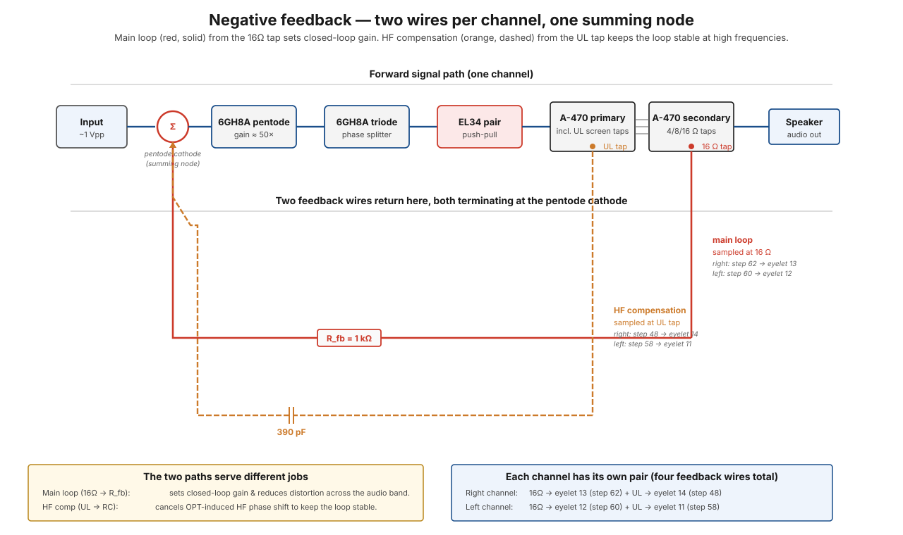

# Negative feedback path

Negative feedback is a single circuit decision with outsized consequences: take a small fraction of the output signal, invert it, and add it back to the input. The amplifier then sees its own output and corrects for any difference between intended and actual — trading raw gain for lower distortion, lower output impedance, and flatter bandwidth.

In the ST-70 the feedback loop wraps **every stage** of the amp: from the input pentode all the way through to the speaker terminals and back. For the theory (the closed-loop math, what loop gain buys you, what stability constraints come with it), see [feedback](../theory/feedback.md). This page traces the **physical wires** that implement the loop — and there are two per channel, not one.

## The big picture

The amp constantly listens to its own output, compares it to the input, and cancels the difference. That's the whole idea. Two small wires per channel carry a sample of the output back to the very first tube, where it *subtracts* from the incoming signal — so any error the amp adds (distortion, drift, ringing) shows up in the comparison and gets corrected automatically, thousands of times per second.

!!! note "In plain words — cruise control"
    Feedback is cruise control. Without it, you'd hold the gas pedal at a fixed angle and your speed would wander with every hill (every tube imperfection, every speaker load change). With it, the car *measures its actual speed* and continuously trims the throttle to hold the target. The ST-70 gives up raw gain (it has ~10× more than it needs) to buy that self-correction — you built this exact trade on the bench in [the feedback divider](../bench-primer/extras/e7-feedback-divider.md). The catch, as you'll see below, is that a correction that arrives *late* becomes a push in the wrong direction — which is why there's a second wire.

## At a glance — one channel

<figure class="diagram-fig" markdown="span">
  
  <figcaption>Top row: the forward signal path. Bottom: the two feedback wires returning to the pentode cathode (the summing node Σ). Red solid = main loop sampled at the OPT 16 Ω secondary tap, through R_fb. Orange dashed = HF compensation sampled at the OPT UL primary tap, through an R+C network. Both terminate at the same node but serve different jobs across the audio band. Hover any element for details. Click to zoom.</figcaption>
</figure>

## Why there are two feedback wires per channel

The main feedback loop samples at the **16 Ω secondary tap** — the conventional choice, because it represents the actual speaker-level output. That tap goes through a resistor (R_fb) to the input pentode's cathode, where it sums against the AC signal arriving at the same cathode through local cathode bias. This is the loop that sets closed-loop gain and gives the ST-70 its low distortion.

The catch: the output transformer adds phase shift at high frequencies, and at some frequency that phase shift accumulates to where the feedback stops being negative and turns positive — at which point the amplifier oscillates. Without compensation, an OPT with steep HF roll-off can push the amplifier into oscillation despite stable behavior at audio frequencies.

!!! note "In plain words — why late feedback makes things worse"
    Picture steadying a wobbling pole by pushing against each wobble. If your pushes land *exactly opposite* the wobble, you damp it — that's negative feedback. But if your reactions lag by half a wobble, every push now lands *with* the motion instead of against it, and you're pumping the wobble bigger — that's oscillation. The OPT delays the feedback signal more and more as frequency rises; at some frequency the "correction" arrives half a cycle late and flips from firefighter to arsonist. The second wire exists purely to prevent that.

The fix: a **second feedback tap from the UL screen winding on the primary**, brought back to the same input cathode through an RC network that bites only at high frequencies. At HF, this second path "feeds forward" some phase-corrected signal that cancels part of the OPT-induced phase shift, restoring negative-feedback margins. At audio frequencies, the cap looks open and the second path contributes nothing — the main loop dominates.

So:

- **Main loop** = 16 Ω tap (secondary). Sets closed-loop gain and audio-band distortion.
- **HF compensation** = UL tap (primary). Keeps the amp stable; only active above a few kHz.

Both terminate at the same node (the pentode cathode) but through different RC networks on the PC-3A board.

## Stage by stage — main loop (16 Ω tap)

### Stage 1 — OPT secondary, YELLOW lead

Each [A-470](../components/a-470-output-transformer.md)'s 16 Ω secondary tap (the YELLOW lead) was landed at lug 1 of its 4-screw rear terminal strip in [step 11](../build/output-stage/step-11-right-opt-secondaries.md) (right channel) and [step 12](../build/output-stage/step-12-left-opt-secondaries.md) (left channel) — and *deliberately left unsoldered* at that step, because the feedback wire would land on the same lug later.

### Stage 2 — Wire from rear strip lug 1 → eyelet on PC-3A board

- **Right channel**: 9½" wire from right strip lug 1 → eyelet 13 ([step 62](../build/driver-stage/step-62-right-strip-1-to-eyelet-13.md)).
- **Left channel**: 12" wire from left strip lug 1 → eyelet 12 ([step 60](../build/driver-stage/step-60-left-strip-1-to-eyelet-12.md)).

The wire length is calibrated — the manual notes that this wire must be routed *close to the chassis* and *around the printed circuit board*. This wire carries a low-level audio signal mixed with the feedback content; nearby AC fields (heaters, power transformer) can induce hum if the wire's loop area is large. Hugging the chassis uses the metal as a partial shield.

### Stage 3 — Through the feedback resistor R_fb on the PC-3A

Inside the board, the feedback wire passes through the **feedback resistor** (1 kΩ, sized for the desired feedback amount) on its way to the pentode's cathode. The value of this resistor, together with the pentode's cathode bias resistor, sets the feedback fraction `β` and therefore the closed-loop gain.

**Why a resistor and not a straight wire?** Because you don't want *all* of the output fed back — that would cancel the signal entirely and the amp would have no gain left. R_fb and the cathode resistor form a voltage divider (the same [β divider you built on the bench](../bench-primer/extras/e7-feedback-divider.md)) that returns only a small, precisely chosen *fraction* of the output. That fraction is the knob that sets how much gain you trade for how much correction. Change R_fb and you change the amp's gain, distortion, and damping all at once — it's one resistor doing system-level work.

The original ST-70 uses about **20 dB of feedback** — meaning the closed-loop gain is about 10× lower than the open-loop gain. See [feedback theory](../theory/feedback.md#what-feedback-buys-you-concretely) for what 20 dB buys.

### Stage 4 — At the pentode cathode

The feedback signal arrives at the pentode's cathode and **sums** there with the cathode bias resistor + bypass cap network. The cathode is the magic node: the AC signal coming in from the grid causes the plate current to swing in one direction; the feedback signal coming in at the cathode tries to swing the plate current the *opposite* direction; the net result is whatever combination satisfies both.

Because the feedback is inverted (sampled at the OPT secondary after an even number of phase inversions through the amp), it *opposes* the input signal. The pentode effectively amplifies the *difference* between input and feedback. That's the closed-loop control mechanism.

**Why the cathode and not the grid?** The tube responds to the *grid-to-cathode* voltage difference. The grid is already occupied by the input signal, and mixing feedback into it would load down the source. Injecting at the cathode is the free back door: raising the cathode has the same effect as lowering the grid, so the feedback subtracts from the input without touching the input wiring at all. One node, two signals, automatic subtraction.

??? note "Check it on this build — the gain is the evidence"
    The pentode stage alone has ~50× of open-loop gain. **Measured on this build, input-to-plate gain is 19× with the feedback active** — the loop is visibly eating the difference, exactly as designed (anywhere around 15–25× is healthy). This makes a great one-measurement health check: if you ever measure ~50× at the pentode plate on a running amp, the feedback loop is open somewhere and the amp needs fixing, not admiring.

## Stage by stage — HF compensation (UL tap)

A second wire per channel adds the HF compensation feed-forward:

- **Right channel**: V6 pin 4 (GREEN UL screen tap of the right A-470, already landed at V6 pin 4 in [step 14](../build/output-stage/step-14-right-opt-primary.md)) → eyelet 14, via 5½" wire in [step 48](../build/driver-stage/step-48-eyelet-14-to-v6-feedback.md).
- **Left channel**: V3 pin 4 (UL tap on the left side) → eyelet 11, via [step 58](../build/driver-stage/step-58-v3-to-eyelet-11-feedback.md).

The UL tap is closer to the EL34 plate (electrically) than the secondary — it has the audio signal at a higher voltage and with less phase shift from the OPT. Sampling here gives the compensation network a "head start" on the phase rotation that the secondary will impose at HF.

On the board, the wire goes through a small **390 pF capacitor** before joining the main feedback at the pentode cathode. The cap is the key: it passes the compensation signal at high frequencies, where it's needed; at audio frequencies, the cap looks open and the path contributes negligibly.

**Why a cap makes the path frequency-selective:** a capacitor's opposition to AC falls as frequency rises — you measured exactly this behavior in [caps with AC](../bench-primer/extras/e5-caps-with-ac.md). At 390 pF the cap is a near-open circuit across the audio band and only starts conducting meaningfully up where the OPT's phase problems live. In plain words: it's a gate that stays shut for music and swings open for trouble. The compensation path is always wired in, but the cap decides *when it gets a vote*.

## Why sampling from the UL tap (not the 16 Ω tap) for compensation

Two design choices interact:

1. **The 16 Ω secondary tap is the "true" output** — it's what the speaker sees, so it's the right place to sample for the main loop. Sampling earlier in the OPT would mean "controlling" something other than what the speaker actually hears.
2. **The UL tap is "before" the OPT secondary's leakage inductance** — so phase shift at HF is smaller there. Sampling here for *compensation* means the corrective signal arrives with the right phase to push the main loop back into stable territory.

Dynaco's design (taking compensation from the primary UL tap) is one of several valid choices — other designs use a small cap across R_fb (a "step network"), or use a different sample point. The UL-tap approach has the benefit of being implementable with just one extra wire and a small RC on the board.

## Per-channel notes

| | Left channel | Right channel |
|---|---|---|
| Main loop sample point | Left 4-screw strip lug 1 (YELLOW) | Right 4-screw strip lug 1 (YELLOW) |
| Main loop arrives at | Eyelet 12 ([step 60](../build/driver-stage/step-60-left-strip-1-to-eyelet-12.md)) | Eyelet 13 ([step 62](../build/driver-stage/step-62-right-strip-1-to-eyelet-13.md)) |
| HF comp sample point | V3 pin 4 (UL tap) | V6 pin 4 (UL tap) |
| HF comp arrives at | Eyelet 11 ([step 58](../build/driver-stage/step-58-v3-to-eyelet-11-feedback.md)) | Eyelet 14 ([step 48](../build/driver-stage/step-48-eyelet-14-to-v6-feedback.md)) |
| Both terminate at | Left 6GH8A pentode cathode | Right 6GH8A pentode cathode |

Per-channel feedback loops are completely independent — the right channel's feedback doesn't interact with the left channel's. They share no wires.

## Where it can break

| Symptom | Likely cause | DMM probe |
|---|---|---|
| Channel has way too much gain (audibly loud) | Main feedback loop open (broken wire, cold solder at strip lug 1) | Probe continuity from rear strip lug 1 to eyelet 12/13 |
| Channel oscillates (squeals, motorboats, looks like noise on the scope at the speaker) | HF compensation missing (broken UL-tap wire, missing or shorted cap on board) | Check eyelet 11/14 has the right RC network intact |
| Channel has the right gain but ringy / shouty at HF | HF compensation cap value wrong or aged | Replace; this is a small cap on the PC-3A board |
| Channel motorboats at very low frequency | Coupling cap on the board too small or feedback loop has DC gain | Scope at pentode plate; look for sub-audio oscillation |
| Slight hum on one channel only | Feedback wire routed too close to a heater wire or power transformer; inducing AC | Re-dress the wire close to the chassis; check the routing matches the pictorial |
| Feedback wire fell off | Wire snapped or cold joint | Visual inspection; resolder |

A note on debugging feedback: it's tempting to assume "the amp works without feedback so feedback isn't necessary." That's wrong — *without feedback, an ST-70 has roughly 10× more distortion and a much higher output impedance, plus drift problems*. Always restore feedback before judging the amp's sound; an "open-feedback" amp is broken, not honest.

## Why feedback is invisible until it's not

When feedback is working, you don't hear it — by design. What you hear is the *absence* of the things feedback suppresses: distortion at low and mid power, woolly bass, drifty mid-band response. A well-functioning ST-70 sounds tight and clean.

When feedback fails (open wire, dried-up cap, wrong resistor), the amp's character changes immediately and dramatically:
- Gain goes up by 10×
- THD goes up by 10×
- Output impedance goes up by 10×
- HF response gets ringy
- And in the worst case, the amp oscillates

All four feedback wires (two per channel) are equally load-bearing. They're tiny — a few inches each — and easy to forget, but the amp without them is unrecognizable.

## What to remember

- Feedback is **cruise control**: sample the output, subtract it from the input, and every error the amp makes gets corrected automatically. The amp trades ~10× of gain (20 dB) for that self-correction.
- **Two wires per channel, two jobs**: the 16 Ω-tap wire through the 1 kΩ R_fb sets gain and kills distortion across the audio band; the UL-tap wire through the 390 pF cap only wakes up at high frequencies to keep the loop stable.
- The **β divider** (R_fb + cathode resistor) decides what fraction comes back — the same divider you built in [bench primer E7](../bench-primer/extras/e7-feedback-divider.md).
- Late feedback is worse than none: phase shift at HF can flip the correction into reinforcement (**oscillation**) — that's the entire reason the compensation path exists.
- One measurement tells you the loop is closed on this build: **~19× at the pentode plate is healthy; ~50× means the loop is open** and the amp is broken, however loud it sounds.

## See also

- [Feedback theory](../theory/feedback.md) — the math and the trade-offs
- [Phase splitting](../theory/phase-splitting.md) — what the feedback loop wraps around
- [A-470 output transformer](../components/a-470-output-transformer.md) — both feedback samples come from this part
- [PC-3A driver board](../components/pc-3a-driver-board.md) — where the feedback network lives
- [Audio signal path](audio.md) — the forward path that the feedback wraps
