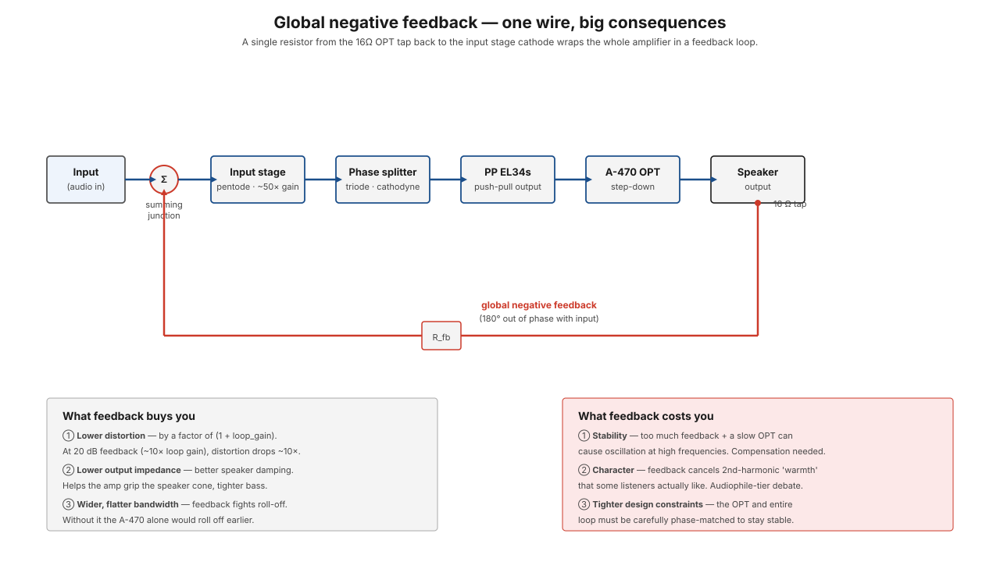

# Feedback

**Negative feedback** is a single design decision with outsized consequences: take a small fraction of the output signal, invert it, and add it back to the input. The amplifier then "sees" its own output and corrects for any difference between input and output. That correction reduces distortion, lowers output impedance, and flattens bandwidth — in exchange for some gain and some new stability constraints.

The ST-70 uses **global negative feedback**: a single resistor from the [A-470](../components/a-470-output-transformer.md)'s 16 Ω secondary tap back to the [input stage](../components/pc-3a-driver-board.md) cathode. That one wire wraps the entire amplifier — every stage, the OPT, everything — in a feedback loop.

<figure class="diagram-fig" markdown="span">
  
  <figcaption>The full signal path with the feedback wire shown in red. Hover any stage for what feedback does to it. Click to zoom.</figcaption>
</figure>

## The mechanism in one paragraph

Without feedback, an amplifier's job is open-loop: take the input, multiply by gain A, hope the output is a faithful copy. Any non-linearity in the tubes, any phase shift in the OPT, any DC drift — all of it shows up on the output.

With feedback, a fraction β of the output is subtracted from the input *before* the amplifier sees it. The amp now sees `input − β·output`. Whatever the amp does to that input shows up as the output. Solve for output:

`output = A · (input − β·output)`
`output · (1 + Aβ) = A · input`
`output = (A / (1 + Aβ)) · input`

The effective gain is `A / (1 + Aβ)` instead of `A`. With Aβ much greater than 1 (which it is in a real tube amp), the closed-loop gain becomes approximately `1/β` — set by the feedback resistor, not by the tubes. Tube non-linearity is dramatically attenuated because *any* deviation between actual output and the expected output gets corrected.

This is the core trade: you give up gain (which you have plenty of) in exchange for linearity, low output impedance, and wide bandwidth (which you want).

## What feedback buys you, concretely

For the ST-70 with about **20 dB of feedback** (loop gain ~10×):

### Lower distortion

Distortion in any stage is reduced by a factor of `1 + Aβ` — the "loop gain." For 10× loop gain, total harmonic distortion drops by ~10×. An open-loop ST-70 might produce 5 % THD at full output; with feedback, more like 0.5 %.

This applies to *every* source of distortion inside the loop: tube non-linearity, screen-grid effects, output transformer saturation. Everything gets pulled toward "what the input said."

### Lower output impedance

The amp looks much more like an ideal voltage source to the speaker. Output impedance drops by `1 + Aβ`. A typical open-loop tube amp has Z_out ≈ 5-10 Ω at the 8 Ω tap; with the ST-70's feedback, it drops to ~0.5 Ω or less.

The practical effect: better **damping factor** — the amp resists motion of the speaker cone caused by stored energy in the voice coil or cabinet. Tighter bass, less mushy low-mid range.

### Wider, flatter bandwidth

The A-470 by itself rolls off at the band extremes — its open-loop response is maybe ±0.5 dB from 25 Hz to 25 kHz. With feedback compensating for the roll-off, the closed-loop response is ±0.2 dB over a wider window. The amp's measured response becomes essentially determined by the feedback network, not by transformer characteristics.

### Reduced sensitivity to supply variation

Hum and ripple in the B+ rail show up as additive noise on the output. Feedback subtracts the same hum from the input, so the amp's output is *less* sensitive to supply noise. This is part of why a well-designed feedback amp tolerates a sloppier power supply than a no-feedback amp would.

## What feedback costs you

### Stability is now a design problem

Open-loop, the amp's bandwidth is whatever it is — phase shifts at the band extremes don't matter. With feedback, those phase shifts come back through the loop. If at some frequency the total phase shift through the loop reaches 180°, the *negative* feedback becomes *positive* feedback — and the amp oscillates.

The ST-70 handles this with three techniques:

1. **The A-470 has very low phase shift** in its passband — extending well into the inaudible high-frequency range.
2. **Modest loop gain** (20 dB instead of, say, 30 dB). Less correction, but more margin.
3. **Compensation capacitor** somewhere in the loop (often across a plate resistor) that rolls off the high frequencies inside the loop before they accumulate enough phase shift to oscillate.

This is why "more feedback is always better" is wrong — beyond a certain point, the amp becomes hard to keep stable across all loads (a partially-blown speaker, a long cable, a different speaker impedance) and starts oscillating into ultrasonic territory. That's bad for tubes, bad for speakers, bad for everyone.

### Even-harmonic "warmth" gets cancelled

This is the audiophile argument against feedback: the second-harmonic distortion characteristic of single-ended tube amps is widely considered "pleasing" — it adds a slight harmonic richness to the signal. Negative feedback works hard to cancel that distortion. The result is a more accurate, less colored amp — which is what the engineering side wants, but not always what the listener prefers.

The push-pull EL34s in the ST-70 already cancel a lot of 2nd-harmonic distortion *via the push-pull arrangement* itself (see [push-pull topology](push-pull-topology.md)). Feedback removes whatever push-pull cancellation missed.

If you want more "warmth": reduce or eliminate the global feedback. The amp's distortion will go up but so will the audible 2nd-harmonic content. This is the "zero-feedback" school of design.

### Constraints on the entire signal chain

Once you commit to a feedback loop, every component in that loop has to behave well at every frequency the loop sees. The OPT can't have weird resonances at 50 kHz. The coupling caps must not introduce phase shift below the cutoff. The driver stage has to swing enough to drive the output tubes through the corrections.

This is why tube amp design is a system-level problem, not a stage-by-stage problem.

## Damping factor

Damping factor is just the ratio of speaker impedance to amplifier output impedance:

`damping_factor = Z_speaker / Z_out`

The ST-70's spec is a damping factor of **at least 15**, which means Z_out ≤ ~0.5 Ω at the 8 Ω tap:

`damping_factor = 8 / 0.5 ≈ 16`

By solid-state amp standards (DF often > 100) that's low. By tube amp standards it's good — most tube amps have damping factors in the 5-20 range. Higher than that and you start losing the "tube character" people associate with bass.

The 16 Ω tap gives somewhat lower output impedance referred to the speaker (more feedback amplitude) — using a 4 Ω speaker on the 4 Ω tap gives a similar damping factor as 16 Ω on 16 Ω. The taps are designed to keep DF roughly constant across speaker impedances.

## Why the 16 Ω tap specifically

The ST-70's feedback resistor goes to the **16 Ω secondary tap**. Why not 8 or 4?

The 16 Ω tap has the largest voltage swing of the secondary (you can derive this: same power, P=V²/Z, so higher Z means higher V). That gives the feedback network the strongest signal to sample, which improves signal-to-noise in the feedback path. Lower-impedance taps would require a smaller feedback resistor to maintain the same loop gain, which would also draw more current from the speaker into the feedback path.

The 16 Ω tap is the canonical choice; the ST-70 uses it regardless of which tap your speaker is connected to.

## Local vs. global feedback

Global feedback wraps the whole amplifier. **Local feedback** is feedback applied within a single stage — most commonly, a cathode resistor *without* a bypass capacitor, which feeds back the cathode current to oppose grid voltage changes (cathode degeneration).

Local feedback:

- Reduces stage gain
- Improves linearity of that stage
- Lowers that stage's output impedance
- No global stability issues (the loop is small and short)

Global feedback:

- Reduces overall gain
- Corrects errors *anywhere* in the loop
- Sets overall closed-loop characteristics
- Introduces global stability constraints

Most tube amps use both: cathode degeneration in selected stages plus a global loop. The ST-70 follows this pattern.

## See also

- [Push-pull topology](push-pull-topology.md) — partly cancels 2nd-harmonic distortion before feedback even sees it
- [Phase splitting](phase-splitting.md) — the stage before push-pull
- [A-470 output transformer](../components/a-470-output-transformer.md) — its phase response is part of the feedback loop
- [PC-3A driver board](../components/pc-3a-driver-board.md) — where the feedback resistor lands at the input stage cathode
- [Step 11 — Right OPT secondaries](../build/output-stage/step-11-right-opt-secondaries.md) — where the 16 Ω tap is brought out for the feedback path
