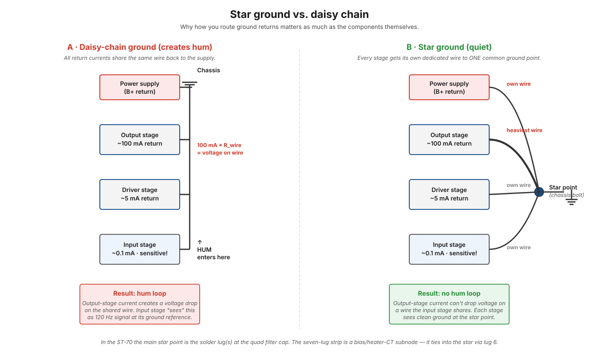

# Grounding and hum

"Ground" sounds like one thing — a reference voltage everyone agrees is 0 V. In a real amplifier it's many things: a reference for the input signal, a return path for output-stage plate current, a return for heater AC, a chassis-to-mains-earth safety bond. These are all called "ground," but the currents they carry are wildly different, and treating them as one thing is the single biggest source of hum in tube amplifiers.

This page is the conceptual reference for the grounding decisions you'll see scattered across the build steps. The TL;DR: route each return *independently* to one common point. Don't share wires between sensitive stages and high-current stages.

<figure class="diagram-fig" markdown="span">
  
  <figcaption>Two grounding topologies side by side. The same components, same currents — but the daisy chain creates a hum loop while the star topology doesn't. In the ST-70 the star point is the solder lug(s) at the quad filter cap. Click to zoom.</figcaption>
</figure>

## The fundamental problem

A wire has resistance. A small resistance — maybe 0.01 Ω per inch for 18 AWG copper. So small that we usually ignore it.

But: when current flows through a wire, the wire develops a voltage drop:

`V_drop = I · R_wire`

For 100 mA flowing through 4 inches of 18 AWG wire:

`V_drop = 0.1 A · 0.04 Ω = 4 mV`

4 millivolts. Tiny. Doesn't matter — unless that wire is also the *ground reference* for a sensitive input stage that's trying to amplify a 10 mV phono signal. Now the 4 mV "ground" voltage is **40 %** of the signal amplitude, and the amp produces a 120 Hz hum that's 40 % of the signal itself.

That's the entire grounding problem in one calculation: ground wires have impedance, currents flowing through them create voltages, and sensitive stages will pick up those voltages as if they were signal.

## Different grounds in the ST-70

The ST-70 has at least these distinct "grounds" by function:

| Ground type | Current | Why it's tricky |
|---|---|---|
| Output stage cathode return | ~100 mA (pulsing!) | Biggest current in the amp |
| Filter cap negative return | ~100 mA pulses at 120 Hz | Charging surges from the rectifier |
| Driver stage cathode return | ~5-10 mA | Modest |
| Phase splitter cathode | ~1 mA | Low |
| Input stage cathode | ~0.1-0.5 mA | Tiny — but the most sensitive! |
| Heater CT return (6.3V) | 60 Hz AC | Different *frequency*, same wire |
| Chassis safety earth (3-prong) | 0 (fault current only) | Must NOT carry signal current |

Tie all of these to the same wire and you get hum. Route each to a dedicated path and you don't.

## Star ground

The solution: designate ONE physical point on the chassis as "ground," and run a dedicated wire from each stage's return to that one point. No daisy-chaining. No "while we're here, let's also ground X to this convenient spot." One star.

In practice for a tube amp, the star point is usually:

- A single bolt on the chassis with several ring terminals stacked under a star washer.
- Located physically near the most current-hungry stages (the output tubes + filter cap), so high-current wires are short.

In the ST-70 specifically, the star point is the **solder lug(s) at the quad filter cap** — physically right where the heaviest currents return. The [seven-lug terminal strip](../components/seven-lug-terminal-strip.md) is a *subnode*: it hosts the bias supply filter network and the heater-CT anchors, and ties back to the star point via its lug 6 — see [step 6](../build/power-supply/step-06-heater-cts.md) for where the heater CTs anchor.

## Why daisy-chained ground creates hum

The diagram above shows what happens when several stages share a ground wire. Output-stage current (100 mA, pulsing at 120 Hz with the rectifier) flows through the shared wire. That current drops voltage along the wire — say, 50 mV at the wire's far end relative to the star point.

Now the input stage, sharing that wire, has its ground reference 50 mV away from "true zero." But that 50 mV isn't constant — it pulses at 120 Hz, following the rectifier. So the input stage sees a **120 Hz signal at its ground reference**, which it then dutifully amplifies through every subsequent stage and out the speakers.

This is what "60 Hz hum" or "120 Hz hum" sounds like — a steady drone at the line frequency or its rectified harmonic. The cause is almost always a ground topology problem, not "bad parts."

## What heater CTs have to do with it

Heater AC at 60 Hz is the OTHER common hum source. The [heater circuits page](heater-circuits.md) covers the CT trick (anchor the midpoint so the two heater leads swing symmetrically and their fields cancel). The CT eventually references "ground" — but WHICH ground, and how?

In the ST-70, the heater CTs land on lugs 5 and 7 of the terminal strip and reach ground **through 0.02 µF disc capacitors, not a hard wire**. At 60 Hz the caps anchor the midpoint for AC balance; at DC the CTs float. The reference is the same star ground the audio uses, so the heater 60 Hz field is balanced against the audio's own ground reference and any residual hum is rejected by the amp's natural common-mode rejection.

If the heater CTs referenced a *different* ground point than the audio star ground, you'd get a hum loop between them.

## Chassis safety earth vs. audio ground

The [3-prong cord modification](../modifications/3-prong-cord.md) adds an earth wire that bonds the chassis to mains ground for safety. This earth wire is critical for safety — and it must NOT be tied directly to the audio star ground.

Why? Because mains earth carries the fault currents of every device sharing the building's wiring. Tying it directly to your audio ground couples mains noise into your audio signal — appliance switching transients, fluorescent ballast noise, all the trash that lives on earth.

The standard fix: tie chassis earth and audio ground at ONE single point, through a resistor (typically 10 Ω) or directly with a single low-impedance link. NOT at multiple points (which creates a ground loop). NOT at zero points (which leaves audio ground floating).

This is also why the 3-prong cord earth goes to its OWN dedicated chassis bolt, separate from the audio star ground bolt. The two are linked at exactly one place, deliberately.

## Hum diagnosis with a scope

When you have hum in a built amp, the procedure is:

1. **Check the residue at the speaker output.** Connect a scope at the speaker terminals with no signal input. Is it 60 Hz (heater hum) or 120 Hz (B+ ripple / rectifier hum)? Different frequencies = different causes.
2. **Trace backward through the signal chain.** Probe at successive stage outputs (output of input stage, output of phase splitter, etc.). At what stage does the hum first appear?
3. **The hum source is just before where it first appears.** If hum appears at the driver stage but not the input stage, the driver's ground reference or supply is the problem.
4. **Touch a finger to the chassis at the star ground point**, then at suspected ground tabs along the chassis. If the hum changes, you've found an unintended current path.

This is a slow, methodical process. Hum problems rarely have one big cause; usually it's a few small ones adding up.

## Practical rules of thumb

- **One ground bolt for safety earth.** No daisy chains.
- **One ground bolt for audio ground (the star).** No daisy chains here either.
- **Link the two at exactly one place.**
- **Sensitive stages get their own return wires** — never share with output-stage returns.
- **Heater CTs reference the star ground** (in this amp, through 0.02 µF bypass caps rather than a hard wire).
- **Filter cap returns** can be heavy and short. If the cap mounts to the chassis directly, that's already the star path.

The ST-70 follows all of these. The star point is the solder lug(s) at the quad filter cap — right where the heavy currents already are. The [seven-lug terminal strip](../components/seven-lug-terminal-strip.md) is a subnode for the bias supply and heater CTs, tied to the star point via its lug 6.

## See also

- [Step 6 — Heater CTs](../build/power-supply/step-06-heater-cts.md) — where the heater CT anchor points are established
- [Seven-lug terminal strip](../components/seven-lug-terminal-strip.md) — the physical ground network anchor
- [3-prong cord modification](../modifications/3-prong-cord.md) — chassis-to-mains-earth bonding
- [Heater circuits](heater-circuits.md) — the CT-to-ground trick for hum reduction
- [Filter capacitors](../components/filter-capacitors.md) — heavy-current ground returns
