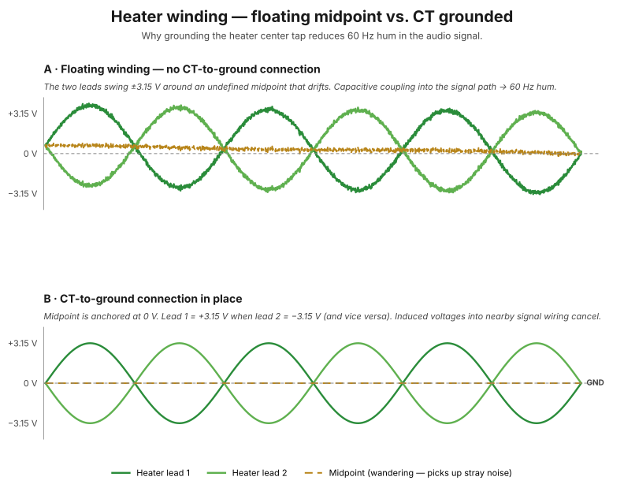

# Heater circuits

The 6.3V and 5V heater windings of the [PA-060](../components/pa-060-power-transformer.md) are the simplest parts of the power supply — but they're also where careless wiring most commonly introduces audible hum. This chapter covers what the heaters do, why they're AC, and the techniques used to keep their magnetic fields from leaking into the audio signal.

!!! note "Diagram placeholders"
    A planned interactive diagram will show magnetic field cancellation in parallel vs. twisted wire pairs. See [diagram roadmap](../index.md).

## Why tubes need heaters at all

All vacuum tubes need their cathodes heated to function. Electrons don't spontaneously leave a cold piece of metal — they're held there by atomic bonds. To get them to "boil off" the cathode surface (thermionic emission), you have to heat the metal until thermal energy overcomes those bonds. For oxide-coated cathodes (the standard for audio tubes), that's around 800°C.

**No heat = no electron flow = the tube is just an empty glass bulb.**

## Why the heaters use AC

The heater windings produce **AC**, not DC. The tubes' filaments are heated by 5V or 6.3V *alternating* current, swinging back and forth 60 times per second.

A filament is just a piece of resistance wire. Power dissipation is `V² / R` regardless of whether V is AC or DC. The wire heats up the same way. There's no rectification or smoothing needed for heaters.

DC heaters *are* sometimes used in very high-end designs to eliminate any chance of heater hum, but they require their own rectifier, filter cap, and regulator — extra cost and complexity that Dynaco didn't think was justified for the ST-70.

## Why 5V (for the 5AR4) and 6.3V (for everything else)

The 5AR4 (and many directly-heated rectifier tubes — 5U4, 5Y3, 5R4, etc.) was designed for **5V filaments**. The number is right there in the tube name: the "5" in "5AR4" tells you it's a 5V heater tube.

Most signal tubes from the same era — the EL34 outputs, 6GH8A drivers, 12AX7s, etc. — were designed for **6.3V filaments**. Again the number is in the name: 12AX7, 6V6, 6L6, 6SN7 — the leading "6" or "12" means 6.3V.

Why the difference? Originally, 6.3V was chosen for compatibility with car batteries (6V batteries actually run at ~6.3V in operation). 5V was a separate standard for power supply rectifier tubes.

You can't share these. Running an EL34 on 5V would underheat it (cold cathode, no emission, distorted/quiet sound, eventual cathode poisoning). Running a 5AR4 on 6.3V would overheat it (shortened life, eventual filament burnout). So the PA-060 has separate windings for the two voltage standards.

## The hum problem

There's a downside to AC heaters: any current flowing through a wire generates a magnetic field around it. AC current generates an *oscillating* magnetic field at 60Hz. If those fields reach into the audio signal circuitry, they induce **60Hz hum** — the audible enemy of every tube amp.

## How twisting the leads helps

The heater wires carry the same current in *opposite* directions (current flows out one wire of the winding and back the other). The magnetic fields around the two wires are also in opposite directions. At any point a few inches away, the field from one wire largely cancels the field from the other.

This cancellation is **dramatically better with twisted pairs than with parallel wires**. A loose pair of parallel wires lets the fields radiate outward; a twisted pair forces them to cancel locally. The tighter the twist, the better the cancellation.

You see this same principle at work in:

- Twisted-pair Ethernet cable (CAT5/6/7)
- Speaker cables sometimes
- Heater wiring throughout every well-built tube amp

## Why we "dress them along the chassis"

"Dressing" wires means routing them neatly along the chassis edge or pressed down against the metal. Two reasons:

1. Mechanically tidy and out of the way of other components
2. Keeping AC heater wires close to the grounded chassis further reduces their radiated magnetic field reaching nearby signal circuitry — the chassis acts as a partial shield

So the seemingly trivial instructions in the manual — *twist them, dress them along the chassis* — are doing real work to keep your amp quiet. A poorly-dressed heater pair can audibly add hum to the output.

## The center-tap-to-ground trick

Most heater windings (the green and brown 6.3V windings, but not the white 5V one) have a center tap brought out as a separate lead (GRN/YEL or BRN/YEL).

A heater winding without a CT-to-ground reference is **floating** with respect to the amp's signal ground. Its absolute voltage relative to the rest of the amp is undefined — it could drift anywhere within the limits of the transformer's insulation. In practice, capacitive coupling between the windings ties the heater leads to some imperfect reference, but it's not a clean one.

The two heater leads swing symmetrically around the floating reference: at any instant, one is at +3.15V relative to the floating midpoint, the other at −3.15V. But that floating midpoint itself wanders around, picking up stray noise.

When you connect the **center tap to ground**, you anchor that midpoint at exactly 0V relative to the amp's signal reference. Now:

- One heater lead is at **+3.15V relative to ground** at any instant
- The other heater lead is at **−3.15V relative to ground** at the same instant
- 1/120th of a second later, they swap

The two leads now swing **symmetrically around zero**, which is the amp's reference.

<figure class="diagram-fig" markdown="span">
  
  <figcaption>Panel A: floating midpoint drifts under stray pickup, both leads ride along. Panel B: CT tied to ground anchors the midpoint at 0 V, so the two leads' induced voltages into nearby signal wiring cancel cleanly. Click to zoom.</figcaption>
</figure>

When the midpoint is held at 0V, any voltage induced into nearby signal-carrying wires (via capacitive coupling between the heater wires and the signal wires running through the chassis) is **balanced** — the +3.15V wire induces a small positive voltage, and the −3.15V wire induces an equal and opposite negative voltage, and they cancel.

When the midpoint is floating, this cancellation is imperfect. The induced voltages don't fully cancel because the reference is wandering. Result: 60Hz hum gets into the audio signal.

The 5AR4 doesn't get this treatment because it's a power supply tube whose filament is electrically isolated from the cathode anyway — heater hum has no easy path into the signal.

## Why the heater AC frequency matters

Heater AC is at the mains frequency — 60Hz in the US. If hum couples from the heaters into the audio signal, it appears as 60Hz hum at the output. This is exactly the kind of low-frequency hum that's audible (the human ear is quite sensitive in the 60–120Hz range) and that audiophiles obsess over eliminating.

A well-designed tube amp with CT-grounded heaters can achieve hum levels 60–80dB below full output — quiet enough that you have to put your ear up to the speaker to hear it.

A poorly-grounded heater chain can produce visible-on-a-scope hum at the output. The CT-to-ground trick is one of the most cost-effective improvements in tube amp design: a single wire from each CT to a grounding point, and your hum floor drops dramatically.

## See also

- [How transformers work](how-transformers-work.md) — what's happening upstream of the heater secondaries
- [Grounding and hum](grounding-and-hum.md) — where the heater CT eventually ties into the amp's star ground
- [PA-060 power transformer](../components/pa-060-power-transformer.md) — the specific heater windings in this build
- [Step 2 — 5AR4 heater](../build/power-supply/step-02-5ar4-heater.md) — wiring the 5V heater
- [Step 4 — V2 heater](../build/power-supply/step-04-v2-heater.md) and [step 5](../build/power-supply/step-05-v7-heater.md) — wiring the 6.3V heaters
- [Step 6 — Heater CTs](../build/power-supply/step-06-heater-cts.md) — the center-tap-to-ground trick in practice
