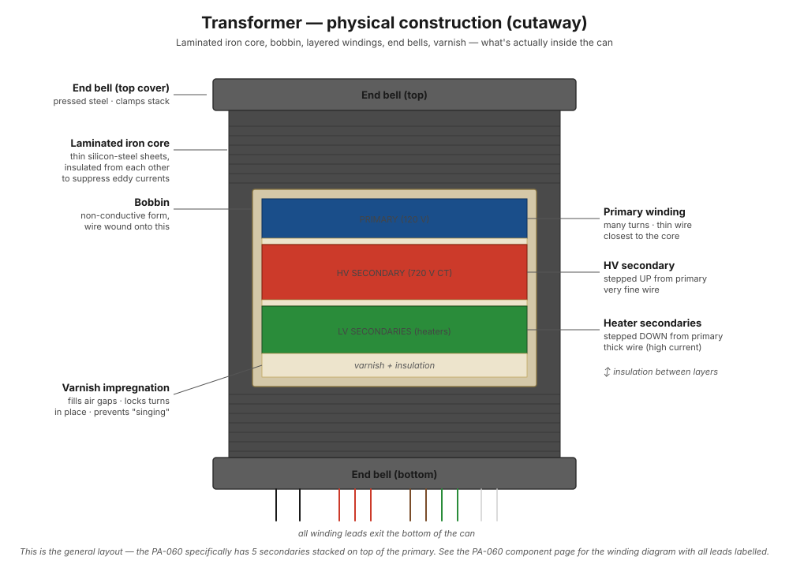

# How transformers work

This chapter covers the fundamental theory of transformers: how energy crosses from primary to secondary, how the physical construction is laid out, and what separates a mediocre transformer from a great one.

For the specific transformers in the ST-70, see the [PA-060](../components/pa-060-power-transformer.md) and [A-470](../components/a-470-output-transformer.md) pages.

## The big picture

Here's the whole chapter in four sentences, before any details. A transformer trades voltage for current, the way a bicycle's gears trade pedaling speed for pedaling force — total power stays (nearly) the same, but the mix changes. It does this with two coils of wire that never touch: energy crosses through a magnetic field, not a wire. The ratio of turns in the two coils sets the trade. Everything else on this page — the iron core, the paper-thin laminations, the fancy interleaved windings — exists only to make that magnetic handoff efficient and faithful.

!!! note "Diagram placeholders"
    ASCII transformer cross-sections here will be replaced with proper schematic-style SVGs before final PDF conversion. See [diagram plan](../index.md) for the full diagram roadmap.

## The fundamental principle

A transformer is two coils of wire wound around a shared chunk of iron. AC current flowing in coil #1 (the "primary") creates a changing magnetic field in the iron. That changing magnetic field induces a voltage in coil #2 (the "secondary"). Energy transfers from primary to secondary through the magnetic field — the two coils never electrically touch.

!!! note "In plain words"
    Think of the primary coil as shaking a rope, and the magnetic field in the iron as the rope. The secondary coil holds the other end and feels the shaking. Nothing travels *through* a wire from one side to the other — the secondary just feels the wiggle in the shared field and generates its own voltage in response. That's also why transformers give you **isolation** for free: there is no copper path from the wall to the amp's high-voltage circuits, only a magnetic one. A short on the secondary side can't put wall current directly into the chassis.

The voltage ratio is determined by the **turns ratio**: if the primary has 1000 turns of wire and the secondary has 100 turns, you get 10:1 step-down. 1000:6000 = 6:1 step-up. The PA-060 steps 120V AC up to 360V AC on each half of its high-voltage winding, and *down* to 6.3V on the heater windings — all from a single primary, with multiple secondaries each having a different turn count.

Why does the turns ratio set the voltage? Every single turn of wire around the core feels the same changing magnetic field, so every turn picks up the same small voltage. Turns in a coil are in series, so their voltages add — like batteries stacked end to end. More turns, more little voltages stacked up, more total voltage. The ratio of turns *is* the ratio of stacked-up voltages.

### Why this trick only works with AC

DC through the primary makes a magnetic field too — but a *steady* one, and a steady field induces nothing in the secondary. Only a **changing** field pushes electrons in the other coil. Feed a transformer DC and the secondary sits at zero volts while the primary, which is just a low-resistance coil of wire at DC, overheats and burns out. The whole device is built around change, which is why the wall gives us AC in the first place: AC can be stepped up for efficient long-distance transmission and stepped back down at your house, all with transformers.

### No free lunch: voltage up means current down

A transformer can't create power — it only converts it. Power in ≈ power out (minus a few percent of losses as heat). So when the PA-060 steps 120 V up to 360 V (3× up), the current available on that winding drops to roughly 1/3 of what the primary draws for it. Conversely, the 6.3 V heater winding is a big step *down*, so it can deliver several amps from modest primary current. This is why the high-voltage winding uses thin wire (low current) and the heater windings use thick wire (high current) — each winding's wire gauge is chosen for the current it actually carries. You worked with the power side of this trade in [power and heat](../bench-primer/extras/e1-power-and-heat.md), and you saw what happens when a supply is asked for more current than it can comfortably give in [source impedance and sag](../bench-primer/extras/e4-source-impedance-and-sag.md) — a real transformer winding sags exactly like the loaded divider you built there.

## Physical construction

<figure class="diagram-fig" markdown="span">
  
  <figcaption>Cutaway of a power transformer: end bells, laminated iron core, bobbin, layered windings (primary innermost, HV secondary, heater secondaries outermost), and the leads exiting the bottom. Hover any element for what it does. Click to zoom.</figcaption>
</figure>

The build sequence is roughly:

1. **Bobbin** — a non-conductive form (paper, plastic, or fiber) that the wire gets wound around
2. **Primary winding** — many turns of relatively thin wire (it carries low primary current at 120V)
3. **Insulation layers** between windings — paper, mylar, or varnish-impregnated tape
4. **Secondary windings** — wound on top of the primary, in layers separated by more insulation. Higher-current windings (heaters) use thicker wire; high-voltage windings (B+) use thinner wire but more turns
5. **Core lamination stack** — thin sheets of silicon steel ("laminations") shaped like Es and Is, stacked through the bobbin to form a closed magnetic loop
6. **End bells** — the metal covers that keep everything mechanically clamped and act as an electrostatic shield
7. **Varnish or oil impregnation** — fills the air gaps in the windings, locks turns in place, prevents vibration ("singing"), and improves heat conduction

Each of these steps has a reason you can trace back to a failure mode:

- **Why a bobbin?** The wire needs to be wound around *something* before the core exists — and that something must be an insulator, or the first layer of wire would short to the core.
- **Why insulation between layers?** Adjacent winding layers can sit hundreds of volts apart. On the PA-060's high-voltage winding, the far end swings to ±509 V peak relative to the center tap. Wire enamel alone is rated for the volts between *neighboring turns*, not between whole layers — the paper/mylar sheets handle the layer-to-layer voltage. Skip them and the winding arcs internally and shorts.
- **Why varnish?** The AC magnetic field physically tugs on the wires and core 120 times a second (the force peaks twice per cycle). Loose turns buzz audibly and slowly chafe through their insulation. Varnish glues everything into one solid block.

## Why iron, and why laminated?

Iron (specifically silicon steel) has high **magnetic permeability** — it concentrates magnetic field lines far more than air. A coil of wire wrapped around an iron core produces hundreds or thousands of times more magnetic flux than the same coil in air.

!!! note "In plain words"
    Iron is a *pipe for magnetism*. Without it, the primary's magnetic field would spray out in all directions and only a little of it would happen to pass through the secondary — like watering a plant by misting the whole yard. The iron core gathers nearly all the field and channels it in a closed loop straight through both coils, so almost every bit of "shake" the primary puts in arrives at the secondary. That's why the core forms a complete ring (the E and I laminations close the loop): a magnetic pipe with a gap in it leaks.

But there's a problem: when a magnetic field changes inside a conductor, it induces electrical currents in that conductor. A solid iron block in a changing magnetic field would have huge circulating currents flowing within it — **eddy currents** — which would heat the iron up and waste enormous amounts of energy.

The fix is **lamination**: instead of one solid block of iron, you use many thin sheets, each separated by a microscopic layer of insulating varnish. The eddy currents can't flow across the insulation, so they're confined to tiny loops within each sheet, which dramatically reduces the energy loss.

!!! note "In plain words"
    A solid iron core would behave like a one-turn secondary winding that's permanently short-circuited: the changing field induces a voltage *in the iron itself*, and since iron conducts, current swirls around inside it doing nothing but making heat. (This is exactly how an induction cooktop heats a pan — great for cooking, terrible for a transformer.) Slicing the core into insulated sheets is like cutting that shorted turn into pieces so the big swirling current has nowhere to go. The magnetic field doesn't care about the slices — magnetism passes through the varnish just fine — but the unwanted electric currents are blocked.

Thinner laminations = less eddy current loss = more efficient = less heat. Cheap transformers use thicker laminations to save on stamping and assembly costs. Premium transformers (like the Pacific Transformer reproductions in the DynakitParts kit) use thinner, often grain-oriented silicon steel.

## What separates a good output transformer from a great one

For the **[A-470 output transformer](../components/a-470-output-transformer.md)** specifically — the one that actually carries your audio signal — winding geometry is critical and arguably the single biggest determinant of sound quality.

The challenge: an output transformer has to faithfully transform a wide audio bandwidth (20Hz to 20kHz, ideally well beyond on both ends) at high power levels. This is technically very hard.

- **Bass response** depends on having lots of primary inductance. More turns = more inductance = better bass. But more turns also means thinner wire (to fit in the same window), more resistance, more capacitance, and worse high-frequency response.
- **Treble response** depends on minimizing the **leakage inductance** — magnetic flux that doesn't link primary to secondary perfectly. Leakage inductance acts like a series inductor in the signal path, rolling off the highs.

!!! note "In plain words"
    Why does bass need lots of inductance? At low frequencies the primary winding starts to look like a plain piece of wire rather than an inductor (an inductor's opposition to AC falls as frequency falls — the flip side of what you measured with capacitors in [caps with AC](../bench-primer/extras/e5-caps-with-ac.md)). If the primary's impedance drops too low at 20 Hz, it short-circuits the output tubes' bass signal instead of passing it to the speaker. More turns keeps the impedance high enough at the lowest notes.

    And "leakage inductance" is just field that misses the target: some of the magnetic field made by the primary loops back without ever passing through the secondary. That stray field stores and releases energy every cycle without delivering it, which acts exactly like an unwanted inductor wired in series with your signal — and a series inductor blocks high frequencies. So: field that leaks = treble that's lost.

So the designer is squeezed from both sides: more turns helps bass but hurts treble, fewer turns does the opposite. A great output transformer isn't the one that maxes out either number — it's the one that escapes the trade-off with clever geometry. That's what interleaving does:

The trick: leakage inductance is minimized by **interleaving the windings**. Instead of winding all the primary first and then all the secondary, you split them into sections — primary, secondary, primary, secondary — sandwiched together. The closer the primary turns are to the secondary turns, the better the magnetic coupling, and the lower the leakage inductance.

The Dynaco A-470 uses multiple-section interleaved winding — typically 5+ alternating layers. This is why it has wide bandwidth (the original spec sheet claimed −1dB from 6Hz to 30kHz at full power, which was extraordinary in 1959 and is still excellent today).

## Why audiophiles obsess over output transformers

The output transformer determines:

- **Frequency response** — how flat the amp is, how far the bass extends, how clean the highs are
- **Phase response** — how the timing of different frequencies aligns, which affects imaging and soundstage
- **Distortion character** — what kind of harmonics dominate when the amp is pushed
- **Damping factor** — how well the amp controls the speaker's motion, which affects bass tightness

A great output transformer with mediocre tubes will sound far better than mediocre transformers with great tubes. This is part of why the ST-70 platform supports such a wide range of tube swaps and modifications — the transformer is *good enough* that the tubes get to express themselves.

## What to remember

- A transformer moves energy through a **magnetic field**, not a wire — the two coils never touch, which also isolates the amp from the wall.
- The **turns ratio sets the voltage ratio**: every turn picks up the same small voltage, and turns stack like series batteries.
- It only works with **AC** — only a *changing* field induces voltage in the other coil.
- **Voltage up means current down** (and vice versa). Power converts; it isn't created. Wire thickness in each winding follows the current.
- Iron concentrates the field; **laminations** stop the iron itself from acting like a shorted, heat-generating turn.
- In the output transformer, **more turns = better bass, tighter primary-to-secondary coupling (interleaving) = better treble** — great transformers win by geometry, not brute force.

## See also

- [PA-060 power transformer](../components/pa-060-power-transformer.md) — the specific power transformer in this build
- [A-470 output transformer](../components/a-470-output-transformer.md) — the specific output transformer
- [Rectification](rectification.md) — what happens after the AC leaves the secondary
- [Heater circuits](heater-circuits.md) — the low-voltage secondaries
