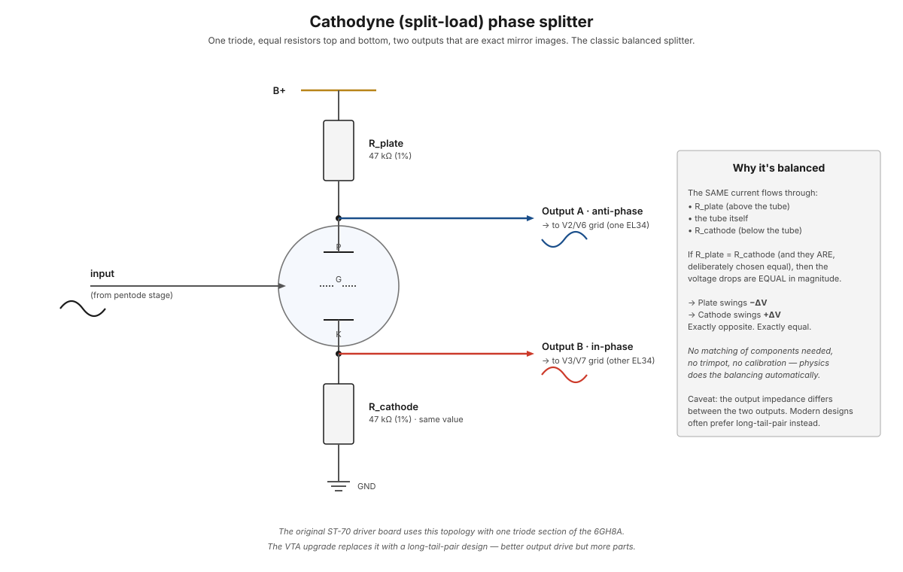

# Phase splitting

[Push-pull output stages](push-pull-topology.md) need two copies of the audio signal that are 180° out of phase. The job of producing them from the single-ended input signal is called **phase splitting**, and the circuit that does it is a **phase splitter** (or "phase inverter," depending on the era of textbook).

The ST-70 uses the simplest reasonable topology: a **cathodyne** (also called "split-load") phase splitter, built around one triode section of the [6GH8A driver tube](../components/6gh8a-driver-tube.md) on the [PC-3A board](../components/pc-3a-driver-board.md).

<figure class="diagram-fig" markdown="span">
  
  <figcaption>Equal resistors above and below a single triode. The plate output swings opposite to the input; the cathode output swings with it. Same current, same R, same magnitude — perfectly balanced. Click to zoom.</figcaption>
</figure>

## The geometry

A triode has three working electrodes: plate, grid, cathode. In a normal voltage amplifier:

- The grid receives the input signal.
- The plate connects to B+ through a load resistor.
- The cathode connects to ground (often through a small bias resistor + bypass cap).
- The output is taken from the plate, inverted and amplified.

A cathodyne phase splitter changes one thing: it makes the **plate load resistor and the cathode resistor equal value**, and removes the cathode bypass cap so the cathode swings with the signal. Then it takes TWO outputs — one from the plate, one from the cathode.

Now consider what happens when the grid swings positive:

- The tube conducts more (positive grid → more current).
- The same current flows through both resistors (Kirchhoff's law — current in a series path is the same everywhere).
- More current × same resistance = more voltage dropped across each.
- The plate, which was sitting at some positive voltage relative to B+, drops DOWN as more voltage is dropped across R_plate.
- The cathode, which was sitting at some positive voltage relative to ground, rises UP as more voltage is dropped across R_cathode.

Two outputs, swinging in opposite directions, with **identical magnitude** because the same current flowed through equal resistors.

That's it. The whole circuit. No matching, no calibration, no trim adjustments. The physics gives you balance for free.

## Why it works without calibration

The "magic" is that the current through both resistors is identical — it's the same physical current, flowing through a series path. Mismatches in:

- The tube's transconductance — irrelevant, same tube for both outputs.
- Power supply variations — irrelevant, same B+ feeds both.
- Temperature drift — affects R_plate and R_cathode equally if they're the same type.

The only thing that needs to match is the resistor values themselves. With 1 % tolerance resistors (cheap and standard), you get within 1 % balance for free.

Compare to a long-tail-pair phase splitter (the alternative — see below), which requires a matched tube pair AND has a balance trimpot. Cathodyne wins on simplicity.

## Where this lives in the ST-70

The 6GH8A is a "compactron" — two separate tube sections in one envelope. One section is a pentode (the voltage-amplifying gain stage), the other is a triode (used here as the phase splitter).

Signal chain through the PC-3A driver board:

1. Audio input arrives at the volume/balance controls.
2. The pentode section of the 6GH8A amplifies the input (voltage gain ~50×).
3. The triode section configured as a cathodyne splits the amplified signal into two phases.
4. Those two phases drive the grids of the [EL34 push-pull pair](push-pull-topology.md).

Two 6GH8As total in the ST-70 — one per channel.

## Output impedance — the cathodyne's weakness

The plate output and cathode output have different output impedances:

- **Plate output impedance** ≈ R_plate ≈ 22 kΩ (looking back into the plate, it's the parallel combination of R_plate and the tube's plate resistance r_p, but r_p >> R_plate so it's roughly R_plate).
- **Cathode output impedance** ≈ R_cathode / (1 + µ) ≈ ~500 Ω (the cathode follower has much lower output impedance due to the inherent feedback of cathode degeneration).

So the cathode output drives its load *much* harder than the plate output. The two EL34 grids see different source impedances, which can subtly unbalance the high-frequency response.

In practice this asymmetry is small enough at audio frequencies that the ST-70 sounds fine. But it's the main reason serious amplifiers (and the VTA upgrade) use a long-tail-pair instead.

## Alternative: long-tail-pair

The "long-tail-pair" (LTP) phase splitter uses two triodes with their cathodes tied together to a shared cathode resistor (the "tail" — often biased through a constant-current source).

Layout:

- Triode A grid receives the input signal.
- Triode B grid is held at AC ground (or tied to a balance trimpot for fine adjustment).
- Both plates have equal load resistors to B+.
- Both cathodes tie together through a shared resistor (the "long tail").

When the input swings positive on triode A's grid, A conducts more. The shared cathode wants to rise (more current through the tail). But triode B's grid is held fixed, so B's grid-to-cathode voltage drops — triode B conducts LESS. The plates of A and B swing in opposite directions.

Advantages over cathodyne:

- **Equal output impedance** at both plates (both are plate outputs, both ~22 kΩ).
- **Better PSRR**: power supply noise tends to common-mode at both outputs and gets cancelled by the push-pull stage.
- **More headroom**: each side can swing a larger fraction of B+.

Disadvantages:

- Uses TWO tube sections instead of one (most LTPs use both halves of a 12AX7 or similar).
- Needs a balance trimpot (or matched tubes).
- More parts overall.

The **VTA driver board** upgrade for the ST-70 (Tubes4HiFi) replaces the PC-3A's cathodyne with an LTP — one of several reasons people prefer that upgrade.

## Why the 180° relationship matters

The two output signals must be EXACTLY 180° apart for push-pull's even-harmonic cancellation to work. Any imbalance — say, one output is 95% of the other's amplitude, or shifted in time by a fraction of a cycle — means:

- Common-mode signals don't fully cancel (hum and 2nd-harmonic distortion leak through).
- The two EL34s are unequally driven, so their plate currents don't perfectly cancel in the OPT core.

The cathodyne's free balance is what makes it work in the ST-70 design. With careful component selection (1 % resistors, low-leakage coupling caps), the balance is good enough that the push-pull cancellation properties hold up well.

## Connection to other 180° relationships

The cathodyne's two outputs being 180° apart is the **same physics** as:

- The two halves of a [center-tapped transformer winding](rectification.md#the-180-phase-relationship-across-a-center-tap) being 180° apart.
- The two halves of the [push-pull primary on the A-470](push-pull-topology.md) being 180° apart.

In all three cases, opposite-phase signals enable the push-pull cancellation properties that make the system sound clean.

## See also

- [Push-pull topology](push-pull-topology.md) — what the phase-split signals drive
- [6GH8A driver tube](../components/6gh8a-driver-tube.md) — the specific tube
- [PC-3A driver board](../components/pc-3a-driver-board.md) — the board that implements the phase splitter in this build
- [Feedback](feedback.md) — the global feedback loop wraps around the splitter + push-pull stage
- [Rectification — 180° phase relationship](rectification.md#the-180-phase-relationship-across-a-center-tap) — same physics, different application
