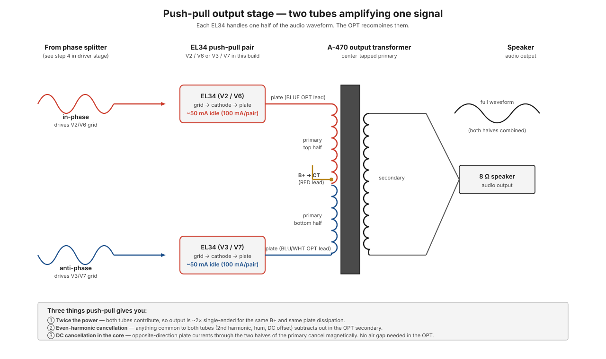

# Push-pull topology

A **push-pull** output stage uses two output tubes (or transistors) wired so that each one amplifies one half of the audio waveform. The two halves are combined in a center-tapped output transformer to produce the full signal at the speaker. The ST-70 has two push-pull pairs — one per channel — each driving an [A-470 output transformer](../components/a-470-output-transformer.md).

Push-pull is the dominant topology for tube power amplifiers, and the reasons aren't only about output power. The most interesting properties come from the geometry of how the two tubes' contributions combine.

**The big picture:** you *could* build an amp with one output tube per channel (that's called "single-ended," and plenty of small amps do it). The ST-70 uses two per channel instead, working as opposed partners, because the arrangement buys three things at once: roughly four times the clean power, automatic cancellation of the most common kinds of distortion and hum, and an output transformer that can be far better because it never sees net DC. Everything on this page is unpacking those three wins and *why* the geometry produces them.

!!! note "In plain words: the two-man saw"
    Picture two people on a two-man crosscut saw. One pulls while the other pushes, then they trade — the blade moves back and forth because their efforts are always *opposite*. Neither person cuts alone; the cut is made by the *difference* between their motions. Now notice what happens to anything they do *identically*: if both lean left at the same moment, the saw doesn't move at all — identical efforts cancel. That's push-pull in one image. The two EL34s are the two sawyers, the OPT is the saw handle connecting them, and the speaker hears only the difference between them. Signal (which the phase splitter deliberately made opposite) comes through doubled; everything the tubes share — hum, ripple, matching distortion — cancels like the two sawyers leaning the same way.

<figure class="diagram-fig" markdown="span">
  
  <figcaption>Two EL34s wired to opposite ends of the OPT's center-tapped primary. B+ enters at the center tap. The two tubes' inputs are 180° out of phase; their outputs combine in the secondary to produce the full audio waveform. Click to zoom.</figcaption>
</figure>

## The basic idea

The driver stage (in the ST-70, a [6GH8A](../components/6gh8a-driver-tube.md) configured as a phase splitter — see [phase-splitting](phase-splitting.md)) produces two copies of the input signal that are *exactly 180° out of phase*. When one swings positive, the other swings negative.

Those two signals drive the grids of two output tubes:

- **Tube A** receives the in-phase signal. When the audio swings positive, tube A conducts more.
- **Tube B** receives the anti-phase signal. When the audio swings positive (tube A conducts more), tube B's grid swings negative, so tube B conducts *less*.

Both tubes share the load (the OPT primary), but they pull current through it in *opposite* directions. The OPT's secondary sees the difference between the two tubes' contributions, which is the full audio waveform.

It's important that this is *the difference*, not the sum:

`output ∝ (current_A) − (current_B)`

Whatever the two tubes have in common — DC bias current, hum picked up equally, distortion products that happen identically in both tubes — gets subtracted out. Whatever differs (the audio signal, which is in opposite phases) gets doubled.

!!! note "Why 'the difference' is the whole trick"
    This one line is the reason the topology exists, so it's worth restating without symbols. The output transformer is a *subtraction machine*. Anything that arrives at both tubes identically — in the same direction, at the same time — produces two equal-and-opposite magnetic fields in the core, and the speaker hears nothing. Anything that arrives in *opposite* directions produces two fields that reinforce, and the speaker hears it doubled.

    So the design strategy is simply: make sure the *music* arrives in opposite phases (that's the [phase splitter's](phase-splitting.md) entire job), and let everything you *don't* want — power-supply ripple, bias drift, matched distortion — arrive identically so the transformer throws it away for free. You can see this working on this actual build: the main B+ rail still carries about 2–3 Vp-p of residual ripple after the choke, yet almost none of it reaches the speaker, because both tubes see that ripple identically through the center tap and the OPT subtracts it out.

## Why not just use one bigger tube?

Before going further, it's worth asking the obvious question: why two tubes in this dance instead of one big tube working alone (single-ended)? Three reasons, each expanded in the sections below:

1. **Power.** One tube can only swing its half of the story; two opposed tubes double the swing and, more importantly, unlock class AB operation where each tube can be driven far harder on its half-cycle.
2. **Distortion.** A single tube's distortion goes straight to the speaker — there's nothing to cancel against. Push-pull cancels the largest distortion components automatically.
3. **The transformer.** A single-ended tube's idle current magnetizes the OPT core continuously, forcing a compromised (air-gapped) transformer. Push-pull's opposed DC currents cancel, so the transformer can be excellent.

Single-ended amps exist and have their devotees — but they pay in all three currencies at once for their simplicity. For a 35 W/channel amplifier, single-ended isn't realistically on the table.

## Three things push-pull gives you

### 1. About twice the power

The two tubes swing in opposite directions, so the total voltage swing across the OPT primary is **doubled** compared to a single tube driving one half of the winding. But the bigger practical win comes from operating conditions push-pull makes possible: the tubes can run class AB (each loafing through part of the cycle, so each can be driven much harder on its half), and the DC magnetisation of the core cancels (see below), letting the transformer do its job efficiently. Together these let a push-pull pair deliver far more clean power than two single-ended tubes of the same dissipation.

The ST-70 delivers 35 W per channel using push-pull EL34s. A single-ended EL34 amplifier maxes out around 8 W. Same tubes, same B+, very different output.

!!! note "In plain words"
    Why more than double from two tubes? Because it's not just "two engines instead of one" — it's two engines *taking turns*. A single-ended tube must idle at half throttle forever, so it can only ever add or subtract half its range. In push-pull class AB, each tube can loaf near idle and then be driven hard through its own half of the waveform, resting during the other half, like two cyclists alternating sprints instead of one cyclist holding a steady cadence. Each tube's *average* dissipation stays safe while its *peak* contribution goes way up. That's where 35 W from a pair of "8 W" tubes comes from. If you want to feel what those watts mean at the speaker end, [E6 — driving a speaker](../bench-primer/extras/e6-driving-a-speaker.md) walks through power into a real load on the bench.

### 2. Even-harmonic cancellation

Pentodes (and triodes) produce both even-order and odd-order harmonic distortion when overdriven. The even-order components (2nd, 4th, 6th harmonics) happen *equally and in phase* in both tubes — so when the OPT subtracts the two tube outputs, they cancel.

Specifically: feed a pure 1 kHz sine into a single tube, you might measure 1 % 2nd-harmonic distortion at the output. Feed the same signal into a push-pull pair, the 2nd-harmonic distortion drops to maybe 0.05 % — a factor of 20 lower. Odd-order harmonics (3rd, 5th) don't cancel — they actually add — but those are also much smaller in magnitude.

??? note "Why do the even harmonics cancel but the odd ones don't?"
    No math needed, just symmetry. A tube's transfer curve is slightly lopsided: it stretches one half of the waveform and squashes the other. That lopsidedness *is* even-harmonic distortion. Now hand the two tubes opposite-phase copies of the signal: tube A squashes the top of *its* waveform, tube B squashes the top of *its* waveform — but B's waveform is upside-down, so B is squashing what will become the *bottom* of the combined output. When the OPT subtracts them, one tube's "stretched top" lands exactly on the other's "stretched top" — same shape, same side, common to both — and it cancels, exactly like the two sawyers leaning the same way.

    Odd-harmonic distortion is different: it's *symmetric* (it squashes both the top and bottom of the wave equally, like soft clipping). Flip a symmetrically-squashed wave upside-down and it looks the same — so the two tubes' odd-harmonic errors arrive in opposite phase along with the signal, and they add just like the signal does. Fortunately they're much smaller to begin with, and the [global feedback loop](feedback.md) knocks down what remains.

This is why push-pull amps measure cleanly. Whether they *sound* cleaner is a matter of taste:

- The "audiophile" argument: push-pull's even-harmonic cancellation removes pleasing 2nd-harmonic "warmth" that single-ended amps preserve.
- The engineering argument: distortion is distortion; less is better; push-pull wins.

Both positions are defensible. The ST-70 is push-pull, and the EL34 push-pull pair is a classical "musical sounding" combination, so the practical answer for this build is: you get the best of both characters.

### 3. DC plate currents cancel in the core

Each tube draws ~50 mA of DC plate current at idle (~100 mA per pair). That current flows through its half of the OPT primary. The two tubes' DC currents flow in *opposite directions* through the magnetic core — they cancel.

!!! note "In plain words"
    B+ enters the primary at the *center tap* and splits: half flows out one end of the winding to tube A, half flows out the other end to tube B. From the core's point of view, those two currents travel through the winding in opposite directions — one clockwise, one counterclockwise around the core. Equal and opposite currents make equal and opposite magnetic fields, and the core feels *nothing* at idle, despite ~100 mA flowing through it. It's the magnetic version of a tug-of-war between two equally matched teams: enormous effort, zero net motion.

This matters because it means the OPT core doesn't have to be designed to handle ~100 mA of DC magnetisation. In a single-ended amp, all the tube's DC current flows one way through the core, magnetising it heavily — the core has to have an air gap to avoid saturating, which reduces inductance and bandwidth.

In push-pull, no gap is needed. The core can be a continuous magnetic path, giving:

- **Higher inductance per turn** → better low-frequency response.
- **Tighter coupling** between primary and secondary → better high-frequency response.
- **Smaller core size** for the same power handling.

The A-470's extraordinary bandwidth (−1 dB from 6 Hz to 30 kHz at full power) is largely possible because of push-pull's DC cancellation.

??? note "Why does DC in the core matter so much?"
    A transformer core can only support so much magnetic field before it *saturates* — the iron simply can't hold any more, and past that point it stops behaving like a transformer (distortion skyrockets). Think of the core as a bucket for magnetic field. In a single-ended amp, the tube's idle current pre-fills that bucket halfway before any music plays — you've spent half your headroom on standing DC, so the designer must cut an air gap in the core to enlarge the bucket, which hurts inductance (bass) and coupling (treble). In push-pull, the two idle currents cancel and the bucket starts *empty*: the entire core is available for the audio signal. Same iron, twice the usable room, no gap compromises. This is the least glamorous of the three push-pull wins but arguably the biggest, because the output transformer is the hardest component in a tube amp to make good.

## Class A, AB, B — operating point matters

Push-pull amps differ in how much of the cycle each tube conducts:

- **Class A**: each tube conducts for the *entire* audio cycle. Both tubes are always partly on. Smoothest distortion characteristic, but inefficient (only ~25 % of B+ becomes output power).
- **Class B**: each tube conducts for *exactly half* the cycle, then cuts off completely. More efficient (~50-70 %), but the transition between tubes (the "crossover") introduces distortion if not handled carefully.
- **Class AB**: somewhere between. Each tube conducts for *more than half* the cycle, so the two overlap during small signal swings (class A behavior). At high signal levels they push into class B for efficiency.

The ST-70's EL34s operate **class AB**. At low listening levels both tubes are always on (class-A territory); pushed hard, the amp slides into class-B operation for the loudest peaks.

!!! note "In plain words: back to the two-man saw"
    Class A is both sawyers keeping their hands on the saw for the entire stroke, always contributing something — smooth, but exhausting (most of the energy becomes heat, not cutting). Class B is each sawyer completely letting go the instant the other takes over — efficient, but the *handoff* is where things get rough: if there's any gap between one letting go and the other gripping, the blade stutters. That stutter is **crossover distortion**, and it's especially audible because it happens right at the quietest part of the waveform, where there's no loud signal to mask it. Class AB is the sensible compromise: both keep a light grip through the handoff (small overlap, no stutter), then each rests during the other's power stroke. The overlap region is set by the idle current — which is exactly what the bias adjustment controls.

    That's *why* bias is a user adjustment on this amp and why it matters: bias sets each EL34's idle current (~50 mA each on this build, from about −32 V on the grids). Too little idle current and the handoff gap opens up (crossover distortion at low volume — the worst place for it). Too much and the tubes run hot all the time for no audible benefit, shortening their lives.

The transition is smooth as long as bias is set correctly. Bias too cold → crossover distortion at low levels. Bias too hot → red-plating and short tube life. See [bias adjustment](../bring-up/bias-adjustment.md) and the [individual bias pots mod](../modifications/individual-bias-pots.md) for the practical procedure.

## Why push-pull needs phase splitting

The whole push-pull arrangement depends on having TWO copies of the input signal, in opposite phases. Where do they come from?

The driver stage. In the ST-70 this is the [6GH8A driver tube](../components/6gh8a-driver-tube.md) on the [PC-3A board](../components/pc-3a-driver-board.md), configured as a phase splitter. The 6GH8A takes one input signal and produces two output signals 180° apart — which become the inputs to the push-pull pair.

If the phase splitter is unbalanced (one output stronger than the other), the push-pull cancellation properties degrade. Hum and distortion that would have cancelled now bleed through. So phase splitter balance is critical — see [phase-splitting](phase-splitting.md) for the topology and tradeoffs.

Why is imbalance so costly? Because every benefit on this page came from *subtraction of equals*. If one sawyer pulls at 95 % of the other's strength, the saw still cuts — but the "identical" stuff is no longer identical, so it no longer fully cancels. A 5 % drive imbalance means 5 % of the rail ripple, 5 % of the matched distortion, and a net 5 %-of-idle DC current all leak past the cancellation. The topology degrades gracefully — it doesn't fail, it just slowly forfeits its advantages in proportion to the imbalance. This is also why *matched output tubes* and balanced bias matter: the splitter can deliver perfect opposite-phase drive, but if one EL34 is stronger than the other, the subtraction is unequal at the output end instead.

## What to remember

- **Two tubes, opposite phases, and the OPT subtracts.** The speaker hears the *difference* between the tubes — signal doubles, everything shared cancels.
- **Three wins from one geometry:** ~4× the clean power (via class AB), automatic cancellation of even-harmonic distortion and rail ripple, and a gapless (therefore excellent) output transformer.
- **The B+ rail can be imperfect and the speaker won't care** — on this build, ~2–3 Vp-p of residual rail ripple reaches the OPT center tap, and push-pull rejects almost all of it.
- **Everything depends on balance.** The phase splitter must produce equal opposite drives, and the two tubes must be matched and biased alike; every imbalance leaks a proportional amount of the "cancelled" garbage through to the speaker.
- **Bias sets the class-AB handoff.** ~50 mA idle per EL34 on this build — too cold stutters at low volume (crossover distortion), too hot cooks tubes.

## How this connects to other parts of the manual

- The two EL34s of each channel ([V2/V3 for the left channel, V6/V7 for the right](../index.md#tube-layout-this-manuals-numbering)) form a push-pull pair driving an [A-470](../components/a-470-output-transformer.md).
- The OPT's center tap (RED lead) is where B+ enters; the two ends (BLUE / BLUE-WHITE) connect to the two tube plates. See the [A-470 page](../components/a-470-output-transformer.md) for the lead assignments.
- The phase splitter that feeds the push-pull pair is covered on the [phase splitting](phase-splitting.md) page.
- Even-harmonic cancellation depends on balanced operation, which depends on matched tubes — see the [individual bias pots mod](../modifications/individual-bias-pots.md) for keeping the two tubes balanced.

## See also

- [Phase splitting](phase-splitting.md) — generating the two opposite-phase signals push-pull needs
- [A-470 output transformer](../components/a-470-output-transformer.md) — the center-tapped OPT that combines the two tubes
- [EL34 output tube](../components/el34-output-tube.md) — the tubes themselves
- [Feedback](feedback.md) — the global negative-feedback loop that wraps around the push-pull stage
- [Individual bias pots mod](../modifications/individual-bias-pots.md) — keeping the two halves of each push-pull pair balanced
