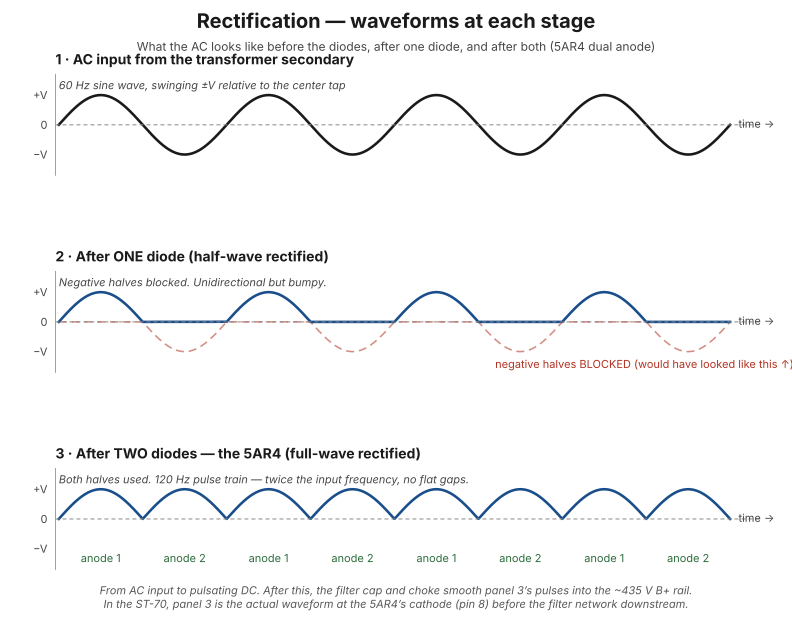
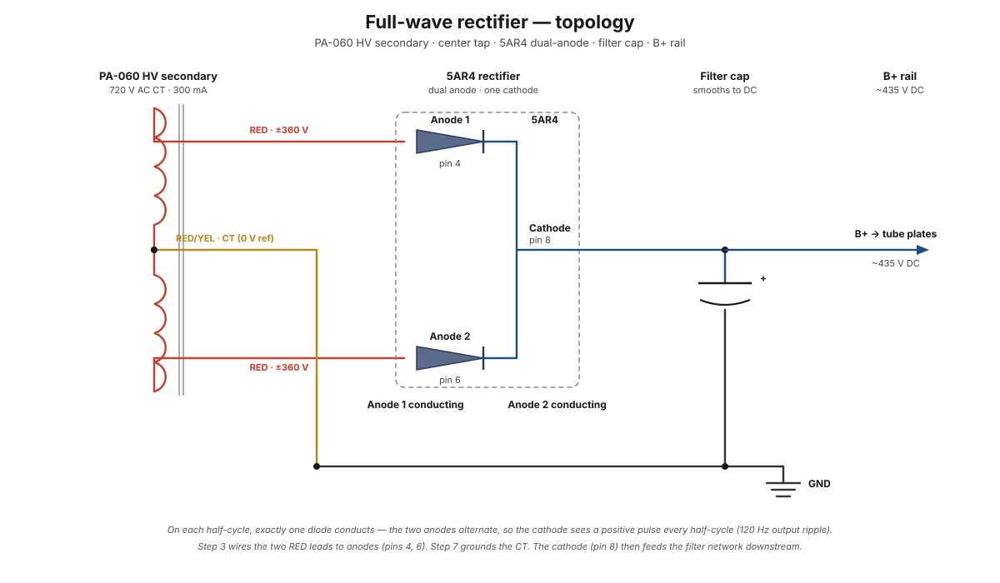
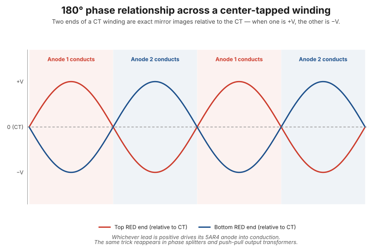
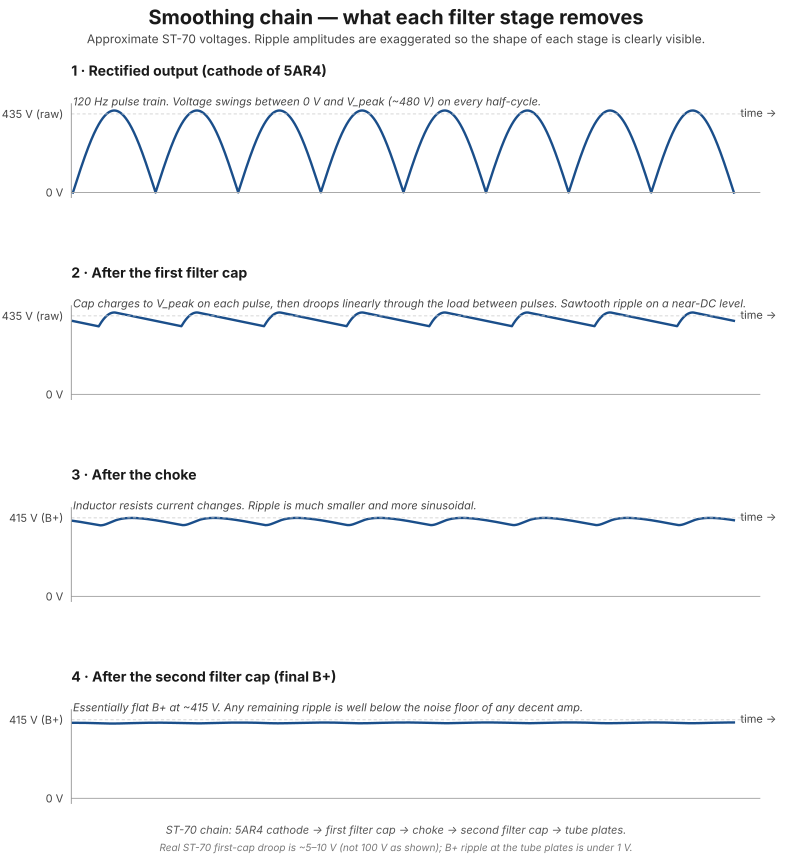

# Rectification: turning AC into DC

Rectification is the bridge between what the wall provides (AC) and what tubes need on their plates (DC). This chapter covers half-wave vs. full-wave rectification, the 5AR4 specifically, smoothing, and the 180° phase relationship across a center tap — a concept that shows up everywhere in tube audio.

!!! note "Diagram placeholders"
    ASCII waveforms here will be replaced with matplotlib-generated graphics. Interactive rectification animations are planned — see [diagram roadmap](../index.md).

## The problem

Tubes need DC on their plates. The wall provides AC. Something has to bridge that.

<figure class="diagram-fig" markdown="span">
  
  <figcaption>What the waveform looks like at each stage: raw AC from the transformer, after one diode (half-wave), after the 5AR4's two anodes (full-wave). Hover any panel for the physics. Click to zoom.</figcaption>
</figure>

## What "rectify" means

The word comes from the Latin *rectus* (straight, right, correct) — same root as "rectangle" and the everyday "rectify" meaning to fix or straighten out. In electronics it specifically means **converting alternating current (AC) into direct current (DC)** by forcing the current to flow in only one direction.

## How a diode rectifies

A diode is a one-way valve for current. It conducts when voltage is applied in one direction (forward-biased) and blocks when applied the other way (reverse-biased).

Putting a diode in line with the AC source produces **half-wave rectification** (panel 2 of the diagram above): the negative halves are blocked. What remains is a series of positive humps — current flowing in only one direction. It's still bumpy DC, not smooth, but it's now *unidirectional*, which is the essential first step.

## Full-wave rectification (what the 5AR4 does)

Half-wave wastes half the energy and produces dirty DC that's hard to smooth. **Full-wave rectification** uses additional diodes (or, in the [5AR4](../components/5ar4-rectifier-tube.md)'s case, two diodes in one tube envelope) to flip the negative halves up — panel 3 of the diagram above. Both halves contribute positive pulses, and the output frequency doubles from 60 Hz to 120 Hz, which makes it far easier to filter.

The 5AR4 has two anodes (pins 4 and 6 on the tube socket) connected to the two ends of the high-voltage transformer winding. The center tap of that winding (the RED/YEL lead) provides the ground reference. On the positive half-cycle, current flows through one anode; on the negative half-cycle, current flows through the other anode. The cathode (pin 8 — also where the heater is, since the 5AR4 is indirectly heated) sees both halves as positive pulses.

<figure class="diagram-fig" markdown="span">
  
  <figcaption>The complete circuit: PA-060 HV secondary with center tap, 5AR4 dual-anode rectifier, filter cap, B+ rail to load. Hover any component for its role and wiring details. Click to zoom.</figcaption>
</figure>

See [step 3](../build/power-supply/step-03-5ar4-anodes.md) for the actual wiring that creates this topology, and [step 7](../build/power-supply/step-07-hv-ct.md) for the center-tap connection that completes it.

## The 180° phase relationship across a center tap

Full-wave rectification depends on a deep fact about center-tapped windings: **the two ends are always exactly 180° out of phase** with each other relative to the center tap.

The center tap is exactly halfway through the high-voltage coil. Both halves of the secondary are wound around the same core, share the same magnetic field, and have the same number of turns. So they produce equal-magnitude voltages.

But because we measure each half "from the center tap outward," the two ends end up with opposite polarities at any instant:

```
       RED (one end)
        │
        ║  ← top half of winding
        ║
        ║
   RED/YEL (center tap)
        ║
        ║  ← bottom half of winding (same number of turns)
        ║
        │
       RED (other end)
```

Each half of the winding produces 360 V RMS, which peaks at about ±509 V at the instant of maximum field. When the magnetic field is rising in one direction:

- **Top RED end:** up to +509V relative to CT
- **Bottom RED end:** down to −509V relative to CT

Half a cycle later (1/120th of a second), the field reverses and so does the polarity:

- **Top RED end:** down to −509V relative to CT
- **Bottom RED end:** up to +509V relative to CT

The two ends are **always opposite** — at any instant, whatever voltage one end sits at, the other is its mirror image.

<figure class="diagram-fig" markdown="span">
  
  <figcaption>Two sine waves measured at the two RED leads relative to the center tap. They cross zero at the same instants; their peaks are exact mirror images. Click to zoom.</figcaption>
</figure>

### The deeper physics: Faraday's law

The 180° phase relationship comes from **Faraday's law of electromagnetic induction**. The voltage induced in a coil is proportional to the rate of change of magnetic flux through it:

`V = −N · (dΦ/dt)`

where N is the number of turns and Φ is the magnetic flux. The negative sign in Faraday's law is what gives us the phase relationship — voltage opposes change, and the geometry of the winding determines the sign convention.

Both halves of the secondary share the same dΦ/dt (same flux going through the same core). They have the same N (same number of turns). So they produce equal-magnitude voltages. The 180° phase relationship comes from how we define their positive terminals: if we measure each half "from CT outward," they appear in series, and the polarity at the far end of one is opposite to the polarity at the far end of the other.

### Why this matters beyond the rectifier

The "two halves of a center-tapped winding are 180° out of phase" relationship shows up everywhere in tube audio:

- **Full-wave rectification** (here, in the power supply)
- **[Phase splitter circuits](phase-splitting.md)** (the driver tube generates two signals 180° apart to drive the push-pull output stage)
- **[Push-pull output transformers](push-pull-topology.md)** (the output transformer's primary has a center tap, and the two output tubes drive opposite halves)
- **Differential / balanced audio circuits**

The same trick — using a center tap as a reference point and exploiting the natural opposite-phase relationship across the two halves — is foundational to how push-pull tube amps work end-to-end. The output stage uses this same principle, just for audio signals instead of 60Hz mains.

## The 5AR4 specifically

The 5AR4 (also called GZ34 in European nomenclature) is an **indirectly heated** rectifier, which is somewhat unusual. The filament heats a separate cathode sleeve, rather than the filament itself being the cathode. This gives it two desirable properties:

1. **Slow warm-up** (~10 seconds before it conducts). This is a *feature*: the rectifier comes online *after* the signal tubes have warmed up, so the high-voltage B+ doesn't slam onto cold output tubes (which causes "cathode stripping" damage over time).
2. **Quieter operation** — directly-heated rectifiers can inject AC ripple from the filament into the DC output. Indirect heating isolates the cathode from the AC heater current.

When you fire up the ST-70 and there's a delay before sound starts, that's the 5AR4 doing its job — letting everything else stabilize first.

See the [5AR4 component page](../components/5ar4-rectifier-tube.md) for tube specifics: pinout, dual-anode topology, specs, failure modes.

## Smoothing: from pulsating DC to clean DC

After rectification, you have unidirectional but bumpy DC. The next stages smooth it:

1. **[Filter capacitors](../components/filter-capacitors.md)** charge up during the peaks and discharge during the valleys, filling in the gaps. They act as energy reservoirs.
2. **[Chokes (inductors)](../components/choke.md)** resist *changes* in current, further smoothing the ripple.

<figure class="diagram-fig" markdown="span">
  
  <figcaption>Same vertical scale on all four panels, in approximate ST-70 volts (B+ ≈ 435 V, V_peak ≈ 509 V). Ripple amplitudes are exaggerated so each stage's shape is visible — real ST-70 ripple at the tube plates is under 1 V. Click to zoom.</figcaption>
</figure>

The ST-70 uses a two-stage filter: rectifier → filter cap → choke → second filter cap → output tubes. This produces clean enough B+ that no audible hum reaches the output.

## See also

- [How transformers work](how-transformers-work.md) — what's happening on the AC side before the rectifier
- [5AR4 rectifier tube](../components/5ar4-rectifier-tube.md) — the specific rectifier in this build
- [1N4007 diode](../components/1n4007-diode.md) — the small silicon diode used for bias supply rectification
- [Step 3 — 5AR4 anodes](../build/power-supply/step-03-5ar4-anodes.md) — wiring the rectifier inputs
- [Step 7 — HV center tap](../build/power-supply/step-07-hv-ct.md) — completing the rectifier topology
